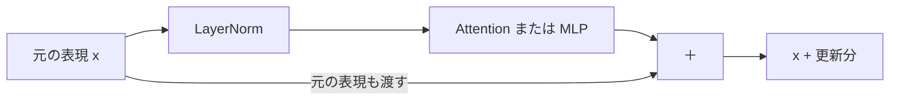
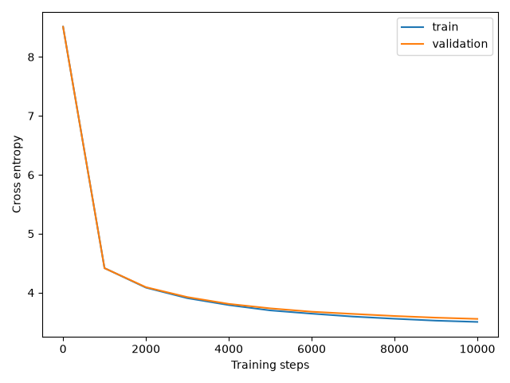

# Part 1 — 1層・1ヘッドのTiny GPTを作る

## これから作るGPTの全体像

このPartでは次の構成のGPTを作ります。図の各部品を実装し、最後に学習と文章生成を動かします。


## まず、学習前のGPTで続きを生成してみる

最初に、これから作るGPTを動かしてみましょう。参照コードには完成した計算の仕組みが入っていますが、パラメータはまだ学習していない初期値です。

このPartでは日本語の文章を使います。モデルが扱う単位を **token** と呼びます。1tokenは1文字や1単語とは限らず、たとえば「日本の首都は東京です。」は次のように分かれます。

```text
日本の | 首都 | は | 東京 | です | 。
```

この分割にはよく現れる並びをまとめるBPEという方式を使います。仕組みは1.2で説明します。

uvが使える環境でこのリポジトリのルートから次のコマンドを実行します。必要なPythonと依存関係はuvが用意します。最初の2行で日本語の1万文書を保存し、tokenの語彙と分割規則を作ります。ここで保存されるデータは参照コード側の `sample/data/` に入ります。自分の作業用ディレクトリには、1.2で同じ手順で作ります。

```bash
uv run --frozen --directory sample python prepare_data.py
uv run --frozen --directory sample python -m tiny_gpt.tokenizer
uv run --frozen --directory sample python -m tiny_gpt.preview
```

GPTのパラメータはまだ学習していません。「プログラミングを学ぶには、」という書きかけの文を渡すと、次のような続きを生成します。以下は実行結果の抜粋です。

```text
プログラミングを学ぶには、ユーザーはされたマイクロ買自体....面積どのような通しを行プラスブック学構成全てが残望�検査を�消化の活用録�アイデア大切とされているログレッジを�
```

日本語の断片は出ますが、意味の通る文章にはなっていません。Tokenizerは「ユーザー」などの断片をすでに語彙として持っていますが、GPTはそれらをどう並べるかをまだ学んでいないためです。`�` はbyte単位のtokenが正しい文字にならない組み合わせで出た部分です。

それでも内部では次のtokenの確率を計算して1つ選び、入力へ追加する処理が動いています。


**文章を生成する仕組みができていても、適切な続きを予測できるとは限りません。** ではどのように予測を計算し、学習によって何を変えるのでしょうか。

ここから自分の作業場所で一つずつ実装していきます。Part 1の最後に同じ入力を使い、学習で予測がどう変わったかを比べましょう。

参考：[学習前のGPTが1tokenずつ生成する過程を見る](demos/part1.html#generation)

## このPartで作るもの

作るのはTransformer Blockを1つ持つDecoder-only Transformerです。Attentionのヘッドも1つにします。固定した日本語の1万文書で次のtokenを予測するように学習させ、同じ入力に対する学習前後の続きを比較します。

目標は、普段使っているLLMの「入力を読む」「学習する」「生成する」が、どの計算に対応するのかを説明できるようになることです。

後のPartではここで作ったBlockを複数並べ、Attentionを複数ヘッドにして生成時のKV Cacheを追加します。学習済みのパラメータからInstruction Tuningを行うところまで、この実装を拡張していきます。

## 学習を始める前の準備

### データと実験の規模を決める

FineWeb-2 Edu Japaneseの `small_tokens_cleaned` から1万文書を取り出して使います。日本語の語句や文末のつながりが学習前後でどう変わるかを観察しましょう。

取得するのは最初のParquetファイル1つだけです。そこから重複しない1万文書を選び、train 9,000文書・validation 1,000文書に分けて保存します。以降は同じデータを使うので、実験のたびに取得する必要はありません。

配布元：[FineWeb-2 Edu Japanese](https://huggingface.co/datasets/hotchpotch/fineweb-2-edu-japanese)

| 条件 | 設定 |
|---|---:|
| Block数 | 1 |
| Attentionのヘッド数 | 1 |
| ベクトルの次元 `d_model` | 128 |
| 一度に読む長さ `context_length` | 128token |
| MLPの中間次元 | 512 |
| 一度に処理する系列数 `batch_size` | 16 |
| BPEの語彙数 | 8,192 |
| train / validation | 9,000文書 / 1,000文書 |
| 更新回数 | 10,000回 |
| パラメータ数 | 2,320,256（約232万） |

まず20回更新して一連の処理を確認し、その後で10,000回の学習を実行します。CPUでの学習は5〜10分程度が目安です。Apple M5 ProのCPU・4スレッドでは学習と定期評価に約5.1分かかりました。

### ファイルを分ける

このリポジトリの `sample/` に参照用の完成コードがあります。本文を読みながら、自分の作業用ディレクトリ `tiny-gpt-handson/` に実装していきましょう。途中で迷ったときは参照コードの対応するファイルを確認できます。

コードはデータ・モデル・学習・生成に分けます。Attentionの計算を追うときは `model.py`、パラメータが更新される順序を追うときは `train.py` を読める構成です。

```text
tiny-gpt-handson/
├── pyproject.toml
├── prepare_data.py
├── data/
│   └── fineweb-japanese-10k/
│       ├── train.jsonl
│       ├── validation.jsonl
│       ├── manifest.json  取得条件とデータのハッシュ
│       └── tokenizer.json 語彙と分割規則
├── tiny_gpt/
│   ├── __init__.py       空のファイル
│   ├── config.py        実験条件
│   ├── tokenizer.py     BPEの語彙作成とIDへの変換
│   ├── dataset.py       文書のID化と入力・正解の組
│   ├── model.py         GPTの計算
│   ├── generate.py      次token予測の繰り返し
│   └── train.py         Loss・更新・記録
└── runs/
    └── part1/           実行時に作成する結果の保存先
```

以下ではファイルに保存するコードとその場で試す確認コードを区別します。`model.py` は部品を順に追加し、1.10でモデル全体がつながります。学習コマンドを実行するのは1.13です。

途中の実験では確認コードを作業用ディレクトリの `check.py` に保存し、`uv run python check.py` で実行します。次の実験では内容を置き換えてください。毎回新しいPythonプロセスで起動するので、変更した実装が読み込まれます。

### uvで環境を用意する

Python 3.14.7とuvを使います。好きな場所に作業用ディレクトリを作り、移動してください。

```bash
mkdir -p tiny-gpt-handson/tiny_gpt
cd tiny-gpt-handson
touch tiny_gpt/__init__.py
```

以下を `pyproject.toml` として保存します。

```toml
[project]
name = "tiny-gpt-handson"
version = "0.1.0"
requires-python = ">=3.14"
dependencies = [
    "torch==2.14.0",
    "matplotlib==3.11.2",
    "huggingface-hub==1.32.0",
    "pyarrow==25.0.1",
    "tokenizers==0.23.2",
]
```

次のコマンドで依存関係をインストールします。

```bash
uv sync --python 3.14.7
```

以降のコマンドと保存先はこの作業用ディレクトリを基準にします。uvはプロジェクトの環境でコマンドを実行でき、依存関係を `uv.lock` に記録します。[uvのプロジェクト管理](https://docs.astral.sh/uv/guides/projects/)

### 実験条件を1か所に置く

設定値を変更したら別の名前で結果を保存します。比較するときにどの設定で得た結果かを見失わないためです。

**保存先：`tiny_gpt/config.py`。**

```python
class Config:
    def __init__(self) -> None:
        self.d_model: int = 128
        self.context_length: int = 128
        self.batch_size: int = 16
        self.steps: int = 10000
        self.learning_rate: float = 0.0003
        self.eval_every: int = 1000
        self.eval_batches: int = 8
        self.seed: int = 42
        self.cpu_threads: int = 4
        self.device: str = "auto"
        self.run_name: str = "part1"
```

コードの `: int` や `: str` は値の型、関数の `->` の後は戻り値の型です。Tensorには `torch.Tensor` と書き、shapeは説明やコメントで示します。

### Tensorのshapeを読む

このPartで繰り返し登場する記号は4つです。

| 記号 | 意味 | 最初の設定での例 |
|---|---|---:|
| `B` | batch size。一度に処理する系列の数 | 16 |
| `T` | 1系列に含まれるtoken数 | 128 |
| `D` | 1tokenを表すベクトルの次元 | 128 |
| `vocab_size` | 語彙に含まれるtokenの数 | 8,192 |

`[B, T, D]` は「B個の系列があり、それぞれのT個の位置にD次元のベクトルがある」という意味です。`T` と `D` が同じ数でも役割は異なります。小さな確認コードでは違いを見分けやすいように `T=3`、`D=4` などに変えます。

PyTorch固有の `reshape`・`transpose`・ブロードキャストはshapeの変化と一緒に確認します。

## 1.1 GPT全体の流れ — 各位置で次のtokenを予測する

### まず何が問題なのか

文章は長さが決まっていません。文章全体を一度に1つの正解として予測しようとすると、候補の組み合わせが膨大になります。

一方「ここまでの文章の次には何が来るか」なら候補を語彙の中から選ぶ問題として扱えます。

### この技術が解決すること

GPTは入力されたtoken列から次のtokenの分布を予測します。1token選んで入力に追加すれば、同じ処理でさらに次のtokenを予測できます。

今回使うBPEではtokenが単語の一部や複数の文字に対応します。GPTが予測するのはtokenのIDで、読める文章へ戻すのはTokenizerの役割です。

### 仕組み

「日本の首都は東京です。」をtokenへ分けて末尾の「。」を除いて入力すると、各位置で次のtokenのスコアを返します。

| 入力の位置 | その位置までの入力 | 予測する正解token |
|---|---|---|
| 0 | 日本の | 首都 |
| 1 | 日本の／首都 | は |
| 2 | 日本の／首都／は | 東京 |
| 3 | 日本の／首都／は／東京 | です |
| 4 | 日本の／首都／は／東京／です | 。 |

1系列の出力shapeは `[1, 5, vocab_size]` です。位置2で「東京」を予測するとき、入力の位置3にある「東京」を見せてはいけません。この制限は1.6のCausal Maskで実装します。

数式では、文章の確率を次のように分けます。

```text
P(x₁, x₂, ..., xₙ)
  = P(x₁) × P(x₂ | x₁) × ... × P(xₙ | x₁, ..., xₙ₋₁)
```

この各項に相当する予測を学習するモデルを自己回帰言語モデルと呼びます。

Transformerには複数の構成があります。この教材では過去と現在の位置を参照するSelf-Attentionを使い、別のEncoderの出力を読む仕組みを持たない **Decoder-only** 構成を作ります。元のEncoder–Decoder型TransformerのDecoderをそのまま丸ごと実装するわけではありません。

LLMは大規模な言語モデルの総称です。今回のTiny GPTはLLMと共通する計算の仕組みを学ぶための小さなモデルであり、その規模や学習量を再現するものではありません。

### 実装

モデルが完成すると、呼び出し方は次の形になります。この断片は全体像を読むためのものです。実行に必要な部品はこの後で作ります。

```python
token_ids = torch.tensor([[3, 5, 8, 2]], dtype=torch.long)
logits = model(token_ids)
last_logits = logits[:, -1, :]
```

`logits[:, -1, :]` は「すべての系列について、最後の位置のすべての候補」を取り出します。生成時に知りたいのは入力の続きなので、最後の位置を使います。

### この節で理解したこと

GPTの基本的な仕事は過去のtoken列を条件に次のtokenを予測することです。学習と生成では同じモデルの出力を違う目的で使います。

## 1.2 学習データとTokenization — 文字列を予測問題に変える

### まず何が問題なのか

ニューラルネットワークで行う行列計算には数値が必要です。文字列のままではEmbedding行列のどの行を取り出すか指定できません。

また学習には入力だけでなく正解も必要です。次のtokenを予測する問題なら、人が別途回答を書く必要はなく、元の文章の続きが正解になります。

### この技術が解決すること

Tokenizerで文字列をtokenへ分割し、それぞれを整数IDへ変換します。さらに同じtoken列から1tokenずらした2つの系列を切り出し、入力と正解を作ります。

### 仕組み

今回のTokenizerで「日本の首都は東京です。」を分割すると、6個のtokenになります。区切りを `/` で表すと、入力と正解の対応は次のとおりです。

```text
元の列： 日本の / 首都 / は   / 東京 / です / 。
入力 x： 日本の / 首都 / は   / 東京 / です
正解 y： 首都   / は   / 東京 / です / 。

この1系列では：x.shape = [T]、y.shape = [T]、T = 5
B系列をまとめると：x.shape = [B, T]、y.shape = [B, T]
```

位置0では「日本の」から「首都」、位置1では「日本の／首都」から「は」を予測します。`y` は「一度に生成すべき別の文章」ではなく、各位置に対応する正解を並べたものです。

**BPEはよく現れる隣接ペアを繰り返しまとめ、語彙と分割規則を作る方式です。** 今回はUTF-8のbyteを出発点にし、8,192種類のtokenを用意します。よく現れる語句を少ないtokenで表せる一方、見たことのない文字もbyteへ分解して扱えます。1tokenが単語や文字の途中で切れる場合もあります。

Tokenizerの語彙を作ることとGPTを学習させることは別の処理です。

| 処理 | 決まるもの | この後の扱い |
|---|---|---|
| BPEの語彙作成 | 文字列の分割規則とtoken ID | 固定して使う |
| GPTの学習 | EmbeddingやAttentionなどのパラメータ | 次token予測の誤差から更新する |

語彙の作成にはtrainの文書だけを使います。validationはGPTのパラメータ更新にも語彙作成にも使いません。

### 実装

まず、参照コードの [prepare_data.py](../sample/prepare_data.py) を手元の作業用ディレクトリへコピーし、実行してください。このファイルには取得条件を固定して文書を保存する処理がまとまっています。

```bash
uv run python prepare_data.py
```

配布元が案内する先頭1万件の重複を除き、空でない異なる本文を1万件選びます。seed 42で並べ替えてからtrain 9,000文書・validation 1,000文書に分けます。取得元のrevisionと保存したデータのSHA-256も記録します。

**trainはパラメータ更新に使う文書、validationは更新に使わず予測を測る文書**です。文書単位で分けることで同じ文書の前半がtrain、後半がvalidationに入ることを防ぎます。

次に、BPEの語彙を作り、文字列とID列を変換するコードを書きます。ここはHugging Face Tokenizersを使い、Transformerの計算はこの後で実装します。

**保存先：`tiny_gpt/tokenizer.py`。**

```python
import json
from pathlib import Path

from tokenizers import Tokenizer as BpeTokenizer
from tokenizers import decoders, models, pre_tokenizers, trainers


DATA_DIR = Path("data/fineweb-japanese-10k")
TOKENIZER_PATH = DATA_DIR / "tokenizer.json"
EOS_TOKEN = "<|endoftext|>"
VOCAB_SIZE = 8192


def read_texts(path: Path) -> list[str]:
    texts: list[str] = []
    with path.open(encoding="utf-8") as source:
        for line in source:
            document = json.loads(line)
            texts.append(document["text"])
    return texts


def train_tokenizer(texts: list[str], vocab_size: int) -> BpeTokenizer:
    tokenizer = BpeTokenizer(models.BPE())
    # 256種類のbyteを出発点にするので、学習にない文字もID列へ変換できる。
    tokenizer.pre_tokenizer = pre_tokenizers.ByteLevel(add_prefix_space=False)
    tokenizer.decoder = decoders.ByteLevel()
    trainer = trainers.BpeTrainer(
        vocab_size=vocab_size,
        min_frequency=2,
        initial_alphabet=pre_tokenizers.ByteLevel.alphabet(),
        special_tokens=[EOS_TOKEN],
        show_progress=False,
    )
    tokenizer.train_from_iterator(texts, trainer=trainer, length=len(texts))
    return tokenizer


class Tokenizer:
    def __init__(self, path: Path = TOKENIZER_PATH) -> None:
        self.backend: BpeTokenizer = BpeTokenizer.from_file(str(path))
        self.vocab_size: int = self.backend.get_vocab_size()
        eos_id = self.backend.token_to_id(EOS_TOKEN)
        if eos_id is None:
            raise ValueError("文書終端tokenがありません")
        self.eos_id: int = eos_id

    def encode(self, text: str) -> list[int]:
        return self.backend.encode(text).ids

    def decode(self, token_ids: list[int]) -> str:
        return self.backend.decode(token_ids)

    def save(self, path: Path) -> None:
        self.backend.save(str(path))


def main() -> None:
    if not TOKENIZER_PATH.exists():
        # validationの内容を使わず、trainだけから分割規則と語彙を作る。
        texts = read_texts(DATA_DIR / "train.jsonl")
        backend = train_tokenizer(texts, VOCAB_SIZE)
        backend.save(str(TOKENIZER_PATH))
    tokenizer = Tokenizer()
    text = "日本の首都は東京です。"
    token_ids = tokenizer.encode(text)
    print("語彙数:", tokenizer.vocab_size)
    print("入力:", text)
    print("token ID:", token_ids)
    print("復元:", tokenizer.decode(token_ids))


if __name__ == "__main__":
    main()
```

`train_tokenizer` が語彙と分割規則を作り、`Tokenizer` が保存済みの規則で変換します。`as BpeTokenizer` はimportしたクラスに別名を付ける書き方です。自分で定義した `Tokenizer` と名前が重ならないようにしています。

次のコマンドで語彙を作ります。すでに `tokenizer.json` がある場合は保存した規則を使います。

```bash
uv run python -m tiny_gpt.tokenizer
```

続いて、各文書をID列へ変換します。文書の末尾には専用の終端token（EOS）を付けます。GPTはこのtokenも予測対象として学習し、生成時に選んだら文章を終了します。

文書をつないだtoken列から連続する範囲を切り出します。この範囲を「窓」と呼びます。1組の入力・正解を作るには `T+1` tokenが必要です。先頭T個を入力、その1つ先からT個を正解にします。

**保存先：`tiny_gpt/dataset.py`。**

```python
import torch

from tiny_gpt.config import Config
from tiny_gpt.tokenizer import DATA_DIR, Tokenizer, read_texts


def encode_documents(texts: list[str], tokenizer: Tokenizer) -> torch.Tensor:
    token_ids: list[int] = []
    for text in texts:
        token_ids.extend(tokenizer.encode(text))
        # 別の文書へ移る境界を、専用のtokenで表す。
        token_ids.append(tokenizer.eos_id)
    return torch.tensor(token_ids, dtype=torch.long)


def load_data(
    tokenizer: Tokenizer, config: Config,
) -> tuple[torch.Tensor, torch.Tensor]:
    train_texts = read_texts(DATA_DIR / "train.jsonl")
    validation_texts = read_texts(DATA_DIR / "validation.jsonl")
    train_ids = encode_documents(train_texts, tokenizer)
    validation_ids = encode_documents(validation_texts, tokenizer)

    if len(train_ids) <= config.context_length:
        raise ValueError("trainデータがcontext_lengthに対して短すぎます")
    if len(validation_ids) <= config.context_length:
        raise ValueError("validationデータがcontext_lengthに対して短すぎます")

    return train_ids, validation_ids


def make_batch(
    data: torch.Tensor,
    config: Config,
    generator: torch.Generator,
    device: torch.device,
) -> tuple[torch.Tensor, torch.Tensor]:
    starts = torch.randint(
        low=0,
        high=len(data) - config.context_length,
        size=(config.batch_size,),
        generator=generator,
    )
    inputs: list[torch.Tensor] = []
    targets: list[torch.Tensor] = []

    for start_tensor in starts:
        start = int(start_tensor.item())
        end = start + config.context_length
        # 各位置の正解は1token先。入力と正解の長さはどちらもTにそろえる。
        inputs.append(data[start:end])
        targets.append(data[start + 1:end + 1])

    x = torch.stack(inputs).to(device)
    y = torch.stack(targets).to(device)
    return x, y
```

`torch.stack` は同じ長さの系列を並べ、`[T]` をB個集めて `[B, T]` にします。`generator` はバッチ選択用の乱数の状態です。後で評価や生成が学習用の乱数を進めないように分けます。

窓が文書の境界をまたぐことはあります。EOSは境界を示すtokenで、Attentionを遮るMaskではありません。この実装では同じ窓に入った前の文書も参照できますが、trainとvalidationの境界をまたぐことはありません。

### 動作確認 — 入力と正解の対応を見る

各位置の正解が「1token先」になっているかをID列と復元した文章で確かめます。

```python
import torch
from tiny_gpt.tokenizer import Tokenizer

tokenizer = Tokenizer()
text = "日本の首都は東京です。"
ids = torch.tensor(tokenizer.encode(text), dtype=torch.long)
x = ids[:-1]
y = ids[1:]
print("元のID:", ids.tolist())
print("入力:", tokenizer.decode(x.tolist()))
print("正解:", tokenizer.decode(y.tolist()))
print(x.shape, y.shape)
assert tokenizer.decode(tokenizer.encode(text)) == text
```

入力は「日本の首都は東京です」、正解は「首都は東京です。」になり、shapeはどちらも `[5]` です。文字数ではなくtoken数で切り出している点に注目してください。

Tokenizerはbyte単位の断片も持っているため、1tokenだけをdecodeすると `�` になる場合があります。文章を復元するときはID列をまとめてdecodeします。

### この節で理解したこと

Tokenizerは文字列をtoken ID列へ変換します。入力と正解を1tokenずらすことで文章そのものから次token予測の学習問題を作れます。

## 1.3 Token Embedding — 整数のラベルを学習できるベクトルへ変える

### まず何が問題なのか

token IDは単なる番号です。IDが10と11だからといって、その2つのtokenの使われ方が似ているとは限りません。IDをそのまま量として計算に使うと、番号の大小や差を持ち込んでしまいます。

### この技術が解決すること

各tokenに学習可能なベクトルを割り当てます。次token予測に役立つ表現を学習を通じて作れるようにします。

### 仕組み

Embeddingは `[vocab_size, D]` の表です。token IDに対応する行を取り出します。

```text
Embedding行列 E： [vocab_size, D]
入力のID：       [B, T]
取り出した結果： [B, T, D]

tokenベクトル = E[token ID]
```

表の中身は最初は乱数で初期化します。学習中に更新されるのはIDの番号ではなく、この表の値です。ベクトルの各成分に人が「動物らしさ」「色らしさ」などの意味を先に割り当てるわけではありません。

### 実装

基本部品の `nn.Embedding` を使います。たとえば語彙数6、ベクトルの次元4なら次のように表を作れます。モデルへの組み込みは1.10で行います。

```python
token_embedding = nn.Embedding(6, 4)
token_vectors = token_embedding(ids)
```

`ids` が `[[2, 5, 2]]` なら取り出すのは表のID 2・ID 5・ID 2に対応する行です。入力のshape `[1, 3]` が出力の `[1, 3, 4]` に変わります。最初と最後の位置は同じ行を取り出すため、同じベクトルになります。

同じtokenでも文脈によって役割は変わりますが、Embeddingを取り出した直後は他のtokenを参照していません。文脈を反映する処理はこの後で追加します。

次のように、同じIDは同じ行を参照します。表の数値は説明用の例です。

| token ID | 成分0 | 成分1 | 成分2 | 成分3 |
|---|---:|---:|---:|---:|
| 2 | 0.2 | -0.5 | 0.1 | 0.8 |
| 5 | -0.3 | 0.4 | 0.6 | 0.0 |

```text
入力のID [2, 5, 2]
   ↓      ↓      ↓
  行2    行5    行2
```


### この節で理解したこと

Embeddingはtokenを学習可能なベクトルに変換する表です。文脈を処理する前の各tokenの出発点となる表現を作ります。

## 1.4 Position情報 — 同じtokenがどこにあるかを表す

### まず何が問題なのか

Token Embeddingではtoken列 `[猫, 犬]` と `[犬, 猫]` は同じ2つのベクトルを逆順に並べたものになります。位置情報もMaskもないSelf-Attentionは、入力を並べ替えると出力も同じように並べ替わります。順序に固有の手掛かりを持っていないためです。

文章を扱うには内容だけでなく並び方も区別したい場面があります。

### この技術が解決すること

「どのtokenか」に加えて「何番目の位置か」をモデルへ渡します。このPartでは位置にも学習可能なベクトルを割り当てるPosition Embeddingを使います。

### 仕組み

```text
X[b, t] = token_embedding[ids[b, t]] + position_embedding[t]

token_embedding(ids)       [B, T, D]
position_embedding(位置)   [T, D]
足した結果                 [B, T, D]
```

位置ベクトルはbatch内のすべての系列で共通なので、`[T, D]` を各系列へ足せます。PyTorchがサイズ1の軸を補って計算するブロードキャストを使っています。

位置の表し方はこれだけではありません。RoPEのように、Attentionの計算へ位置関係を組み込む方式もあります。このPartではまずEmbeddingを足す方式で位置情報の役割を確かめます。

### 実装

入力の長さに応じて `0, 1, 2, ...` という位置IDを作り、位置ベクトルを取り出します。1.10では次の処理をモデルの `forward` へ入れます。

```python
positions = torch.arange(ids.shape[1], device=ids.device)
x = self.token_embedding(ids)
x = x + self.position_embedding(positions)
```

token列 `[猫, 犬, 猫]` の最初と最後の「猫」はToken Embeddingでは同じベクトルです。そこへ位置0と位置2の別々のベクトルを足すので、位置を区別できる表現になります。

この方式では用意した位置の表より長い系列をそのまま入力できません。たとえば位置の表が128行なら使える位置は0〜127です。

### この節で理解したこと

Position情報はtokenの内容に加えて位置や順序を計算へ持ち込むためにあります。学習可能な位置の表を使う方式では、その表の長さが入力できる長さの上限になります。

## 1.5 1-head Self-Attention — 他のtokenから情報を集める

### まず何が問題なのか

ここまでの処理では各位置のベクトルは「自分が何のtokenで、何番目にいるか」だけで決まります。他のtokenの内容は入っていません。

たとえば「日本の首都は」の続きを予測するには、直前の「は」だけでなく、「日本の」「首都」の情報も必要です。過去のベクトルを単純に平均する方法もありますが、どの入力でも同じ割合で混ぜることになります。

### この技術が解決すること

Self-Attentionは各位置について「他の位置の情報をどの割合で集めるか」を入力に応じて計算します。参照する側も参照される側も同じ入力列から作るため、Self-Attentionと呼びます。

### 仕組み

各tokenのベクトル `X` を3つの別々の線形変換へ通します。

| ベクトル | この計算での役割 |
|---|---|
| Query（Q） | 参照する側の特徴。Keyとのスコア計算に使う |
| Key（K） | 参照される側の特徴。Queryとのスコア計算に使う |
| Value（V） | 重みを掛けて、実際に集める情報 |

入力のベクトル同士をそのまま照合する代わりに、参照する側・参照される側・集める情報に分けて変換します。「どの情報を選ぶか」と「選んだ先から何を受け取るか」にそれぞれ適した変換を学習できます。Q・K・Vの役割を人が決め打ちするのではなく、次token予測の誤差から変換行列を更新します。

バイアスを省略して書くと、次の式になります。

```text
Q = XWq
K = XWk
V = XWv

scores  = QKᵀ / √d_k
weights = softmax(scores)
output  = weights V

Attention(Q, K, V) = softmax(QKᵀ / √d_k)V
```

1ヘッドでは `d_k = D` とします。B個の入力系列は独立に処理されます。

| 計算 | 入力のshape | 結果のshape |
|---|---|---|
| Q・K・Vへの変換 | `[B, T, D]` | それぞれ `[B, T, D]` |
| Kの最後の2軸を交換 | `[B, T, D]` | `[B, D, T]` |
| QとKの行列積 | `[B, T, D] × [B, D, T]` | `[B, T, T]` |
| 最後の軸にsoftmax | `[B, T, T]` | `[B, T, T]` |
| Valueの重み付き和 | `[B, T, T] × [B, T, D]` | `[B, T, D]` |

内積は対応する成分を掛けて足す計算です。2次元なら `q・k = q[0]×k[0] + q[1]×k[1]` です。向きがそろうほど大きくなりますが、ベクトルの長さにも左右されます。softmaxはこのscoreを指数関数に通して合計で割り、参照する割合へ変換します。

操作デモ：[内積が参照の割合に変わる過程を見る](demos/part1.html#dot-product)

Queryの向きと長さを変え、scoreとsoftmax後の割合がどう動くかを確かめられます。

`[T, T]` の行は参照する側、列は参照される側です。各行にsoftmaxを適用すると、その位置から各tokenへ向けた重みの合計が1になります。

`√d_k` で割るのは、次元が増えたときに内積の大きさが増え、softmaxが極端に偏りやすくなるのを抑えるためです。各成分の分散が同程度という仮定では内積の分散は次元数に比例します。平方根で割ることでそのスケールを調整します。この計算はscaled dot-product attentionと呼ばれます。[Attention Is All You Need](https://arxiv.org/abs/1706.03762)

小さな数値で重みがどのようにできるかを見てみましょう。ここでは学習済みの値を使わず、計算を追うためにQ・K・Vを直接決めます。

```text
Q = [[1, 0],       K = [[1, 0],       V = [[10,  0],
     [0, 1]]            [0, 1]]            [ 0, 20]]

QKᵀ / √2 ≈ [[0.707, 0.000],
             [0.000, 0.707]]

weights ≈ [[0.670, 0.330],
           [0.330, 0.670]]

1行目のoutput ≈ 0.670 × [10, 0] + 0.330 × [0, 20]
              ≈ [6.70, 6.60]
```

QとKが決めるのは混ぜる割合です。最終的に混ぜる対象はValueです。

操作デモ：[Valueを重みの分だけ縮めて足す](demos/part1.html#weighted-sum)

矢印を1本ずつつなぎ、「他のtokenの情報を集める」がベクトルの足し算であることを確かめられます。

### 実装

まず、Q・K・Vから重み付き和を計算する関数を作ります。続いて、入力をQ・K・Vへ変換する層を作ります。

**保存先：`tiny_gpt/model.py`。このファイルは以降の節で拡張します。**

```python
import math

import torch
from torch import nn
from torch.nn import functional as F

from tiny_gpt.config import Config


def scaled_attention(
    q: torch.Tensor, k: torch.Tensor, v: torch.Tensor,
) -> tuple[torch.Tensor, torch.Tensor]:
    key_size = q.shape[-1]
    # [B, T, D] @ [B, D, T] → [B, T, T]。行iから列jを参照するスコア。
    scores = q @ k.transpose(-2, -1)
    scores = scores / math.sqrt(key_size)
    # 各行について参照先の重みを合計1にし、その割合でValueを集める。
    weights = torch.softmax(scores, dim=-1)
    output = weights @ v
    return output, weights


class SelfAttention(nn.Module):
    def __init__(self, d_model: int) -> None:
        super().__init__()
        self.query = nn.Linear(d_model, d_model)
        self.key = nn.Linear(d_model, d_model)
        self.value = nn.Linear(d_model, d_model)
        self.output = nn.Linear(d_model, d_model)

    def forward(self, x: torch.Tensor) -> tuple[torch.Tensor, torch.Tensor]:
        # 同じxから、参照する側の特徴Q、参照される側の特徴K、集める情報Vを作る。
        q = self.query(x)
        k = self.key(x)
        v = self.value(x)
        mixed, weights = scaled_attention(q, k, v)
        output = self.output(mixed)
        return output, weights
```

`@` は行列積です。`transpose(-2, -1)` は最後の2軸を交換します。softmaxの `dim=-1` は最後の軸、つまり参照先tokenの軸を指定しています。

`nn.Linear` は `x @ weight.T + bias` を計算します。そのためPyTorchに保存される `weight` の軸の順序は上の数式の `Wq` とは逆です。`query.weight`・`key.weight`・`value.weight` がQ・K・Vを作るために学習するパラメータです。

最後の `self.output` は集めた情報を次の処理へ渡す線形変換です。

`nn.Module` を継承したクラスで各層を属性へ代入すると、PyTorchがそのパラメータを登録します。`model.parameters()` や `model.to(device)` が中の層まで扱えるのは、この登録があるためです。

**この時点のAttentionは未来のtokenも参照できます。次の節でMaskを追加してからGPTの学習に使います。**

### 実験 — 混ぜる割合と混ぜる情報を分けて変える

Q・Kが決める重みとVから集める情報が別の役割を持つことを確かめます。

先ほどの数値例を動かします。

```python
import torch
from tiny_gpt.model import scaled_attention

q = torch.tensor([[[1.0, 0.0], [0.0, 1.0]]])
k = torch.tensor([[[1.0, 0.0], [0.0, 1.0]]])
v = torch.tensor([[[10.0, 0.0], [0.0, 20.0]]])
output, weights = scaled_attention(q, k, v)

print(weights)
print(output)
torch.testing.assert_close(weights.sum(dim=-1), torch.ones(1, 2))
```

次に、Q・Kを変えずにValueだけを2倍にしてください。重みは変わらず、重み付き和は2倍になります。Q・KとValueが別の役割を持つことを確かめられます。

操作デモ：[Wq・Wk・Wvを変えて、役割の違いを確かめる](demos/part1.html#qkv)

同じ入力Xからでも、Wq・Wkを変えると参照する割合が変わります。Wvだけを変えると割合は同じまま、集める情報と出力が変わります。入力から計算するQ/K/Vと学習するWq/Wk/Wvの違いを確認してください。

### この節で理解したこと

Self-AttentionはQ・Kから参照先ごとの重みを作り、その重みでValueを集めます。重みは入力ごとに変わり、その作り方を決める変換行列は学習で変わります。

## 1.6 Causal Mask — 次に予測するはずのtokenを見せない

### まず何が問題なのか

入力が「日本の／首都／は／東京／です」、正解が「首都／は／東京／です／。」のとき、位置0の正解は「首都」です。その「首都」は入力の位置1にすでに存在しています。

未来まで参照できるモデルは位置1から「首都」の情報を持ってくるだけで簡単に予測できてしまいます。生成時には未知の次tokenが入力にないので、学習時だけ答えを見る状態になります。

### この技術が解決すること

各位置から自分より後ろの位置を参照できないようにします。過去と現在だけで予測させ、生成時にも使える規則を学習させます。

### 仕組み

スコア行列のうち未来に対応する場所を負の無限大にしてからsoftmaxを計算します。

```text
参照される位置 →     0    1    2    3
参照する位置 0       ○    ×    ×    ×
             1       ○    ○    ×    ×
             2       ○    ○    ○    ×
             3       ○    ○    ○    ○

× のscoreを -∞ にする → softmax後の重みは0
```

softmaxの前に0を入れるだけでは不十分です。`exp(0)=1` なので、その位置にも重みが付く可能性があるためです。

MaskがないSelf-Attentionは全位置を参照できます。上の制限を加えたものがCausal Self-Attentionです。すべてのTransformerで未来を隠すわけではなく、この教材の自己回帰生成に必要な制限です。

### 実装

**`model.py` の `scaled_attention` を、次の関数へ置き換えます。** `SelfAttention` クラスは変更しません。

```python
def scaled_attention(
    q: torch.Tensor, k: torch.Tensor, v: torch.Tensor, causal: bool = True,
) -> tuple[torch.Tensor, torch.Tensor]:
    key_size = q.shape[-1]
    length = q.shape[-2]
    # [B, T, D] @ [B, D, T] → [B, T, T]。行iから列jを参照するスコア。
    scores = q @ k.transpose(-2, -1)
    scores = scores / math.sqrt(key_size)

    if causal:
        future = torch.ones(length, length, dtype=torch.bool, device=q.device)
        future = torch.triu(future, diagonal=1)
        # 未来のスコアを -∞ にすると、softmax後の重みが0になる。
        scores = scores.masked_fill(future, float("-inf"))

    # 各行について参照先の重みを合計1にし、その割合でValueを集める。
    weights = torch.softmax(scores, dim=-1)
    output = weights @ v
    return output, weights
```

`torch.triu(..., diagonal=1)` は対角線より右上を残します。Maskのshapeは `[T, T]` で、batch内の各スコア行列へ共通に適用されます。現在のtokenに相当する対角線は隠しません。

この実装ではQ・K・Vの系列の長さを揃えます。

Causal Maskも参照できる範囲を位置ごとに変えるため、位置の手掛かりを含みます。ただしPosition Embeddingとは働きが異なります。位置の表現を明示的に与える処理と未来を参照させない処理を組み合わせて使います。

### 実験 — Maskで未来への参照が消えるか

Maskの有無だけを変え、未来に対応するAttention weightが0になることを確かめます。

先ほどの数値例をMaskあり・なしで比較します。新しい関数では `causal=True` が既定値です。

```python
import torch
from tiny_gpt.model import scaled_attention

q = torch.tensor([[[1.0, 0.0], [0.0, 1.0]]])
k = torch.tensor([[[1.0, 0.0], [0.0, 1.0]]])
v = torch.tensor([[[10.0, 0.0], [0.0, 20.0]]])

_, normal_weights = scaled_attention(q, k, v, causal=False)
_, causal_weights = scaled_attention(q, k, v, causal=True)
print(normal_weights)
print(causal_weights)
assert causal_weights[0, 0, 1].item() == 0.0
```

Maskありでは1行目が `[1, 0]` になります。最初のtokenは自分しか参照できません。2行目はもともと未来を含まないため、約 `[0.330, 0.670]` のままです。

操作デモ：[Causal Maskの有無を切り替える](demos/part1.html#causal-mask)

未来へのscoreが−∞になり、weightが0になる変化を確認できます。

### この節で理解したこと

Causal Maskは未来の正解を参照する抜け道を防ぎます。これにより1回の計算で複数位置を学習しながら、それぞれを過去だけに基づく予測にできます。

## 1.7 Feed Forward Network / MLP — 各位置の表現を加工する

### まず何が問題なのか

Attentionで他のtokenから情報を集められるようになりました。ただし集めた情報を次の予測へ使いやすい表現に加工する処理も必要です。

情報を集める計算だけに表現の変換をすべて任せる必要はありません。

### この技術が解決すること

MLPは各位置のベクトルへ非線形な変換を適用します。Attentionがtoken間で情報を集めるのに対し、MLPは集めた後の各ベクトルを加工します。

### 仕組み

```text
MLP(x) = GELU(xW₁ + b₁)W₂ + b₂

[B, T, D] → Linear → [B, T, 4D] → GELU → Linear → [B, T, D]
```

GELUは非線形な活性化関数です。線形変換を2回続けるだけなら1回の線形変換へまとめられますが、間に非線形関数を入れるとより多様な変換を表せます。

一度 `4D` に広げることで中間段階で扱える特徴の数を増やします。最後はResidual Connectionで元のベクトルへ足せるように `D` へ戻します。4倍は設計上の選択であり、必須の比率ではありません。中間次元を増やすとパラメータ数と計算量も増えます。

同じMLPのパラメータをすべての位置で共有します。位置ごとに別のMLPを用意するわけではありません。

### 実装

**`model.py` に `FeedForward` を追加します。**

```python
class FeedForward(nn.Module):
    def __init__(self, d_model: int) -> None:
        super().__init__()
        self.expand = nn.Linear(d_model, 4 * d_model)
        self.contract = nn.Linear(4 * d_model, d_model)

    def forward(self, x: torch.Tensor) -> torch.Tensor:
        # Linearは最後のD軸だけを変換する。別の位置のtokenは混ぜない。
        hidden = self.expand(x)
        hidden = F.gelu(hidden)
        output = self.contract(hidden)
        return output
```

### 実験 — 別のtokenへ変更が伝わるか

MLPが各tokenを独立に加工することを1か所だけ入力を変えて確かめます。

位置0の入力だけを変え、位置2の出力が変わるかを確かめます。

```python
import torch
from tiny_gpt.model import FeedForward

mlp = FeedForward(4)
x = torch.randn(1, 3, 4)
changed = x.clone()
changed[0, 0] = changed[0, 0] + 10.0

original_output = mlp(x)
changed_output = mlp(changed)
torch.testing.assert_close(original_output[0, 2], changed_output[0, 2])
print(original_output.shape)
```

位置2の出力は同じです。MLP単独では別のtokenの変更は伝わりません。一方Causal Attentionでは位置2から過去の位置0を参照できるため、位置0の変更が位置2の出力へ影響することがあります。

### この節で理解したこと

Attentionはtoken間の情報交換を担い、MLPは各tokenの表現を非線形に加工します。この2つを交互に使って文脈に応じた表現を作ります。

## 1.8 Residual ConnectionとLayerNorm — 変換を重ねられるようにする

### まず何が問題なのか

AttentionとMLPで毎回ベクトルを置き換えると、学習の初期段階でもそれまでの表現が大きく変わることがあります。層を重ねるほど勾配も多くの変換を通ることになります。

また層ごとにベクトルの値の大きさが変わると、後続の計算が扱うスケールも変わります。小さな1層モデルでは動いても、そのまま深くすると学習しにくくなる可能性があります。

### この技術が解決すること

Residual Connectionは変換前のベクトルに変換結果を足します。変換全体で毎回表現を作り直す代わりに、元の表現への追加・修正を学習できる形にします。

LayerNormは各tokenのベクトル内で値のスケールを整えます。このPartではAttentionやMLPへ入力する前に適用するPre-LN構成を使います。

### 仕組み

Residual Connectionの式は単純です。

```text
y = x + f(x)
```

`f(x)` が小さいときにも `x` をそのまま先へ渡せます。微分には恒等写像の項もあるため、変換を通る経路に加えて勾配が流れる経路を持てます。ただし元の情報が必ず保存されることや勾配の問題が完全になくなることを保証するわけではありません。

LayerNormは1つのtokenのD成分について平均と分散を計算します。

```text
μ = (x₁ + ... + x_D) / D
σ² = Σ(xᵢ − μ)² / D

LayerNorm(xᵢ) = γᵢ × (xᵢ − μ) / √(σ² + ε) + βᵢ
```

たとえば `[1, 3]` の平均は2、分散は1です。εを省略し、γを1、βを0とすると `[-1, 1]` になります。γ・βは学習可能なパラメータなので、学習後の出力が常に平均0・分散1になるわけではありません。

正規化するのは最後のD軸だけです。別のtokenや別の入力列を混ぜて平均を取ることはありません。

### 実装

計算する軸を確認できるように、この教材ではLayerNormを自分で書きます。**`model.py` に `LayerNorm` を追加します。**

```python
class LayerNorm(nn.Module):
    def __init__(self, d_model: int) -> None:
        super().__init__()
        self.scale = nn.Parameter(torch.ones(d_model))
        self.shift = nn.Parameter(torch.zeros(d_model))
        self.epsilon = 0.00001

    def forward(self, x: torch.Tensor) -> torch.Tensor:
        # 1tokenのD成分内で正規化する。平均のshapeは [B, T, 1]。
        mean = x.mean(dim=-1, keepdim=True)
        centered = x - mean
        variance = (centered * centered).mean(dim=-1, keepdim=True)
        normalized = centered / torch.sqrt(variance + self.epsilon)
        return self.scale * normalized + self.shift
```

`keepdim=True` で平均・分散のshapeを `[B, T, 1]` に保ちます。元の `[B, T, D]` から引いたり割ったりするときにtokenごとの値をD成分へ適用できます。`nn.Parameter` はTensorを学習対象として登録します。

Residual Connectionは専用クラスを作らず、次の節の `x + ...` として実装します。



### この節で理解したこと

Residual Connectionは元の表現に更新分を加える構造です。LayerNormは各tokenのベクトルのスケールを整えます。両者を組み込んで変換を繰り返せるBlockを作ります。

## 1.9 Transformer Block — 情報の収集と加工を1層にまとめる

### まず何が問題なのか

ここまでの部品をどの順番でつなぐか決める必要があります。位置の数やベクトルの次元が途中で変わると、元の表現へ足したり、同じ構造を重ねたりできません。

### この技術が解決すること

入出力を `[B, T, D]` に揃えたTransformer Blockを作ります。このBlockを1回通すことがこの教材でいう「1層」に対応します。`Linear` が1つだけある、という意味ではありません。

### 仕組み

```text
                 ┌───────────────────────────┐
入力 x ──────────┤                           ＋ → h
                 └→ LayerNorm → Attention ───┘

                 ┌───────────────────────────┐
     h ──────────┤                           ＋ → 出力
                 └→ LayerNorm → MLP ─────────┘

h      = x + Attention(LayerNorm₁(x))
output = h + MLP(LayerNorm₂(h))
```

Attentionが過去のtokenから情報を集め、その結果を含む表現をMLPが加工します。2つのLayerNormは構造が同じでも、学習するγ・βは別々です。

### 実装

**`model.py` に `TransformerBlock` を追加します。**

```python
class TransformerBlock(nn.Module):
    def __init__(self, d_model: int) -> None:
        super().__init__()
        self.norm1 = LayerNorm(d_model)
        self.attention = SelfAttention(d_model)
        self.norm2 = LayerNorm(d_model)
        self.mlp = FeedForward(d_model)

    def forward(self, x: torch.Tensor) -> torch.Tensor:
        attention_output, _ = self.attention(self.norm1(x))
        # 変換結果で置き換えず、元の表現へ更新分を足す。
        x = x + attention_output
        x = x + self.mlp(self.norm2(x))
        return x
```

Attentionの2つ目の戻り値は観察用の重みです。Block内では使わないため、変数名を `_` にしています。重要な処理はこの `forward` の3行に対応します。

Blockの入出力はどちらも `[B, T, D]` です。次のBlockへそのまま渡せる形になりました。モデル全体をつないだ後で1.10の確認コードを実行します。

### この節で理解したこと

GPTの1層はAttention・MLP・LayerNorm・Residual Connectionを組み合わせたBlockです。同じshapeで受け渡せるので、このBlockを積み重ねられます。

## 1.10 LM Head — 各tokenの表現を次token候補のスコアに変える

### まず何が問題なのか

Blockの出力はD次元のベクトルです。そのままでは「次は `a` なのか、空白なのか」を選べません。語彙内の候補ごとのスコアが必要です。

### この技術が解決すること

LM HeadでD次元から`vocab_size` 次元へ変換します。各位置に次token候補ごとのlogitが1つずつ出ます。

### 仕組み

```text
hidden state          [B, T, D]
最後のLayerNorm       [B, T, D]
LM Head               Linear(D, vocab_size)
logits                [B, T, vocab_size]
probabilities         softmax(logits, 最後の軸)
```

logitは確率ではありません。負の値も取れ、候補全体の合計が1になる必要もありません。softmaxを使うと、各候補が0〜1の値を持ち、合計が1の分布になります。

Attentionのsoftmaxは「どの入力tokenを参照するか」の分布でした。ここでのsoftmaxは「次にどのtokenを出すか」の分布です。同じ関数を使いますが、対象の軸と目的が異なります。

### 実装

いよいよ入力から出力までをつなぎます。**`model.py` に `TinyGPT` を追加します。**

```python
class TinyGPT(nn.Module):
    def __init__(self, vocab_size: int, config: Config) -> None:
        super().__init__()
        self.context_length = config.context_length
        self.token_embedding = nn.Embedding(vocab_size, config.d_model)
        self.position_embedding = nn.Embedding(
            config.context_length, config.d_model
        )
        self.block = TransformerBlock(config.d_model)
        self.final_norm = LayerNorm(config.d_model)
        self.lm_head = nn.Linear(config.d_model, vocab_size)

    def forward(self, ids: torch.Tensor) -> torch.Tensor:
        length = ids.shape[1]
        if length == 0 or length > self.context_length:
            raise ValueError("入力の長さがcontext_lengthの範囲外です")

        positions = torch.arange(length, device=ids.device)
        # tokenの表現 [B, T, D] に、全系列で共通の位置表現 [T, D] を足す。
        x = self.token_embedding(ids)
        x = x + self.position_embedding(positions)
        x = self.block(x)
        x = self.final_norm(x)
        # 各位置から次token候補のスコアを出す。出力は [B, T, vocab_size]。
        logits = self.lm_head(x)
        return logits
```

モデルはlogitsを返します。学習用のCross Entropy Lossはlogitsを直接受け取るため、ここではsoftmaxをかけません。生成時にはtokenを選ぶ処理側で分布へ変換します。

Embeddingの重み `[vocab_size, D]` とLM Headの重み `[vocab_size, D]` を共有する設計もあります。これをweight tyingと呼びます。パラメータ数を減らせますが、このPartでは「入力の表」と「出力の変換」の役割を見分けやすいように別々に持ちます。

### 動作確認 — 全体のshapeと未来の遮断を確かめる

モデル全体を通して、出力が次token候補のスコアになっているか、未来の情報が過去へ漏れていないかを確認します。

モデル全体の入出力とCausal Maskが最後まで効いているかを確認します。後半のtokenだけを変えても、前半の出力は変わらないはずです。

```python
import torch
from tiny_gpt.config import Config
from tiny_gpt.model import TinyGPT
from tiny_gpt.tokenizer import Tokenizer

torch.manual_seed(42)
config = Config()
tokenizer = Tokenizer()
model = TinyGPT(tokenizer.vocab_size, config)
model.eval()

first_ids = tokenizer.encode("日本の首都は東京です。")
second_ids = first_ids.copy()
# 文字列を編集して再分割すると、前半のtokenまで変わり得るのでID列を直接変える。
second_ids[3] = tokenizer.encode("猫")[0]
second_ids[4] = tokenizer.encode("犬")[0]
first = torch.tensor([first_ids], dtype=torch.long)
second = torch.tensor([second_ids], dtype=torch.long)

with torch.no_grad():
    first_logits = model(first)
    second_logits = model(second)

print(first_logits.shape)
torch.testing.assert_close(first_logits[:, :3], second_logits[:, :3])

parameter_count = 0
for parameter in model.parameters():
    parameter_count += parameter.numel()
print("parameter数:", parameter_count)
```

shapeは `[1, 6, 8192]` です。`torch.no_grad()` の範囲では後の勾配計算に備えた記録を作りません。`model.eval()` は評価モードへの切り替えです。このモデルにはDropoutなどがありませんが、勾配計算の無効化とは別の役割であることを押さえておきましょう。

1.6の重みの確認と合わせて、未来の情報が出力へ影響しないことを確かめられます。

### この節で理解したこと

GPTは各位置のベクトルを語彙数次元のlogitsへ変換します。これで入力token列から、すべての位置での次token予測までつながりました。

## 1.11 Lossと学習 — 正解のtokenへ確率を寄せる

### まず何が問題なのか

モデルはlogitsを出せるようになりましたが、パラメータはまだ初期値です。正しい続きを予測するには、予測の誤差を数値にし、それを小さくするようにパラメータを更新する必要があります。

### この技術が解決すること

Cross Entropy Lossで正解tokenに割り当てた確率を評価します。Backpropagationで各パラメータに対する勾配を求め、optimizerで値を更新します。

### 仕組み

位置tの正解を `y_t`、そのtokenへ割り当てた確率を `p(y_t)` とすると、1つの予測のlossは次の値です。

```text
loss_t = −log p(y_t)

全体のloss = −(1 / (B × T)) Σ_b Σ_t log p(y[b, t])

正解の確率 0.8 → loss ≈ 0.223
正解の確率 0.1 → loss ≈ 2.303
```

logは自然対数です。正解の確率が高いほどlossは小さくなります。正解が最も確率の高い候補だったとしても、確率をさらに上げる余地があればlossは0ではありません。

学習では次の順に処理します。

```text
入力 → model → logits → 正解と比較 → loss
                                    ↓ backward
各パラメータの勾配 ← 計算を逆向きにたどる
        ↓ optimizer.step
各パラメータを更新 → 次のバッチへ
```

Backpropagationが計算するのは「各パラメータを微小に変えたとき、lossがどちらへどの程度変化するか」です。optimizerはその勾配を使って実際の値を変えます。この教材では勾配の履歴を使って更新幅を調整するAdamWを使います。

更新対象にはToken Embedding・Position Embedding・Wq/Wk/Wv・Attentionの出力変換・MLP・LayerNorm・LM Headが含まれます。入力ごとに計算されるQ・K・VやAttention weight自体を固定の表として学習するわけではありません。なおあるバッチで使わなかったEmbeddingの行など、毎回すべてのパラメータに非ゼロの勾配が付くわけではありません。

### 実装

まずlossと評価の処理を書きます。PyTorchの `cross_entropy` には確率ではなくlogitsを渡します。関数内部で対数とsoftmaxに相当する計算を数値的に安定した形で行います。[CrossEntropyLoss](https://docs.pytorch.org/docs/stable/generated/torch.nn.CrossEntropyLoss.html)

**保存先：`tiny_gpt/train.py`。この節のコードを順に保存し、1.13で実行処理を追加します。**

```python
import hashlib
import json
import platform
import time
from pathlib import Path

import matplotlib.pyplot as plt
import torch
from torch.nn import functional as F

from tiny_gpt.config import Config
from tiny_gpt.dataset import load_data, make_batch
from tiny_gpt.model import TinyGPT
from tiny_gpt.tokenizer import DATA_DIR, TOKENIZER_PATH, Tokenizer, read_texts


def batch_loss(
    model: TinyGPT, x: torch.Tensor, y: torch.Tensor,
) -> torch.Tensor:
    logits = model(x)
    vocab_size = logits.shape[-1]
    # B系列×T位置の予測と正解を、同じ順序でB*T組へ並べる。
    flat_logits = logits.reshape(-1, vocab_size)
    flat_targets = y.reshape(-1)
    return F.cross_entropy(flat_logits, flat_targets)


def evaluate(
    model: TinyGPT, data: torch.Tensor, config: Config, device: torch.device,
) -> float:
    generator = torch.Generator()
    # 評価するたび同じ窓を選び、モデルの変化を比較する。学習用乱数とは独立。
    generator.manual_seed(1234)
    total_loss = 0.0
    model.eval()

    with torch.no_grad():
        for _ in range(config.eval_batches):
            x, y = make_batch(data, config, generator, device)
            loss = batch_loss(model, x, y)
            total_loss += loss.item()

    return total_loss / config.eval_batches
```

`reshape(-1, vocab_size)` で `[B, T, vocab_size]` を `[B×T, vocab_size]` にし、正解も `[B×T]` に並べます。`-1` は要素数が変わらないようにその軸の長さを自動計算する指定です。入力と正解の並びを同じ規則で平らにするので、位置の対応は保たれます。

更新と評価で窓の選び方を分けます。

| 処理 | データ | 窓の選び方 | パラメータ更新 |
|---|---|---|---|
| 学習 | train | 更新するたびに抽選 | する |
| train lossの測定 | train | 評価のたびに同じ窓 | しない |
| validation lossの測定 | validation | 評価のたびに同じ窓 | しない |

評価専用の乱数を同じseedへ戻すことで同じ窓を選べます。学習バッチの抽選とは乱数を分けるので、評価を増やしても学習データの抽選順は変わりません。ここでのlossはそれぞれのテキスト全体ではなく、固定した一部の窓の平均です。

次に、学習ループを追加します。学習中のtrain lossも評価用の固定した窓で測り、validationと同じタイミングで記録します。

**`train.py` に追加します。**

```python
def synchronize(device: torch.device) -> None:
    if device.type == "mps":
        torch.mps.synchronize()


def train_model(
    model: TinyGPT,
    train_ids: torch.Tensor,
    validation_ids: torch.Tensor,
    config: Config,
    device: torch.device,
) -> tuple[list[dict[str, float]], float]:
    optimizer = torch.optim.AdamW(
        model.parameters(), lr=config.learning_rate, weight_decay=0.01
    )
    generator = torch.Generator()
    generator.manual_seed(config.seed)
    history: list[dict[str, float]] = []

    synchronize(device)
    started = time.perf_counter()

    for step in range(config.steps + 1):
        if step % config.eval_every == 0 or step == config.steps:
            train_loss = evaluate(model, train_ids, config, device)
            validation_loss = evaluate(model, validation_ids, config, device)
            history.append({
                "step": step,
                "train_loss": train_loss,
                "validation_loss": validation_loss,
            })
            print(
                "step:", step,
                "train:", round(train_loss, 4),
                "validation:", round(validation_loss, 4),
            )

        if step == config.steps:
            break

        model.train()
        x, y = make_batch(train_ids, config, generator, device)
        optimizer.zero_grad(set_to_none=True)
        loss = batch_loss(model, x, y)
        if not torch.isfinite(loss).item():
            raise RuntimeError("lossが有限の値ではありません")
        loss.backward()   # 勾配を計算する。この時点では重みは変わらない。
        optimizer.step()  # 勾配に基づいて重みを更新する。

    synchronize(device)
    elapsed = time.perf_counter() - started
    return history, elapsed
```

`zero_grad` で前回の勾配を消し、`backward` で今回の勾配を計算して `step` でパラメータを更新します。`backward` だけではパラメータは変わりません。

MPSの計算はCPUから非同期で実行されるため、時間を測る前後で完了を待ちます。ここで記録する時間は学習ループと定期評価を含む経過時間です。データ取得や文章生成は含めません。

### 実験 — 正解への確率とlossの関係を見る

正解tokenのスコアだけを変え、lossがどちらへ変化するかを確かめます。

まず、正解tokenのlogitを上げるとlossが下がることを確かめます。

```python
import torch
from torch.nn import functional as F

target = torch.tensor([1], dtype=torch.long)
uncertain = torch.tensor([[0.0, 0.0, 0.0]])
confident = torch.tensor([[0.0, 3.0, 0.0]])
print(F.cross_entropy(uncertain, target).item())
print(F.cross_entropy(confident, target).item())
```

結果は約1.099と約0.095です。次に、正解を `0` へ変えて同じlogitsを評価すると、2つ目のlossは大きくなります。自信を持って間違えるほど正解の確率が低くなるためです。

全体の学習は生成処理を追加した後で実行します。その際は初期値のlossと学習後のlossを比較し、実際に予測が変わったかを見ます。

### この節で理解したこと

学習は正解の次tokenへ高い確率を割り当てるように、モデル内のパラメータを更新する処理です。lossの計算・勾配の計算・パラメータの更新はそれぞれ別の段階です。

## 1.12 文章生成 — 次token予測を繰り返す

### まず何が問題なのか

モデルが返すのは次token候補のスコアです。文章を作るには候補から1つ選び、その結果を次の入力へ戻す必要があります。

また常に最も確率の高いtokenを選ぶか、分布から抽選するかによって、同じモデルでも続きを変えられます。

### この技術が解決すること

自己回帰生成で選んだtokenを入力へ追加しながら続きを作ります。モデルの重みを変えずに選び方を切り替えて生成結果の違いを観察します。

### 仕組み

```text
入力 日本の／首都／は          → 最後の位置のlogits → 東京を選ぶ
入力 日本の／首都／は／東京    → 最後の位置のlogits → ですを選ぶ
入力 日本の／首都／は／東京／です → 最後の位置のlogits → ...
```

このPartでは次の2つの選び方を実装します。

| 選び方 | 処理 | 観察する点 |
|---|---|---|
| greedy decoding | 最大のlogitのtokenを選ぶ | 同じ候補や短いパターンを繰り返す場合がある |
| sampling | 確率分布から抽選する | 毎回の選択によって違う続きが出る |

samplingではtemperatureを使って分布の偏りを調整できます。

```text
pᵢ = exp(logitᵢ / temperature) / Σⱼ exp(logitⱼ / temperature)

temperature < 1：高いlogitの候補に、より確率が集まる
temperature = 1：元のlogitsによる分布
temperature > 1：候補間の確率の差が小さくなる
```

正のtemperatureで割っても、候補の大小関係は変わりません。そのためgreedyの選択は変わりません。temperatureを低くしても、モデルが新しい知識を学習するわけではありません。

### 実装

**保存先：`tiny_gpt/generate.py`。**

```python
import torch

from tiny_gpt.model import TinyGPT
from tiny_gpt.tokenizer import Tokenizer


def generate(
    model: TinyGPT,
    tokenizer: Tokenizer,
    prompt: str,
    max_new_tokens: int,
    device: torch.device,
    method: str = "sampling",
    temperature: float = 0.8,
    seed: int = 100,
) -> str:
    if not prompt:
        raise ValueError("promptには1文字以上を指定してください")
    if method not in ("greedy", "sampling"):
        raise ValueError("methodはgreedyまたはsamplingを指定してください")
    if temperature <= 0:
        raise ValueError("temperatureは正の値を指定してください")

    ids = torch.tensor([tokenizer.encode(prompt)], dtype=torch.long, device=device)
    generator = torch.Generator(device="cpu")
    generator.manual_seed(seed)
    model.eval()

    with torch.no_grad():
        for _ in range(max_new_tokens):
            # 上限を超えたら末尾だけを読み、窓の中で位置を0から付け直す。
            context = ids[:, -model.context_length:]
            logits = model(context)
            # 入力の続きを選ぶため、最後の位置の予測だけを使う。
            last_logits = logits[:, -1, :]

            if method == "greedy":
                next_id = torch.argmax(last_logits, dim=-1, keepdim=True)
            else:
                probabilities = torch.softmax(last_logits / temperature, dim=-1)
                next_id = torch.multinomial(
                    probabilities.cpu(), num_samples=1, generator=generator
                )
                next_id = next_id.to(device)

            if int(next_id.item()) == tokenizer.eos_id:
                break
            # 自分で選んだtokenも、次の予測の入力になる。
            ids = torch.cat((ids, next_id), dim=1)

    return tokenizer.decode(ids[0].cpu().tolist())
```

EOSを選んだら `break` で終了し、文章として表示するID列には追加しません。EOSが出なければ `max_new_tokens` まで繰り返します。

`next_id` のshapeは `[1, 1]`、追加後の `ids` は `[1, T+1]` です。この関数では1つのpromptから生成します。学習で使うbatch sizeとは独立です。

生成用の乱数を学習と分けるため、抽選は専用のCPU Generatorで行います。モデルをMPSで動かす場合も、分布をCPUへ移して抽選し、選んだIDだけを戻します。

長さが上限を超えたら末尾の `context_length` tokenだけを使います。その窓に対して位置を0から付け直す方式です。学習時より長い履歴を記憶できるようになったわけではありません。Part 4のKV Cacheではこの位置の扱いも揃える必要があります。

### 実験 — 重みを変えずに候補の選び方を変える

temperatureが変えるのはモデルの重みではなく、候補を選ぶ確率であることを確かめます。

まず、モデルと切り離してtemperatureだけを変えます。

```python
import torch

logits = torch.tensor([2.0, 1.0, 0.0])
for temperature in (0.5, 1.0, 2.0):
    probabilities = torch.softmax(logits / temperature, dim=-1)
    print(temperature, probabilities.tolist())
```

| temperature | 候補0 | 候補1 | 候補2 |
|---|---:|---:|---:|
| 0.5 | 0.867 | 0.117 | 0.016 |
| 1.0 | 0.665 | 0.245 | 0.090 |
| 2.0 | 0.506 | 0.307 | 0.186 |

どの場合も一番確率が高いのは候補0ですが、その候補に集まる確率は変わります。

操作デモ：[temperatureと候補の選択を比べる](demos/part1.html#temperature)

生成の観察：[実際のGPTの生成を1tokenずつ再生する](demos/part1.html#generation)

前者は説明用のlogits、後者はPythonで記録した実際の分布と選択結果を使っています。

### この節で理解したこと

文章生成は予測・選択・入力への追加の繰り返しです。temperatureやsamplingは選び方を変えますが、モデルのパラメータは更新しません。

## 1.13 学習前後を比較する — lossと生成を一緒に見る

### まず何が問題なのか

コードが最後まで実行できても、何を学習したかは分かりません。見栄えのよい生成例が1つ出ただけでも、モデル全体の予測がよくなったとは判断できません。

学習したテキストと未使用のテキストで予測を測り、同じpromptの続きを比較する必要があります。

### この技術が解決すること

固定した条件で学習前後のtrain loss・validation loss・生成結果を保存します。パラメータ数と経過時間も残し、モデルを拡張した後でも同じ方法で比較できるようにします。

### 仕組み

```text
同じ初期値から出発
  ├─ 更新前：固定した窓のlossと、固定したpromptの生成
  ↓ trainデータだけでパラメータ更新
  └─ 更新後：同じ窓のlossと、同じpromptの生成
```

validationを使って勾配を計算したり、パラメータを更新したりしません。ただしvalidationを何度も見て設定を選ぶと、そのデータに合う選択へ偏ります。この小さな実験のvalidation lossをそのまま一般的な言語能力と読み替えないようにしましょう。

### 実装

学習前後の生成を保存するため、**`train.py` のimportに次の1行を追加します。**

```python
from tiny_gpt.generate import generate
```

次に、実行時の準備とloss curveの保存を追加します。

**`train.py` に追加します。**

```python
def select_device(name: str) -> torch.device:
    if name == "auto":
        if torch.backends.mps.is_available():
            return torch.device("mps")
        return torch.device("cpu")
    if name == "mps" and not torch.backends.mps.is_available():
        raise RuntimeError("この環境ではMPSを利用できません")
    if name not in ("cpu", "mps"):
        raise ValueError("deviceはcpu、mps、autoから選んでください")
    return torch.device(name)


def save_loss_curve(history: list[dict[str, float]], path: Path) -> None:
    steps: list[float] = []
    train_losses: list[float] = []
    validation_losses: list[float] = []
    for row in history:
        steps.append(row["step"])
        train_losses.append(row["train_loss"])
        validation_losses.append(row["validation_loss"])

    figure, axes = plt.subplots()
    axes.plot(steps, train_losses, label="train")
    axes.plot(steps, validation_losses, label="validation")
    axes.set_xlabel("Training steps")
    axes.set_ylabel("Cross entropy")
    axes.legend()
    figure.tight_layout()
    figure.savefig(path)
    plt.close(figure)
```

最後に、準備・学習前の生成・学習・学習後の生成をつなぎます。結果を保存する部分は次の実験と比べるための処理です。

**`train.py` の末尾に追加します。**

```python
def collect_generations(
    model: TinyGPT,
    tokenizer: Tokenizer,
    prompts: list[str],
    device: torch.device,
) -> list[dict[str, str]]:
    results: list[dict[str, str]] = []
    for prompt in prompts:
        results.append({
            "prompt": prompt,
            "sampling": generate(model, tokenizer, prompt, 80, device),
            "greedy": generate(model, tokenizer, prompt, 80, device, method="greedy"),
        })
    return results


def run(config: Config) -> None:
    torch.set_num_threads(config.cpu_threads)
    torch.manual_seed(config.seed)
    device = select_device(config.device)
    tokenizer = Tokenizer()
    train_ids, validation_ids = load_data(tokenizer, config)
    model = TinyGPT(tokenizer.vocab_size, config).to(device)

    parameter_count = 0
    for parameter in model.parameters():
        parameter_count += parameter.numel()
    print("device:", device)
    print("parameter数:", parameter_count)
    print("train / validationのtoken数:", len(train_ids), len(validation_ids))

    prompts = ["日本の首都は", "猫は", "健康を保つためには、", "プログラミングを学ぶには、"]
    validation_texts = read_texts(DATA_DIR / "validation.jsonl")
    # 学習に使わなかった文書の冒頭からも続きを生成する。
    for index in range(2):
        prompts.append(validation_texts[index][:24])
    before = collect_generations(model, tokenizer, prompts, device)
    print("学習前:\n" + json.dumps(before, ensure_ascii=False, indent=2))

    history, elapsed = train_model(
        model, train_ids, validation_ids, config, device
    )
    after = collect_generations(model, tokenizer, prompts, device)
    print("学習後:\n" + json.dumps(after, ensure_ascii=False, indent=2))
    print("学習と評価の秒数:", round(elapsed, 2))

    output_dir = Path("runs") / config.run_name
    output_dir.mkdir(parents=True, exist_ok=True)
    manifest = json.loads((DATA_DIR / "manifest.json").read_text(encoding="utf-8"))
    report = {
        "config": vars(config),
        "python": platform.python_version(),
        "torch": torch.__version__,
        "platform": platform.platform(),
        "device": str(device),
        "parameters": parameter_count,
        "vocab_size": tokenizer.vocab_size,
        "tokenizer_sha256": hashlib.sha256(TOKENIZER_PATH.read_bytes()).hexdigest(),
        "dataset": manifest,
        "train_tokens": len(train_ids),
        "validation_tokens": len(validation_ids),
        "processed_tokens": config.steps * config.batch_size * config.context_length,
        "training_and_evaluation_seconds": elapsed,
        "history": history,
        "generation_temperature": 0.8,
        "generation_seed": 100,
        "max_new_tokens": 80,
        "before": before,
        "after": after,
    }
    (output_dir / "metrics.json").write_text(
        json.dumps(report, indent=2, ensure_ascii=False), encoding="utf-8"
    )
    tokenizer.save(output_dir / "tokenizer.json")
    torch.save({
        "model": model.state_dict(),
        "config": vars(config),
    }, output_dir / "model.pt")
    save_loss_curve(history, output_dir / "loss.png")


if __name__ == "__main__":
    run(Config())
```

`vars(config)` は設定オブジェクトの属性を辞書として取り出します。`state_dict()` はモデルの学習済みパラメータを取り出します。ここでは生成と後のFine-tuningに使うため、`model.pt` に重みと設定、`tokenizer.json` に語彙と分割規則を保存します。この2つは組にして使います。別のTokenizerで同じIDが別のtokenを指すと、モデルに違う入力を渡してしまうためです。optimizerの状態を保存していないため、学習途中から更新履歴まで完全に再開するcheckpointではありません。

末尾の `if __name__ == "__main__"` はこのファイルを実行したときだけ `run` を呼ぶ指定です。他の確認コードから関数をimportしただけで学習が始まるのを防ぎます。

### 実験 — 学習で予測がどう変わったかを比べる

ここまでの部品をまとめて動かし、パラメータ更新によって未使用データの予測と生成結果がどう変わるかを調べます。

#### まず短く動かす

`config.py` の `steps` を20、`run_name` を `"part1-smoke"` に変え、実行します。

```bash
uv run python -m tiny_gpt.train
```

パラメータ数、step 0とstep 20のloss、学習前後の生成が表示されることを確認します。`runs/part1-smoke/` に `metrics.json`・`model.pt`・`tokenizer.json`・`loss.png` ができていれば、一連の処理がつながっています。

20回の更新は動作確認用です。ここで文章らしい出力が出なくても、学習の実装が間違っているとは限りません。

#### 学習前後を比較する

`steps` を10,000、`run_name` を `"part1"` に戻し、同じコマンドを実行します。各実行は同じseedでモデルを初期化するため、20回学習した重みからの続きにはなりません。

`runs/part1/` の結果を開き、次の表を手元の結果で埋めてください。lossの数値は `metrics.json` の `history`、生成文は `before`・`after` にあります。lossの推移は `loss.png` で見られます。

| 観察するもの | 学習前：step 0 | 学習後：step 10,000 |
|---|---|---|
| 固定したtrain窓のloss | 記録する | 記録する |
| 固定したvalidation窓のloss | 記録する | 記録する |
| 語句や文末のつながり | 記録する | 記録する |
| 入力の話題が続くか | 記録する | 記録する |
| 同じ表現の繰り返し | 記録する | 記録する |

seedを固定しても、PyTorchのバージョンやCPU・MPSの違いをまたいだ結果の完全一致は保証されません。比較は同じ環境で行い、生成の完全一致よりlossの推移と複数の出力の傾向を見ます。

#### 参考：この設定での実行結果

Apple M5 ProのMPS、Python 3.14.7・PyTorch 2.14.0・macOS 26.6で実行した結果です。パラメータ数は2,320,256で、10,000回の更新と定期評価に約98.5秒かかりました。同じ設定をCPU・4スレッドで実行した場合は約305.9秒（約5.1分）でした。データ取得・語彙作成・文章生成の時間は含みません。

| 指標 | 学習前 | 10,000回の更新後 |
|---|---:|---:|
| train loss | 9.1897 | 5.5719 |
| validation loss | 9.1951 | 5.7454 |



同じ入力「プログラミングを学ぶには、」からsamplingで生成した結果を示します。temperatureは0.8、生成用のseedは100です。以下は冒頭の抜粋です。

```text
学習前：
プログラミングを学ぶには、ユーザーはされたマイクロ買自体....面積どのような通しを行プラスブック学構成全てが残望�検査を�消化の活用録�アイデア大切とされているログレッジを�

学習後：
プログラミングを学ぶには、ユーザーは増えていきます。

そのため、また「プラス」で、
このように望まれ、今夏を避けるため、かつ、データ統合する業者から、
```

**断片が並んでいた出力に「増えていきます」「そのため」のような文らしいつながりが現れました。** Tokenizerは学習前後で同じです。GPTのパラメータを更新したことで次に続くtokenの選ばれ方が変わっています。

一方プログラミングの学び方を説明する文章にはなっていません。greedyでは「また、」などの繰り返しも見られました。語句のつながりが整うことと話題を保って説明できることを分けて観察しましょう。

固定した4つの入力文とvalidationの2文書の冒頭について、学習前後のsampling・greedyを記録しています。全条件と出力は `sample/results/japanese-10k.json` にあります。

操作デモ：[学習前と学習後の生成過程を比べる](demos/part1.html#generation)

#### 結果をどう読むか

**trainとvalidationのlossが下がった場合**、学習した窓だけでなく、未使用の窓でも正解tokenへ高い確率を割り当てられるようになったと考えられます。ただし同じコーパス内の評価なので、別の文体や質問への対応能力までは示していません。

**trainだけが下がり、validationが上がった場合**、学習データへの適合が進みすぎている可能性があります。データ量・更新回数・モデル容量を変えて確かめます。1回の小さな揺れだけで過学習と決めず、曲線の傾向を見ましょう。

**どちらも高いままの場合**、学習量が足りない、learning rateが合っていない、実装に問題がある、といった可能性があります。1.2の入力・正解のずれと1.10のCausal Maskの確認に戻り、その後で更新回数を増やします。

**lossが下がっても文章が不自然な場合**もあります。学習時は正しい過去tokenを入力しますが、生成時は自分の出したtokenを次の入力にします。1つの誤りでその後の入力が学習データから外れていくことがあります。候補を選ぶ方法の違いも結果に影響します。

#### 選び方だけを変える

`metrics.json` の `after` 内にある同じpromptの `sampling` と `greedy` を比較してください。モデルの重みは同じです。違うのはtokenの選び方だけです。

次に、同じ学習済みモデルでtemperatureを変えます。`run` の `after = collect_generations(...)` の直後へ次を追加します。

```python
for temperature in (0.7, 1.0, 1.3):
    text = generate(
        model, tokenizer, "プログラミングを学ぶには、", 80, device,
        temperature=temperature, seed=100,
    )
    print("temperature:", temperature)
    print(text)
```

重みは同じでも候補の選び方によって文章が変わります。この変化を「追加の知識を学習した」と解釈しないことがポイントです。

### この節で理解したこと

学習の結果は未使用データのlossと生成例の両方から確認します。lossの低下、読みやすい文章、質問に正しく答える能力はそれぞれ別に確かめる必要があります。

## Part 1で完成したもの

文字列を入力すると、各位置で次tokenのlogitsを返すモデルができました。その内部ではtokenと位置をベクトルに変換し、1層のTransformer Blockで文脈を取り込んでいます。正解tokenとの誤差でパラメータを更新し、その予測を繰り返して続きを生成できます。

学習で変わるのはこの計算に使うパラメータの値です。入力文やAttentionの重みがそのままモデルの中へ保存されるわけではありません。生成時には学習済みパラメータを使って入力に応じた表現と分布を計算します。

ここまでのコードを使って次の問いを説明してみてください。

1. 入力と正解を1tokenずらすと、なぜ次token予測の学習問題になるのでしょうか。
2. Token EmbeddingとPosition Embeddingは、何の違いを表すのでしょうか。
3. Q・K・Vのうち、参照する割合を決めるものと、実際に混ぜるものはどれでしょうか。
4. Causal Maskを外すと、学習時だけ使えるどんな抜け道ができるでしょうか。
5. AttentionとMLPでは、どちらがtoken間で情報を交換するでしょうか。
6. GPTの「1層」の中には、どの部品があるでしょうか。
7. `backward()` と `optimizer.step()` は何が違うでしょうか。
8. temperatureを変えることとFine-tuningでは、何を変えるのでしょうか。

Part 2ではここで作ったBlockを複数並べます。1層・2層・4層でパラメータ数・loss・学習時間・生成結果を比べ、深くすると何が変わるかを確かめましょう。
