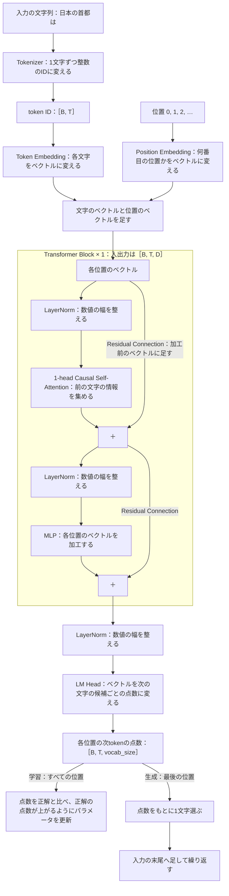
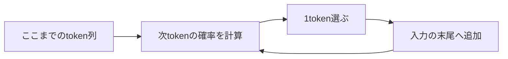
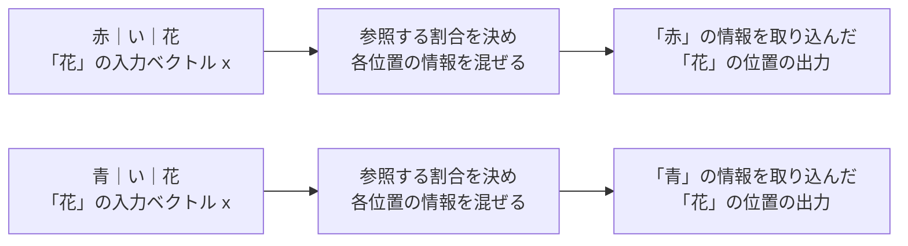
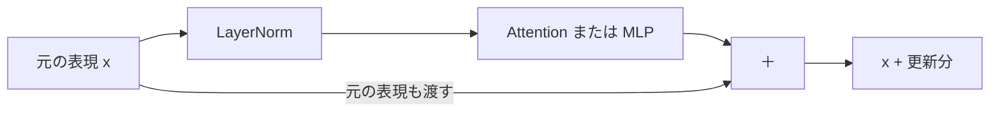

# Part 1 — 1層・1ヘッドのTiny GPTを作る

## これから作るGPTの全体像

このPartでは次の構成のGPTを作ります。入力の文字列は上から順に加工され、最後に「次の文字は何か」の候補ごとの点数になります。図の各部品を実装し、最後に学習と文章生成を動かします。



「日本の首都は」がこの図を通る流れを追ってみます。Tokenizerが6文字をそれぞれ整数のIDに変え、Token EmbeddingとPosition Embeddingが各IDを「どの文字が何番目にあるか」を表すベクトルに変えます。Attentionでは各位置が自分より前の文字の情報を取り込み、たとえば「は」の位置のベクトルに「日本」「首都」の情報が入ります。MLPは、前の文字の情報を取り込んだベクトルを位置ごとに加工します。LM Headは各位置のベクトルを、語彙のすべての文字について「次の文字としてどれだけありそうか」を表す点数に変えます。学習ではこの点数を正解の次の文字と比べ、正解の点数が上がるようにパラメータを更新します。生成では最後の位置「は」の点数から1文字を選び、たとえば「東」を末尾に足した「日本の首都は東」をもう一度この図に通します。

## まず、学習前のGPTで続きを生成してみる

最初に、これから作るGPTを動かしてみましょう。参照コードには完成した計算の仕組みが入っていますが、パラメータはまだ学習していない初期値です。

このPartでは日本語の文章を使います。モデルが扱う単位を **token** と呼びます。この教材では1文字を1tokenにし、「日本の首都は東京です。」は次のように分かれます。

```text
日 | 本 | の | 首 | 都 | は | 東 | 京 | で | す | 。
```

実際のGPTでは1tokenが単語や文字列の一部になることもあります。仕組みは1.2で説明します。

uvが使える環境でこのリポジトリのルートから次のコマンドを実行します。1行目で日本語の1万文書を保存し、2行目で文字の語彙を作ってから学習前のGPTで生成します。ここで保存されるデータは参照コード側の `sample/data/` に入ります。自分の作業用ディレクトリには、1.2で同じ手順で作ります。

```bash
uv run --frozen --directory sample python prepare_data.py
uv run --frozen --directory sample python preview.py
```

GPTのパラメータはまだ学習していません。「プログラミングを学ぶには、」という書きかけの文を渡すと、次のような続きを生成します。以下は実行結果の抜粋です。

```text
プログラミングを学ぶには、息話关仰ι句巳ֹ竿و肉膨櫻逮討際狼諏恕絆引当赦緊砺瀉刈徨͡捨城孙繕盧喝≡鑞じこ劉क堀屏鬱芭唐汐政ي夷帳影廠虚代
```

出てくるのはどれもtrainの文書にある文字ですが、意味の通る並びにはなっていません。GPTはどの文字の後にどの文字が続きやすいかをまだ学んでおらず、語彙の文字をほぼでたらめに選んでいるためです。

それでも内部では次のtokenの確率を計算して1つ選び、入力へ追加する処理が動いています。



**文章を生成する仕組みができていても、適切な続きを予測できるとは限りません。** ではどのように予測を計算し、学習によって何を変えるのでしょうか。

ここから自分の作業用ディレクトリで1つずつ実装していきます。Part 1の最後に同じ入力を使い、学習で予測がどう変わったかを比べましょう。

操作デモ：[学習前のGPTが1tokenずつ生成する過程を見る](demos/part1.html#generation)

## このPartで作るもの

作るのはTransformer Blockを1つ持つDecoder-only Transformer（1.1で説明します）です。Attentionのヘッドも1つにします。固定した日本語の1万文書で次のtokenを予測するように学習させ、同じ入力に対する学習前後の続きを比較します。

目標は、普段使っているLLMの「入力を読む」「学習する」「生成する」が、どの計算に対応するのかを説明できるようになることです。

後のPartではここで作ったBlockを複数並べ、Attentionを複数ヘッドにして生成時のKV Cacheを追加します。学習済みのパラメータからInstruction Tuningを行うところまで、この実装を拡張していきます。

## 学習を始める前の準備

### データと実験の規模を決める

FineWeb-2 Edu Japaneseの `small_tokens_cleaned` から1万文書を取り出して使います。日本語の語句や文末のつながりが学習前後でどう変わるかを観察しましょう。

配布データから重複しない1万文書を選び、train 9,000文書・validation 1,000文書に分けて保存します。以降は同じデータを使うので、実験のたびに取得する必要はありません。

配布元：[FineWeb-2 Edu Japanese](https://huggingface.co/datasets/hotchpotch/fineweb-2-edu-japanese)

| 条件 | 設定 |
|---|---:|
| Block数 | 1 |
| Attentionのヘッド数 | 1 |
| ベクトルの次元 `d_model` | 128 |
| 一度に読む長さ `context_length` | 128token |
| MLPの中間次元 | 512 |
| 一度に処理する系列数 `batch_size` | 16 |
| 語彙数 | 4,052 |
| train / validation | 9,000文書 / 1,000文書 |
| 更新回数 | 10,000回 |
| パラメータ数 | 1,256,276（約126万） |

まず20回更新して一連の処理を確認し、その後で10,000回の更新を実行します。10,000回の更新は数分で終わります（参考環境では約3分）。

### 作業用ディレクトリの構成

このリポジトリの `sample/` に参照用の完成コードがあります。本文を読みながら、自分の作業用ディレクトリ `tiny-gpt-handson/` に実装していきましょう。途中で迷ったときは参照コードの対応するファイルを確認できます。

```text
tiny-gpt-handson/
├── pyproject.toml
├── prepare_data.py
├── 1_2.py               1.2の動作確認
├── 1_3.py               1.3の動作確認（以降も節ごとに作成）
├── 1_13.py              学習と結果の保存
├── data/
│   └── fineweb-japanese-10k/
│       ├── train.jsonl
│       ├── validation.jsonl
│       └── manifest.json  取得条件とデータのハッシュ
├── tiny_gpt/
│   ├── __init__.py       空のファイル
│   ├── config.py        実験条件
│   ├── tokenizer.py     文字の語彙とIDへの変換
│   ├── dataset.py       文書のID化と入力・正解の組
│   ├── model.py         GPTの計算
│   ├── generate.py      次token予測の繰り返し
│   └── train.py         loss・更新・記録
└── runs/
    └── part1/           実行時に作成する結果の保存先
```

`model.py` は1.3で完成時の構造を先に置き、節ごとに部品の中身を埋めて、1.10でモデル全体がつながります。学習コマンドを実行するのは1.13です。

各節の動作確認・実験のコードは、作業用ディレクトリの `1_2.py`・`1_3.py` のように節番号に対応するファイルへ保存します。1.2なら `uv run python 1_2.py` で実行します。各ファイルにはその節で必要な準備処理と確認コードを置き、`tiny_gpt/` の部品を呼び出します。最後の1.13では `1_13.py` から学習を実行し、学習済みパラメータ・設定・語彙を `runs/part1/` に保存します。

### uvで環境を用意する

Python 3.14.7とuvを使います。好きな場所に作業用ディレクトリを作り、移動してください。

```bash
mkdir -p tiny-gpt-handson/tiny_gpt
cd tiny-gpt-handson
touch tiny_gpt/__init__.py
```

以下を `pyproject.toml` として保存します。

```toml
[project]
name = "tiny-gpt-handson"
version = "0.1.0"
requires-python = ">=3.14"
dependencies = [
    "torch==2.14.0",
    "matplotlib==3.11.2",
    "huggingface-hub==1.32.0",
    "pyarrow==25.0.1",
]
```

次のコマンドで依存関係をインストールします。

```bash
uv sync --python 3.14.7
```

以降のコマンドと保存先はこの作業用ディレクトリを基準にします。

### Tensorのshapeを読む

このPartで繰り返し登場する記号は4つです。

| 記号 | 意味 | 最初の設定での例 |
|---|---|---:|
| `B` | バッチサイズ。一度に処理する系列の数 | 学習時16、動作確認では1 |
| `T` | 1系列に含まれるtoken数 | 128 |
| `D` | 1tokenを表すベクトルの次元 | 128 |
| `vocab_size` | 語彙に含まれるtokenの数 | 4,052 |

`B` だけは性格が違います。`T`・`D`・`vocab_size` はモデルの設計で、パラメータの形を決めます。`B` はモデルの構造とは無関係で、同じモデルに互いに無関係な系列を何本まとめて流すかという使い方の数です。系列同士は計算の途中で混ざらないので、16本まとめて流しても1本ずつ16回流しても、各系列の結果は同じです。まとめるのは、学習で複数の文章から一度にパラメータを更新するためで、1.11で必要になります。それまでの動作確認では系列を1本だけ入れるので、`B` は常に1です。

GPTに渡す入力は、B行T列の表です。1行が1つの系列で、列が系列の中の位置です。1.3のEmbeddingを通ると、この表の各マスにD個の数が入ります。図では読みやすさのためにマスを文字で書いていますが、実際に入っているのは文字のIDです。ベクトルの数値は説明用です。

```text
[B, T]：B行T列のID表（B=2系列、T=6文字の例）
  系列0:  日    本    の    首    都    は
  系列1:  東    京    は    大    き    い

[B, T, D]：同じ表の各マスに、D個の数が入る
  系列0の「日」 → [0.2, -0.5,  0.1, 0.8, …]  D個
  系列0の「本」 → [0.4,  0.1, -0.3, 0.0, …]  D個
  …
  系列1の「い」 → [-0.1, 0.6,  0.2, 0.3, …]  D個
```

`[B, T, D]` は「B個の系列があり、それぞれのT個の位置にD次元のベクトルがある」という意味です。最初の設定では `T` も `D` も128ですが、別の軸です。

### 実験条件を1か所に置く

設定値を変更したら別の名前で結果を保存します。比較するときにどの設定で得た結果かを見失わないためです。

**保存先：`tiny_gpt/config.py`。**

```python
class Config:
    def __init__(self) -> None:
        # 1tokenを表すベクトルの次元数（shapeの D）。1tokenの性質を
        # D個の数で表すので、Dが大きいほど1tokenに持たせられる性質の数が増える
        self.d_model: int = 128
        # 1系列に入れるtoken数の上限。shapeの T はこの値以下。
        # Attentionが参照できる範囲であり、生成時に見返せる長さでもある
        self.context_length: int = 128
        # 1回の更新に使う系列の数（shapeの B）。
        # B本ぶんのlossを平均して、パラメータを1回だけ更新する
        self.batch_size: int = 16
        # パラメータを更新する回数。
        # 1stepで batch_size × context_length 個のtokenから学習する
        self.steps: int = 10000
        # 1回の更新でパラメータを動かす幅。lossが下がる向きへ、
        # この幅に応じて動かす（1.11で扱う）。AdamWに渡す
        self.learning_rate: float = 0.0003
        # 何stepごとにvalidationのlossを測るか
        self.eval_every: int = 1000
        # 評価1回で使うバッチ数。複数バッチの平均を取り、lossのぶれを抑える
        self.eval_batches: int = 8
        # 乱数の種。初期化するパラメータと、学習に使うバッチの切り出し位置を
        # 実行ごとに同じにする
        self.seed: int = 42
        # 結果の保存先 runs/<run_name>。設定を変えて比較するときは名前も変える
        self.run_name: str = "part1"
```

## 1.1 GPT全体の流れ — 各位置で次のtokenを予測する

冒頭で動かしたGPTは、次のtokenを1つ選んで入力へ追加する処理を繰り返していました。この節では、その「次のtokenを予測する」をどんな計算問題として定義するかを決めます。ここで決めた問題を、1.2以降の部品で1つずつ解いていきます。

**GPTは、入力の位置ごとに「次に来るtoken」を予測し、語彙のすべての候補に点数を付けて返します。** 「日本の首都は東京です。」をtokenへ分けて末尾の「。」を除いて入力すると、10個の位置それぞれで次のtokenを予測します。

| 入力の位置 | その位置までの入力 | 予測する正解token |
|---|---|---|
| 0 | 日 | 本 |
| 1 | 日本 | の |
| 2 | 日本の | 首 |
| 3 | 日本の首 | 都 |
| 4 | 日本の首都 | は |
| 5 | 日本の首都は | 東 |
| 6 | 日本の首都は東 | 京 |
| 7 | 日本の首都は東京 | で |
| 8 | 日本の首都は東京で | す |
| 9 | 日本の首都は東京です | 。 |

「予測する」の中身は、語彙のすべての候補に点数を付けることです。たとえば位置5の出力には、4,052個の候補それぞれの点数が並びます。数値は説明用です。

```text
位置5（ここまでの入力：日本の首都は）の出力
  候補「東」  3.2
  候補「大」  1.1
  候補「京」  0.4
  …（語彙の4,052個すべてに点数が付く）
```

点数が高い候補ほど、次に来やすいとモデルが見ていることを表します。この点数を1.10でlogitと呼びます。学習前のGPTでは点数がほぼでたらめで、学習によって正解の「東」の点数が上がっていきます。

**1回の計算で、10個の位置すべての予測が同時に出ます。** 位置0の「日」から位置9の「す」まで、各位置に4,052個の点数が並ぶので、出力は10行×4,052列の表になります。そのため学習では、1つの文から10個の予測問題を一度に解き、10個の正解とまとめて比べられます。出力のshapeは1系列なら `[1, 10, vocab_size]` です。

ただし位置5で「東」を予測するとき、入力の位置6にある「東」を見せてはいけません。答えを見てから当てても、予測を学んだことにならないためです。この制限は1.6のCausal Maskで実装します。

各位置で次のtokenを予測できれば、文章全体の確率も扱えます。文章は長さが決まっていないので、文章全体を1つの出力として予測することはできません。代わりに、「ここまでの文字を読んだとき、次にその文字が来る確率」の掛け算に分けます。

```text
P(日本の首都は東京です。)
  = P(日) × P(本 | 日) × P(の | 日本) × P(首 | 日本の) × …
    × P(。 | 日本の首都は東京です)
```

`P(本 | 日)` は「日」を読んだ後に「本」が来る確率です。2項目以降の各項は上の表の各行に対応し、どれも同じモデルで予測できます。このように次のtokenの予測を積み重ねて文章を扱うモデルを、自己回帰言語モデルと呼びます。

この教材のGPTは入力の文字列だけを読んで続きを予測します。翻訳モデルのように別の文を読み込む部品は持ちません。この構成を **Decoder-only** と呼びます。

モデルが完成すると、呼び出し方は次の形になります。この節ではまだ実行できません。1.3から部品を作り始め、1.10でこの形になります。

```python
# 1.2のTokenizerで「日本の首都は」を変換したID列。1系列6文字なので [1, 6]
token_ids = torch.tensor([[1879, 1959, 482, 3934, 3660, 483]], dtype=torch.long)
# 6個の位置それぞれについて、語彙の全候補の点数が返る。[1, 6, vocab_size]
logits = model(token_ids)
last_logits = logits[:, -1, :]
```

`logits[:, -1, :]` は「すべての系列について、最後の位置のすべての候補」を取り出します。ここでは「は」の位置の点数で、「日本の首都は」の次に来る文字の候補を表します。生成時に知りたいのは入力の続きなので、最後の位置を使います。

### この節で理解したこと

GPTの基本的な仕事は過去のtoken列を条件に次のtokenを予測することです。学習と生成では同じモデルの出力を違う目的で使います。

## 1.2 学習データとTokenization — 文字列を予測問題に変える

GPTを学習させるには、「ここまでの入力」と「その次に来るtoken」の組が大量に必要です。次のtokenを予測する問題なら、人が別途回答を書く必要はありません。元の文章の続きがそのまま正解になるので、文章そのものから学習問題を作れます。

ただしモデルが扱えるのは数値のTensorだけで、文字列をそのまま入力できません。学習問題を作る前に、文字列を数値の列へ変える必要があります。

そこでTokenizerで文字列をtokenへ分割し、それぞれを整数IDへ変換します。さらに同じtoken列から1tokenずらした2つの系列を切り出し、入力と正解を作ります。

今回のTokenizerは1文字を1tokenにします。文字をIDへ変えるには、どの文字を何番にするかを決めた表が要ります。この表を語彙と呼びます。

**語彙はtrainの文書に出てきた文字を並べた表です。** 文字をコード順に並べ、表の添字をtoken IDにします。今回のデータには4,050種類の文字が出てきます。先頭の2つは文字ではない特別なtokenで、後で説明します。実際に作った語彙の一部は次のとおりです。

```text
ID     token
0      <eos>
1      <unk>
2      改行
3      空白
4      !
5      "
…
415    。
…
461    す
…
475    で
…
481    ね
482    の
483    は
…
670    京
…
1879   日
…
1959   本
…
1983   東
…
3660   都
…
3934   首
…      （全4,052個）
```

Tokenizerは文字ごとにこの表を引き、対応するIDに置き換えます。「日本の首都は東京です。」は11個のtokenになり、次のID列になります。

```text
文字： 日     本     の    首     都     は    東     京    で    す    。
ID：   1879   1959   482   3934   3660   483   1983   670   475   461   415
```

IDの大小には意味がなく、文字をコード順に並べた結果にすぎません。「の」（482）の隣が「ね」（481）と「は」（483）なのもそのためです。このID列は、この節の `1_2.py` を実行すると同じ値で確認できます。

実際のGPTは、よく現れる文字の並びを1つのtokenにまとめるBPEという方式を使い、語彙も数万から十数万あります。仕組みの理解には1文字単位で十分なので、この教材では文字単位のまま進めます。

語彙には文字とは別に、特別なtokenを2つ予約します。文書の終わりを示す専用の終端token（EOS）と、語彙にない文字を表すtoken（UNK）です。validationにはtrainに出ない文字が少しあり、その文字だけUNKに置き換えます。

このID列から1tokenずらした2つの系列を切り出すと、入力と正解になります。区切りを `/` で表すと、入力と正解の対応は次のとおりです。

```text
元の列： 日 / 本 / の / 首 / 都 / は / 東 / 京 / で / す / 。
入力 x： 日 / 本 / の / 首 / 都 / は / 東 / 京 / で / す
正解 y： 本 / の / 首 / 都 / は / 東 / 京 / で / す / 。
```

位置0では「日」から「本」、位置1では「日 / 本」から「の」を予測します。`y` は「一度に生成すべき別の文章」ではなく、各位置に対応する正解を並べたものです。

1つの文なら、入力も正解も10個のIDの並びです。学習ではB個の文をまとめて扱うので、入力も正解もB行T列の表になります。shapeで書くと `x` と `y` はどちらも `[B, T]` です。

Tokenizerの語彙を作ることとGPTを学習させることは別の処理です。

| 処理 | 決まるもの | この後の扱い |
|---|---|---|
| 語彙作成 | 文字とtoken IDの対応 | 固定して使う |
| GPTの学習 | EmbeddingやAttentionなどのパラメータ | 次token予測の誤差から更新する |

語彙の作成にはtrainの文書だけを使います。validationはGPTのパラメータ更新にも語彙作成にも使いません。

### 実装

まず、参照コードの [prepare_data.py](../sample/prepare_data.py) を手元の作業用ディレクトリへコピーし、実行してください。このファイルには取得条件を固定して文書を保存する処理がまとまっています。

```bash
uv run python prepare_data.py
```

**trainはパラメータ更新に使う文書、validationは更新に使わず予測を測る文書**です。文書単位で分けることで同じ文書の前半がtrain、後半がvalidationに入ることを防ぎます。

次に、文字の語彙を作り、文字列とID列を変換するコードを書きます。

**保存先：`tiny_gpt/tokenizer.py`。**

```python
import json
from pathlib import Path


DATA_DIR = Path("data/fineweb-japanese-10k")
# 文字とは別に語彙の先頭へ予約する特別なtoken。文字列は表示用の名前で、
# 文章の中には現れない。
# EOS: 文書の終わり。文書の末尾にだけ付ける。GPTはこれも予測対象として学習し、
#      生成時に選んだら文章を終了する。
# UNK: 語彙にない文字。trainに出なかった文字がvalidationやpromptに現れたとき、
#      その文字だけこのtokenに置き換える。
EOS_TOKEN = "<eos>"
UNK_TOKEN = "<unk>"


def read_texts(path: Path) -> list[str]:
    texts: list[str] = []
    with path.open(encoding="utf-8") as source:
        for line in source:
            document = json.loads(line)
            texts.append(document["text"])
    return texts


class Tokenizer:
    def __init__(self, tokens: list[str]) -> None:
        # ID順に並べたtokenの表。token IDはこの表の添字。
        self.tokens: list[str] = tokens
        self.token_to_id: dict[str, int] = {}
        for token_id, token in enumerate(tokens):
            self.token_to_id[token] = token_id
        self.vocab_size: int = len(tokens)
        self.eos_id: int = self.token_to_id[EOS_TOKEN]
        self.unk_id: int = self.token_to_id[UNK_TOKEN]

    @classmethod
    def from_texts(cls, texts: list[str]) -> "Tokenizer":
        chars: set[str] = set()
        for text in texts:
            chars.update(text)
        return cls([EOS_TOKEN, UNK_TOKEN] + sorted(chars))

    def encode(self, text: str) -> list[int]:
        token_ids: list[int] = []
        for char in text:
            token_ids.append(self.token_to_id.get(char, self.unk_id))
        return token_ids

    def decode(self, token_ids: list[int]) -> str:
        chars: list[str] = []
        for token_id in token_ids:
            chars.append(self.tokens[token_id])
        return "".join(chars)
```

`Tokenizer.from_texts` がtrainの文字から語彙を作り、`encode` と `decode` が文字列とID列を変換します。

**`1_2.py` を次の内容で作成します。** 語彙はtrainの文書から毎回作ります。1秒もかからず、同じ文書からは同じ語彙ができます。

```python
from tiny_gpt.tokenizer import DATA_DIR, Tokenizer, read_texts

tokenizer = Tokenizer.from_texts(read_texts(DATA_DIR / "train.jsonl"))
text = "日本の首都は東京です。"
token_ids = tokenizer.encode(text)
print("語彙数:", tokenizer.vocab_size)
print("入力:", text)
print("token ID:", token_ids)
print("復元:", tokenizer.decode(token_ids))
```

```bash
uv run python 1_2.py
```

先ほど語彙を引いて求めたものと同じID列が出て、`decode` で元の文字列に戻ります。

```text
語彙数: 4052
入力: 日本の首都は東京です。
token ID: [1879, 1959, 482, 3934, 3660, 483, 1983, 670, 475, 461, 415]
復元: 日本の首都は東京です。
```

### 動作確認 — 入力と正解の対応を見る

各位置の正解が「1token先」になっているかを、ID列と復元した文章で確かめます。

**`1_2.py` の末尾に次を追記し、同じコマンドで実行します。**

```python
import torch

ids = torch.tensor(tokenizer.encode(text), dtype=torch.long)
x = ids[:-1]
y = ids[1:]
print("元のID:", ids.tolist())
print("入力:", tokenizer.decode(x.tolist()))
print("正解:", tokenizer.decode(y.tolist()))
print(x.shape, y.shape)
assert tokenizer.decode(tokenizer.encode(text)) == text
```

入力は「日本の首都は東京です」、正解は「本の首都は東京です。」になり、shapeはどちらも `[10]` です。

trainに出てこない文字を `encode` するとUNKのIDになり、`decode` すると `<unk>` と表示されます。

### この節で理解したこと

Tokenizerは文字列をtoken ID列へ変換します。入力と正解を1tokenずらすことで文章そのものから次token予測の学習問題を作れます。

## 1.3 Token Embedding — 整数のラベルを学習できるベクトルへ変える

次tokenを予測するには「今のtokenがどんな性質を持つか」が必要です。たとえば「。」は文の終わりを表し、「は」は名詞の後に来やすい助詞です。こうした性質があるからこそ、その後に何が来やすいかを絞れます。

ところが1.2で作ったtoken IDは「どのtokenか」を区別するための番号にすぎず、こうした性質を入れる場所がありません。IDが10と11だからといって、その2つのtokenの使われ方が似ているとは限りません。IDをそのまま量として計算に使うと、番号の大小や差という無関係な情報を持ち込んでしまいます。

そこで各tokenに、性質を保持するための入れ物としてベクトルを割り当てます。これがToken Embeddingです。ベクトルは複数の成分を持つので、1つのtokenについて「文の終わりらしさ」「助詞らしさ」のような複数の性質を同時に持てます。

**Token Embeddingは、語彙の1文字につき1行のベクトルを持つ表です。** 行の番号がtoken IDに対応し、各行にD個の数が並びます。1.2の語彙で作ると次の形になります。

```text
Embedding表（語彙数4,052行 × D列。数値は説明用、D=4で表示）
ID     文字    成分0   成分1   成分2   成分3
…
415    。      0.9    -0.2     0.1     0.0
…
448    が     -0.3     0.8     0.1    -0.3
…
482    の     -0.1     0.7     0.3    -0.4
483    は     -0.2     0.8     0.2    -0.3
…
1879   日      0.3    -0.1    -0.6     0.5
…
1959   本      0.2     0.0    -0.5     0.6
…
```

文字をベクトルに変えるには、token IDの番号の行をこの表から引きます。「日本の」なら次のとおりです。

```text
入力「日本の」
  日 → ID 1879 → 行1879を引く → [ 0.3, -0.1, -0.6,  0.5]
  本 → ID 1959 → 行1959を引く → [ 0.2,  0.0, -0.5,  0.6]
  の → ID 482  → 行482を引く  → [-0.1,  0.7,  0.3, -0.4]
```

3つのIDが、それぞれ4個の数の並びに置き換わりました。IDの番号は行を探すためだけに使います。以降の計算はIDが何番かではなく、このベクトルが表す性質をもとに進みます。

表の値は人が決めるのではありません。最初は乱数で、次token予測の学習によって少しずつ更新されます。学習が進むと、使われ方が似たtokenは似たベクトルへ近づいていく傾向があります。上の表で「が」「の」「は」の行が似た数値なのは、その状態を表しています。どれも助詞で、後ろに名詞や動詞が来やすいという共通の性質が、似たベクトルとして表れます。ベクトルが似ていれば以降の計算でも似た扱いを受けるので、「は」の後ろを予測して学んだことが「が」の後ろの予測にも効きます。文字ごとに一から覚えなくてよくなります。

ベクトルの各成分に、人が「文の終わりらしさ」「助詞らしさ」などの意味を先に割り当てるわけではありません。学習の結果、たまたま成分1が大きい文字に助詞が多い、という形になることはありますが、そうなる保証はありません。性質は成分の組み合わせに表れます。

式で書くと `tokenベクトル = E[token ID]` です。Eは `[vocab_size, D]` の表で、学習中に更新されるのはIDの番号ではなくこの表の値です。上の例では系列1本のT個のIDから `[T, D]` を引きました。モデルは複数の系列をまとめて受け取れるようにしておくので、入力のshapeは `[B, T]`、行を引いた結果は `[B, T, D]` と書きます。この節の動作確認では系列を1本だけ入れるので `B=1` です。

### 実装

この節からモデル本体を作り始めます。まず `model.py` に完成時の構造を置きます。部品のクラスは名前と入出力の型だけを書き、中身は使う節で埋めます。モデル全体の `TinyGPT` は、冒頭の図のとおりEmbedding・Block・最後のLayerNorm・LM Headの順に通す完成形で書きますが、この節で動くのはToken Embeddingだけです。`TransformerBlock`・`LayerNorm`・`FeedForward` は中身を書くまで入力をそのまま返し、LM Headは1.10まで `nn.Identity` で素通しにします。

表は `nn.Embedding` で作ります。行数が語彙数、列数がConfigの `d_model` です。

**`tiny_gpt/model.py` を次の内容で作成します。**

```python
import torch
from torch import nn

from tiny_gpt.config import Config


def scaled_attention(
    q: torch.Tensor, k: torch.Tensor, v: torch.Tensor,
) -> tuple[torch.Tensor, torch.Tensor]:
    # 出力とAttention weightの組を返すので、入力をそのまま返す形が作れない。
    # 1.9でBlockの中身を書くまで呼ばれない。1.5で実装する。
    raise NotImplementedError("1.5で実装する")


class SelfAttention(nn.Module):
    def forward(self, x: torch.Tensor) -> tuple[torch.Tensor, torch.Tensor]:
        # scaled_attentionと同じ理由で、入力をそのまま返す形が作れない。1.5で実装する。
        raise NotImplementedError("1.5で実装する")


class FeedForward(nn.Module):
    def __init__(self, d_model: int) -> None:
        super().__init__()

    def forward(self, x: torch.Tensor) -> torch.Tensor:
        # 1.7で実装するまで、入力をそのまま返す。
        return x


class LayerNorm(nn.Module):
    def __init__(self, d_model: int) -> None:
        super().__init__()

    def forward(self, x: torch.Tensor) -> torch.Tensor:
        # 1.8で実装するまで、入力をそのまま返す。
        return x


class TransformerBlock(nn.Module):
    def __init__(self, d_model: int) -> None:
        super().__init__()

    def forward(self, x: torch.Tensor) -> torch.Tensor:
        # 1.9で実装するまで、入力をそのまま返す。
        return x


# TinyGPTの構造
#
# ids [B, T]
#   │ token_embedding + position_embedding
#   ▼
# x [B, T, D]
#   │ transformer_block: TransformerBlock
#   │   x = x + attention(norm1(x))   SelfAttention・LayerNorm
#   │   x = x + mlp(norm2(x))         FeedForward・LayerNorm
#   ▼
# x [B, T, D]
#   │ final_norm: LayerNorm
#   │ lm_head: Linear(D, vocab_size)
#   ▼
# logits [B, T, vocab_size]
class TinyGPT(nn.Module):
    def __init__(self, vocab_size: int, config: Config) -> None:
        super().__init__()
        self.token_embedding = nn.Embedding(vocab_size, config.d_model)
        self.transformer_block = TransformerBlock(config.d_model)
        self.final_norm = LayerNorm(config.d_model)
        # 1.10で、D次元からvocab_size次元へ変換するLinearに置き換える。
        self.lm_head = nn.Identity()

    def forward(self, ids: torch.Tensor) -> torch.Tensor:
        # token_embeddingは語彙数×Dの表で、各行が1つの文字の性質を表すベクトル。
        # idsの各文字IDでその文字の行を引き、整数のIDを学習で更新できるベクトルに
        # 置き換える。[B, T] → [B, T, D]
        x = self.token_embedding(ids)
        x = self.transformer_block(x)
        x = self.final_norm(x)
        x = self.lm_head(x)
        return x
```

`TinyGPT` の直前のコメントが完成時の構造で、`forward` はその順に部品を通します。上に並べた部品のうち、`scaled_attention` と `SelfAttention` は1.5と1.6、`FeedForward` は1.7、`LayerNorm` は1.8、`TransformerBlock` は1.9で中身を書きます。`scaled_attention` と `SelfAttention` だけは、コメントにある理由で `NotImplementedError` にしておきます。

### 動作確認 — IDの番号の行を表から引いているか

1.2のTokenizerで「日本の」をID列にし、そのままモデルへ入れます。語彙は1.2と同じ4,052文字なので表は4,052行になり、表示して読めるように `d_model` だけ4にします。

**`1_3.py` を次の内容で作成します。**

```python
import torch
from tiny_gpt.config import Config
from tiny_gpt.model import TinyGPT
from tiny_gpt.tokenizer import DATA_DIR, Tokenizer, read_texts

tokenizer = Tokenizer.from_texts(read_texts(DATA_DIR / "train.jsonl"))

config = Config()
config.d_model = 4
model = TinyGPT(tokenizer.vocab_size, config)

ids = torch.tensor([tokenizer.encode("日本の")], dtype=torch.long)
print("入力:", tokenizer.decode(ids[0].tolist()))
print("ID:", ids.tolist())
x = model(ids)
print(x.shape)
print(x[0])
print(torch.equal(x[0], model.token_embedding.weight[ids[0]]))
```

```bash
uv run python 1_3.py
```

`ids` は `[[1879, 1959, 482]]` になります。内側が「日 本 の」の3文字の系列で、本文の例と同じIDです。外側の `[ ]` はバッチの軸で、系列を1本だけ入れているので `B=1` です。複数の系列をまとめて入れるのは、学習で必要になる1.11で扱います。表から引くのは行1879・行1959・行482で、入力のshape `[1, 3]` が出力の `[1, 3, 4]` に変わります。`transformer_block` 以降はまだ入力をそのまま返すので、表示される3行は表から引いた行そのものです。

最後の行がそれを確かめています。`model.token_embedding.weight` が式のEにあたる `[4052, 4]` の表で、`[ids[0]]` で行1879・行1959・行482を取り出したものが `x[0]` と一致し、`True` と表示されます。表の値は乱数で初期化されるので、表示される数値は実行のたびに変わります。

Embeddingを引いた直後は、各文字のベクトルが他の文字を参照していません。同じtokenでも文脈によって役割は変わりますが、それを反映する処理はこの後で追加します。

### この節で理解したこと

Embeddingはtokenを学習可能なベクトルに変換する表です。IDという番号では持てないtokenの性質をベクトルとして保持し、以降の計算で使えるようにします。文脈を処理する前の各tokenの出発点となる表現です。

## 1.4 Position情報 — 同じtokenがどこにあるかを表す

文章の意味は、どのtokenが並ぶかだけでなく、どの順で並ぶかで決まります。「犬が猫を追う」と「猫が犬を追う」は同じ文字の集まりですが、追う側と追われる側が逆です。次token予測でも同じで、同じtokenの集まりでも並びが違えば次に来やすいtokenは変わります。予測のためには、各tokenが何番目にあるかをモデルが分かる必要があります。

ところが1.3までの処理では、各位置のベクトルはそのtokenのIDだけで決まります。「東京と京都」と「京都と東京」は同じ5文字を並べ替えただけなので、表から引いた5つのベクトルの集まりとしては同じで、位置の情報はどこにも入っていません。さらに「東京と京都」には「京」が2回出ますが、位置1の「京」と位置3の「京」はまったく同じベクトルになり、「東京」の京なのか「京都」の京なのかを区別できません。1.5で足すSelf-Attentionは各位置のベクトルの中身だけを見て情報を集めるので、ここで位置を入れておかないと後の処理でも順序を使えません。

そこで「どのtokenか」に加えて「何番目の位置か」をベクトルに入れます。このPartでは、位置にも学習可能なベクトルを割り当てるPosition Embeddingを使います。

**Position Embeddingは位置番号ごとに1行のベクトルを持つ表で、各tokenのベクトルにその位置の行を足します。** Token Embeddingが文字のIDで行を引いたように、位置の表は位置番号0, 1, 2, …で行を引きます。「京」が2回出る「東京と京都」で追うと次のようになります。IDは1.2のTokenizerが実際に付ける番号で、ベクトルの数値は説明用です。

```text
入力 ids[0] = [1983, 670, 476, 670, 3660]     token列「東 京 と 京 都」

token_embedding（4052行×4列）               position_embedding（128行×4列。先頭5行を表示）
  行1983「東」: [0.5, 0.1, 0.2, 0.9]          行0: [0.1, 0.0, 0.3, 0.2]
  行670 「京」: [0.3, 0.8, 0.0, 0.1]          行1: [0.0, 0.4, 0.1, 0.0]
  行476 「と」: [0.2, 0.0, 0.6, 0.3]          行2: [0.2, 0.2, 0.0, 0.5]
  行3660「都」: [0.7, 0.4, 0.1, 0.0]          行3: [0.3, 0.1, 0.4, 0.1]
                                              行4: [0.0, 0.5, 0.2, 0.3]

位置0の「東」:  行1983 + 位置0 → [0.6, 0.1, 0.5, 1.1]
位置1の「京」:  行670  + 位置1 → [0.3, 1.2, 0.1, 0.1]
位置2の「と」:  行476  + 位置2 → [0.4, 0.2, 0.6, 0.8]
位置3の「京」:  行670  + 位置3 → [0.6, 0.9, 0.4, 0.2]   同じ「京」でも位置が違えば別のベクトル
位置4の「都」:  行3660 + 位置4 → [0.7, 0.9, 0.3, 0.3]
```

位置1と位置3の「京」は、足す前はどちらも行670の `[0.3, 0.8, 0.0, 0.1]` です。そこへ位置1の行と位置3の行という別々の行を足すので、足した後は違うベクトルになります。

足した結果は、「何の文字か」と「何番目か」を1本のベクトルに重ねたものです。足すと文字の情報が崩れるように見えますが、ベクトルにはD個の成分があります。学習が進むと、文字の情報と位置の情報が別々の成分の組み合わせに載るように2つの表が調整されていきます。位置の表もToken Embeddingと同じく最初は乱数で、学習で更新されます。

式で書くと `位置tのベクトル = token_embedding[位置tのID] + position_embedding[t]` です。位置のベクトルは全系列で共通なので、同じ `[T, D]` の表をどの系列にも足します。PyTorchはこの足し算を自動で各系列へ適用するので、`[B, T, D]` に `[T, D]` を足した結果は `[B, T, D]` になります。

位置の表し方はこれだけではありません。RoPEのように、Attentionの計算へ位置関係を組み込む方式もあります。このPartではまずEmbeddingを足す方式でPosition情報の役割を確かめます。

### 実装

位置の表を `TinyGPT` に足します。行数はConfigの `context_length` です。`forward` では入力の長さに応じて `0, 1, 2, ...` という位置番号を作り、位置の表から行を引いてToken Embeddingへ足します。

**`model.py` の `TinyGPT` に、位置の表とそれを足す処理を追加します。**

以下の `...` は変更しない既存部分の省略です。手元のコードは残してください。独立した追加項目には `# ← 追加`、まとまった追加処理には先頭に `# --- 追加: ... ---` を1つ付けます。以降もこの記法を使い、既存部分を変更するときは `# --- 差し替え: ... ---` で対象を示します。

```python
class TinyGPT(nn.Module):
    def __init__(self, vocab_size: int, config: Config) -> None:
        super().__init__()
        self.context_length = config.context_length  # ← 追加
        self.token_embedding = nn.Embedding(vocab_size, config.d_model)
        self.position_embedding = nn.Embedding(  # ← 追加
            config.context_length, config.d_model
        )
        ...

    def forward(self, ids: torch.Tensor) -> torch.Tensor:
        # --- 追加: Token Embeddingを引く前 ---

        length = ids.shape[1]
        if length == 0 or length > self.context_length:
            raise ValueError("入力の長さがcontext_lengthの範囲外です")

        # 0, 1, 2, … という位置番号。位置の表の行を引くのに使う。
        positions = torch.arange(length)

        x = self.token_embedding(ids)
        # 各位置のベクトルに、位置の表からその位置の行を足す。「何の文字か」に
        # 「何番目か」が重なったベクトルになる。位置の表は全系列で共通。
        # [B, T, D] + [T, D]
        x = x + self.position_embedding(positions)  # ← 追加
        x = self.transformer_block(x)
        ...
```

この方式では用意した位置の表より長い系列をそのまま入力できません。たとえば位置の表が128行なら使える位置は0〜127です。`forward` の先頭で長さを確かめているのはこのためです。

### 動作確認 — 同じ「京」でも位置が違えば別のベクトルになるか

本文と同じ「東京と京都」を入れ、位置1と位置3の「京」を比べます。位置を足す前は同じベクトルですが、足した後は違うベクトルになるはずです。

**`1_4.py` を次の内容で作成します。**

```python
import torch
from tiny_gpt.config import Config
from tiny_gpt.model import TinyGPT
from tiny_gpt.tokenizer import DATA_DIR, Tokenizer, read_texts

tokenizer = Tokenizer.from_texts(read_texts(DATA_DIR / "train.jsonl"))

config = Config()
config.d_model = 4
model = TinyGPT(tokenizer.vocab_size, config)

ids = torch.tensor([tokenizer.encode("東京と京都")], dtype=torch.long)
token_vectors = model.token_embedding(ids)
x = model(ids)

print("位置を足す前")
print("位置1の「京」:", token_vectors[0, 1].detach())
print("位置3の「京」:", token_vectors[0, 3].detach())
print("位置を足した後")
print("位置1の「京」:", x[0, 1].detach())
print("位置3の「京」:", x[0, 3].detach())
```

```bash
uv run python 1_4.py
```

「位置を足す前」の2行は、どちらもToken Embeddingの「京」の行なので同じ数値になります。「位置を足した後」の2行は、位置1と位置3のベクトルをそれぞれ足しているので違う数値になります。これで同じ文字にも「どこにあるか」の違いが入りました。表の値は乱数で初期化されるため、具体的な数値は実行のたびに変わります。

この時点では `transformer_block` 以降が入力をそのまま返すので、`model(ids)` の出力で位置を足した直後のベクトルを見られます。

### この節で理解したこと

Position情報はtokenの内容に加えて位置や順序を計算へ持ち込むためにあります。学習可能な位置の表を使う方式では、その表の長さが入力できる長さの上限になります。

## 1.5 1-head Self-Attention — 他のtokenから情報を集める

「赤い花が咲いた。」「青い花が咲いた。」では、同じ「花」でも文中で示されている色が違います。こうした文脈の違いを予測に使うには、他の文字の情報を取り込む必要があります。

1.4までの処理では、各位置のベクトルは文字と位置だけで決まります。どちらの文も「花」は位置2にあるので、そのベクトルは同じです。前に「赤」があるか「青」があるかは、まだ反映されていません。

この違いを取り込む役割を担うのがSelf-Attentionです。**各位置が「どの位置から、どれだけ情報を取り込むか」を入力に応じて決め、その割合で情報を混ぜます。** 色に着目して情報を集める場合を、模式図で見てみましょう。



この処理を「花」だけでなく、すべての位置で行います。各位置から見た割合を計算するので、位置ごとに異なる情報を集められます。参照する側もされる側も同じ入力列にあるため、Self-Attentionと呼びます。

### 集める割合と渡す情報を、学習で決める

どこを参照するかは、人が指定するのではなく次token予測に役立つように学習します。そのために、各位置の入力ベクトルから3種類のベクトルを作ります。先ほどの色に着目する例なら、それぞれの役割は次のように考えられます。

| ベクトル | 役割 | 色に着目する場合の例 |
|---|---|---|
| **Query（Q）** | 参照する側が探す特徴 | 「花」から、色の情報を参照したいという特徴を取り出す |
| **Key（K）** | 参照される側の目印 | 「赤」から、色の情報を提供できるという特徴を取り出す |
| **Value（V）** | 参照先から実際に渡す内容 | 「赤」から、赤さの情報を取り出す |

QとKを分けると、参照する側が探す特徴と、参照される側が提供する特徴を別々に調整できます。また、「赤」も「青」も色の情報として参照したくても、受け取りたい内容は違います。そこで、目印のKと渡す内容のVも分けて作ります。

各位置で同じ入力に3つの線形変換をかけます。入力の成分を混ぜて新しい成分を作る変換で、その混ぜ方を決める `D × D` の数の表がWq・Wk・Wvです。

```text
各位置の入力ベクトル x
  ├─ Wqで変換 → Q：何を参照したいか
  ├─ Wkで変換 → K：どんな参照先になるか
  └─ Wvで変換 → V：相手へ何を渡すか
```

**Q・K・Vは入力から計算するベクトルで、Wq・Wk・Wvが学習するパラメータです。** 各Wは全位置で共通に使います。「色を探す」といった役割を人が書き込むのではなく、次token予測の誤差から変換を学習します。

### 「花」の位置へ情報を集める計算を追う

先頭の3文字「赤い花」を使い、「花」が各位置から情報を集める計算を追います。流れは、Q・Kの照合、割合への変換、Vの混合の3段階です。

QとKの合い具合を数値にするには、類似度を測る計算である内積を使います。内積は対応する成分を掛けて足します。参照先ごとのスコア（score）は、この内積を `√d_k` で割った値です。`d_k` はQ・Kの成分数で、成分数が増えても割合が極端に偏りにくくなるよう、値の幅を調整しています。

次に、全参照先のスコアをまとめてsoftmaxに渡し、合計が1の割合に変えます。スコアが大きい位置ほど多くの情報を取り込みます。この割合がAttention weightです。

「花」のQueryを `[1, 0, 1, 0]` として計算した例を示します。数値は説明用で、割合は小数第2位に丸めています。

| 参照先 | Key | スコア | 割合 | Value |
|---|---|---:|---:|---|
| 赤 | `[2, 0, 2, 0]` | 2 | 0.79 | `[2, 0, 0, 0]` |
| い | `[0, 1, 0, 0]` | 0 | 0.11 | `[0, 1, 0, 0]` |
| 花 | `[0, 0, 0, 1]` | 0 | 0.11 | `[0, 0, 1, 0]` |

たとえば「赤」へのスコアは `(1×2 + 0×0 + 1×2 + 0×0) / √4 = 2` です。他の2つの内積は0になります。softmaxにより、「赤」から約8割、残りから約1割ずつ取り込む割合になります。

最後に、各位置のValueへこの割合を掛けて足します。これが「情報を集める」の計算です。

```text
「花」の位置へ集める情報
  ≈ 0.79 × [2, 0, 0, 0]   ← 「赤」のValue
  + 0.11 × [0, 1, 0, 0]   ← 「い」のValue
  + 0.11 × [0, 0, 1, 0]   ← 「花」のValue
  = [1.58, 0.11, 0.11, 0]
```

「赤」のValueが大きな割合で含まれるベクトルができました。先頭が「青」に変われば、その位置から作るK・Vも変わります。この計算により、「花」自身の入力が同じでも周囲の文字の違いを出力へ反映できます。

操作デモ：[割合を掛けてValueを足す計算を見る](demos/part1.html#weighted-sum)

### 同じ計算を全位置でまとめて行う

「赤」「い」の位置でも、それぞれ自分のQueryを使って同じ計算をします。全位置のスコアを表にすると、行が参照する側、列が参照される側になります。

```text
                     参照される位置（Key）
                         赤    い    花
参照する位置    赤        ·     ·     ·
（Query）       い        ·     ·     ·
                花        2     0     0   ← 先ほどの計算
```

各位置の入力を行に並べた行列を `X`、Q・K・Vを行に並べた行列をそれぞれ `Q`・`K`・`V` とすると、全位置の計算を次のように書けます。バイアスは省略しています。

```text
Q = XWq,  K = XWk,  V = XWv

scores  = QKᵀ / √d_k         各位置から各位置へのスコア [T, T]
weights = softmax(scores)     行ごとに合計1の割合にする
mixed   = weights V          各行の割合でValueを混ぜる [T, D]
```

`QKᵀ` は全位置のQとKの内積をまとめて求める行列積です。`weights V` の「花」の行は、先ほどのValueを足す計算に対応します。行列でまとめても、各位置が行う処理は同じです。B文をまとめて処理するときも、文ごとに独立して計算します。

参考：Attention Is All You Need: https://arxiv.org/abs/1706.03762

### 実装

まず、Q・K・Vから重み付き和を計算する関数を作ります。続いて、入力をQ・K・Vへ変換するモジュールを作ります。

**`model.py` の先頭に `import math` を足し、`scaled_attention` と `SelfAttention` の空実装を次に置き換えます。**

```python
import math  # ← 追加

...


def scaled_attention(
    q: torch.Tensor, k: torch.Tensor, v: torch.Tensor,
) -> tuple[torch.Tensor, torch.Tensor]:
    key_size = q.shape[-1]
    # 各位置のQueryと各位置のKeyの内積を一度に計算する。scores[b, i, j] は
    # 「位置iが探しているもの」と「位置jが持っているもの」の噛み合い度合い。
    # [B, T, D] @ [B, D, T] → [B, T, T]
    scores = q @ k.transpose(-2, -1)
    # 成分数が増えるほど内積の幅が広がるので、√D で割って幅を揃える。
    scores = scores / math.sqrt(key_size)
    # 行ごとに合計1の割合へ変換する。weights[b, i] は位置iが各位置を参照する割合。
    weights = torch.softmax(scores, dim=-1)
    # 各位置のValueをその割合で混ぜる。output[b, i] は位置iが集めた情報。[B, T, D]
    output = weights @ v
    return output, weights


class SelfAttention(nn.Module):
    def __init__(self, d_model: int) -> None:
        super().__init__()
        self.query = nn.Linear(d_model, d_model)
        self.key = nn.Linear(d_model, d_model)
        self.value = nn.Linear(d_model, d_model)
        self.output = nn.Linear(d_model, d_model)

    def forward(self, x: torch.Tensor) -> tuple[torch.Tensor, torch.Tensor]:
        # 同じxから、探しているもの（Q）・持っているもの（K）・渡す中身（V）を作る。
        q = self.query(x)
        k = self.key(x)
        v = self.value(x)
        mixed, weights = scaled_attention(q, k, v)
        # 集めた情報のうち、元のベクトルへどの成分をどれだけ書き足すかを学習で決める変換。
        output = self.output(mixed)
        return output, weights
```

`nn.Linear(d_model, d_model)` がWq・Wk・Wvにあたる学習可能な変換を持ちます。`query`・`key`・`value` が、各位置の同じ入力からQ・K・Vを作ります。

`k.transpose(-2, -1)` は式の `Kᵀ` にあたり、softmaxの `dim=-1` は表の行ごとに割合を作る指定です。

最後の `self.output` は、Valueを混ぜただけの結果をもう1度線形変換します。1.9のBlockで元のベクトルへ足すときに、混ぜた情報のどの成分をどれだけ反映するかを学習で調整できるようにするためです。

**この時点のAttentionは未来のtokenも参照できます。次の節でMaskを追加してからGPTの学習に使います。**

### 動作確認 — 周囲を変えると「花」の出力も変わるか

同じモデルに「赤い花」「青い花」を渡します。位置2の「花」は文字も位置も同じなので、Attention前の入力ベクトルは同じです。Attentionを通すと、他の文字の違いが「花」の位置の出力にも反映されることを確かめます。

**`1_5.py` を次の内容で作成します。**

```python
import torch
from tiny_gpt.config import Config
from tiny_gpt.model import SelfAttention, TinyGPT
from tiny_gpt.tokenizer import DATA_DIR, Tokenizer, read_texts

torch.manual_seed(0)
tokenizer = Tokenizer.from_texts(read_texts(DATA_DIR / "train.jsonl"))

config = Config()
config.d_model = 4
model = TinyGPT(tokenizer.vocab_size, config)

ids = torch.tensor([
    tokenizer.encode("赤い花"),
    tokenizer.encode("青い花"),
], dtype=torch.long)
positions = torch.arange(ids.shape[1])
embedded = model.token_embedding(ids) + model.position_embedding(positions)

attention = SelfAttention(config.d_model)
output, weights = attention(embedded)

print("Attention前の「花」は同じ:", torch.allclose(embedded[0, 2], embedded[1, 2]))
print("Attention後の「花」は同じ:", torch.allclose(output[0, 2], output[1, 2]))
print("「赤い花」の「花」の出力:", output[0, 2].detach())
print("「青い花」の「花」の出力:", output[1, 2].detach())
print("「花」から各文字を参照する割合:", weights[:, 2].detach())
torch.testing.assert_close(weights.sum(dim=-1), torch.ones(2, 3))
```

```bash
uv run python 1_5.py
```

最初の2行は `True`、`False` になります。「花」の入力は同じでも、周囲から情報を集めた結果が変わりました。表示する割合の列は「赤（青）」「い」「花」に対応します。最後の行では、各位置から見た割合の合計が1になることを確かめています。

2文をまとめて渡したので、入力と出力のshapeは `[2, 3, 4]`、Attention weightは `[2, 3, 3]` です。文どうしの情報は混ざりません。

この時点ではパラメータが学習前の初期値なので、参照する割合に適切な意味があるとは限りません。ここで確認できたのは、他の位置の情報を取り込む仕組みが動くことです。予測に役立つ集め方は、この後の学習で獲得します。

操作デモ：[Wq・Wk・Wvを変えて、役割の違いを確かめる（任意）](demos/part1.html#qkv)

Wvだけを2倍にすると、参照する割合は同じまま出力が2倍になります。Q・Kで決める割合とVから受け取る内容を、別々に調整できることを確かめられます。

### この節で理解したこと

文字と位置のベクトルだけでは、その文にある他の文字の情報は取り込まれません。Self-Attentionは、各位置が参照する割合を決め、その割合で情報を混ぜる仕組みです。Q・Kから割合を作り、Vを混ぜる計算を実装したことで、周囲の文字の違いが各位置の出力へ届くようになりました。

## 1.6 Causal Mask — 次に予測するはずのtokenを見せない

学習では、1つの系列のすべての位置の予測を一度に計算したいです。1.2で作った入力と正解は位置ごとに対応しているので、1回の計算でT個の位置それぞれの次tokenを予測させれば、1系列からT個の学習問題をまとめて扱えます。ただし各位置には、その位置で予測するべき答えを見せてはいけません。

ところが1.5のSelf-Attentionはすべての位置を参照できます。入力が「日本の首都は東京です」、正解が「本の首都は東京です。」のとき、位置0の正解は「本」です。その「本」は入力の位置1にすでに存在しています。未来まで参照できるモデルは位置1から「本」の情報を持ってくるだけで簡単に予測できてしまいます。生成時には未知の次tokenが入力にないので、学習時だけ答えを見る状態になります。

そこでCausal Maskを使います。**Causal Maskは、各位置から自分より後ろの位置を参照できないようにする仕組みです。** 過去と現在だけで予測させ、生成時にも使える規則を学習させます。

具体的には、1.5で作ったスコアの表のうち、未来に対応する場所を−∞にしてからsoftmaxを計算します。「日本の首」の4文字で、参照してよい場所を○、隠す場所を×で表すと次のようになります。

```text
                   参照される側
                   日(0)  本(1)  の(2)  首(3)
参照する側  日(0)    ○      ×      ×      ×
            本(1)    ○      ○      ×      ×
            の(2)    ○      ○      ○      ×
            首(3)    ○      ○      ○      ○

× のスコアを −∞ にする → softmax後のAttention weightは0
```

位置1の「本」の行では、「日」と自分だけが○で、「の」「首」は×です。「本」の位置で当てる正解は次の「の」なので、ちょうど答えが隠れます。

softmaxの前に0を入れるだけでは不十分です。`exp(0)=1` なので、その位置にもAttention weightが付く可能性があるためです。

MaskがないSelf-Attentionは全位置を参照できます。上の制限を加えたものがCausal Self-Attentionです。すべてのTransformerで未来を隠すわけではなく、この教材の自己回帰生成に必要な制限です。

### 実装

**`model.py` の `scaled_attention` に、`causal` 引数と未来を隠す処理を追加します。** Maskをかける位置は、スコアを計算した後、softmaxで割合へ変換する前です。

```python
def scaled_attention(
    q: torch.Tensor, k: torch.Tensor, v: torch.Tensor,
    causal: bool = True,  # ← 追加
) -> tuple[torch.Tensor, torch.Tensor]:
    key_size = q.shape[-1]
    length = q.shape[-2]  # ← 追加
    ...
    scores = scores / math.sqrt(key_size)

    # --- 追加: softmaxの前に未来のスコアを隠す ---

    if causal:
        # 各位置から見て未来にあたる位置だけTrueの表。対角線より右上が未来。[T, T]
        future = torch.ones(length, length, dtype=torch.bool)
        future = torch.triu(future, diagonal=1)
        # 未来の位置のスコアを −∞ にする。softmaxで exp(−∞) = 0 になり、未来への
        # 割合が0になる。予測すべき答えを見せないため。
        scores = scores.masked_fill(future, float("-inf"))

    weights = torch.softmax(scores, dim=-1)
    ...
```

`torch.triu(..., diagonal=1)` は対角線より右上を残します。Maskのshapeは `[T, T]` で、バッチ内の各スコア行列へ共通に適用されます。現在のtokenに相当する対角線は隠しません。

### 実験 — Maskで未来への参照が消えるか

Maskの有無だけを変え、未来に対応するAttention weightが0になることを確かめます。

1.5と同じ2つの位置の `q`・`k`・`v` を用意し、Maskあり・なしを並べて比較します。

**`1_6.py` を次の内容で作成します。**

```python
import torch
from tiny_gpt.model import scaled_attention

q = torch.tensor([[[1.0, 0.0], [0.0, 1.0]]])
k = torch.tensor([[[1.0, 0.0], [0.0, 1.0]]])
v = torch.tensor([[[10.0, 0.0], [0.0, 20.0]]])

_, normal_weights = scaled_attention(q, k, v, causal=False)
_, causal_weights = scaled_attention(q, k, v, causal=True)
print(normal_weights)
print(causal_weights)
assert causal_weights[0, 0, 1].item() == 0.0
```

```bash
uv run python 1_6.py
```

Maskなしでは1.5と同じ値が出ます。Maskありでは1行目が `[1, 0]` で、最初のtokenは自分しか参照できません。2行目はもともと未来を含まないため約 `[0.330, 0.670]` のままです。

操作デモ：[Causal Maskの有無を切り替える](demos/part1.html#causal-mask)

未来へのスコアが−∞になり、Attention weightが0になる変化を確認できます。

### この節で理解したこと

Causal Maskは未来の正解を参照する抜け道を防ぎます。これにより1回の計算で複数位置を学習しながら、それぞれを過去だけに基づく予測にできます。

## 1.7 Feed Forward Network / MLP — 各位置の表現を加工する

Attentionで、各位置は過去の位置から情報を集められるようになりました。ただし集めた情報は、そのままでは次token予測に使いやすい形とは限りません。たとえば「日本の首都は」の最後の位置では、「首都」と「は」の情報を組み合わせて「次は地名が来やすい」という特徴にしたいです。各位置で、集めた情報を組み合わせて加工し、次token予測に使える特徴へ変える処理が必要です。

そこでMLPを使います。

**MLPは、各位置のベクトルの中で成分を組み合わせて新しい特徴を作り、書き足す部品です。** 位置ごとに独立に働き、他の位置は見ません。

「組み合わせる」が何を指すかを、「は」の位置のベクトルで見てみます。ベクトルの成分のうち、「首都の情報」と「助詞『は』」を表す2つだけを取り出したとします。「首都の情報」は1.5のAttentionで前の文字から集めてきた情報です。作りたいのは、2つが両方そろったときだけ大きくなる「首都の後の『は』」という特徴です。

```text
「は」の位置のベクトルの2成分（数値は説明用）

                     首都の情報   助詞「は」   2×首都 + 2×は − 3    GELU後
 「日本の首都は」        1           1              1               0.84
 「首都」だけ            1           0             −1              −0.16
 「は」だけ              0           1             −1              −0.16
 どちらもなし            0           0             −3               0.00
```

3列目は2つの成分を線形変換したものです。線形変換の出力は、掛ける数と足す定数をどう選んでも「首都の情報の何倍 ＋ 『は』の何倍 ＋ 定数」の形にしかなりません。この形では、「首都」があると「は」の有無に関係なく同じだけ値が増えます。3列目でも、どちらもなしの−3から片方で+2、両方で+4と、足し算で増えているだけです。線形変換を2回続けても、まとめると1回の線形変換と同じ形になります。だから「両方あるときだけ反応する」特徴は、線形変換だけでは作れません。

ただし3列目をよく見ると、正の値になるのは両方そろった行だけです。そこで線形変換の後にGELUを挟みます。GELUは、負の入力をほぼ0に、正の入力をほぼそのまま通す関数です。

```text
入力    −3     −1     0     1      2
GELU   0.00  −0.16    0   0.84   1.95
```

GELUを通した4列目では、「日本の首都は」の行だけが0.84と大きく、他の行は0に近い値になりました。これが「首都の後の『は』」という新しい特徴で、次に地名が来やすいことの手掛かりになります。GELUのように「何倍かして足す」形では書けない性質を非線形と呼びます。

実際のMLPでは、この「成分を組み合わせ、条件を満たしたものだけ残す」をたくさん並べて同時に行います。

- 1つ目の線形変換 `expand` は、D個の成分を組み合わせた特徴の候補を4D個作ります。上の例の「2×首都 + 2×は − 3」が候補1つ分です。どの成分をどう組み合わせるかは人が決めるのではなく、学習で決まります
- GELUは条件を満たさなかった候補をほぼ0にします
- 2つ目の線形変換 `contract` は、残った特徴を組み合わせてD次元に戻します。1.8のResidual Connectionで、元のベクトルへ足せる形にするためです

式とshapeで書くと次のとおりです。W₁・b₁が `expand`、W₂・b₂が `contract` のパラメータです。

```text
MLP(x) = GELU(xW₁ + b₁)W₂ + b₂

[B, T, D] → expand → [B, T, 4D] → GELU → contract → [B, T, D]
```

候補の数を4Dにするのは設計上の選択で、必須の比率ではありません。増やすと作れる特徴が増える一方、パラメータ数と計算量も増えます。同じMLPのパラメータをすべての位置で共有するので、どの位置でも同じ候補の作り方を使います。

### 実装

**`model.py` の先頭に `from torch.nn import functional as F` を足し、`FeedForward` の空実装を次に置き換えます。**

```python
from torch.nn import functional as F  # ← 追加

...


class FeedForward(nn.Module):
    def __init__(self, d_model: int) -> None:
        super().__init__()
        self.expand = nn.Linear(d_model, 4 * d_model)
        self.contract = nn.Linear(4 * d_model, d_model)

    def forward(self, x: torch.Tensor) -> torch.Tensor:
        # D個の成分を組み合わせて、4D個の特徴の候補を作る。各候補が「どの成分の
        # 組み合わせに反応するか」は学習で決まる。位置ごとに独立で、別の位置の
        # tokenは混ぜない。[B, T, D] → [B, T, 4D]
        hidden = self.expand(x)
        # 条件を満たさなかった候補（負の値）をほぼ0にし、反応した候補だけ残す。
        # これがないと2つのLinearは1つのLinearにまとまり、組み合わせの特徴を作れない。
        hidden = F.gelu(hidden)
        # 残った特徴を組み合わせてD次元へ戻す。1.9で元のベクトルへ足す更新分になる。
        # [B, T, 4D] → [B, T, D]
        output = self.contract(hidden)
        return output
```

`expand` と `contract` はどちらも `nn.Linear` で、最後のD軸だけを変換します。位置の軸には触れないので、各位置のベクトルは別々に加工されます。

### 実験 — 手で重みを置いて、組み合わせに反応する特徴を作る

上の図の「2×首都 + 2×は − 3」を、`FeedForward` の候補の1つとして手で置きます。入力は図の4通りで、GELUを通した後の値が図の4列目と一致するかを確かめます。

`FeedForward(2)` の `expand` は8個の候補を作ります。そのうち0番目の候補の重みを `[2.0, 2.0]`、バイアスを−3にし、`[..., 0]` でその候補の値だけを取り出します。パラメータは学習で更新される値なので、手で書き換えるときは `torch.no_grad()` の中で行います。

**`1_7.py` を次の内容で作成します。**

```python
import torch
from torch.nn import functional as F
from tiny_gpt.model import FeedForward

mlp = FeedForward(2)
with torch.no_grad():
    mlp.expand.weight[0] = torch.tensor([2.0, 2.0])
    mlp.expand.bias[0] = -3.0

# 各行は [首都の情報, 助詞「は」]
pairs = torch.tensor([[1.0, 1.0], [1.0, 0.0], [0.0, 1.0], [0.0, 0.0]])
feature = F.gelu(mlp.expand(pairs))[..., 0]
for inputs, value in zip(pairs.tolist(), feature.tolist()):
    print(inputs, f"{value:.2f}")
```

```bash
uv run python 1_7.py
```

```text
[1.0, 1.0] 0.84
[1.0, 0.0] -0.16
[0.0, 1.0] -0.16
[0.0, 0.0] -0.00
```

図の4列目と同じ値になりました。最後の `-0.00` はGELU(−3) = −0.004を丸めたもので、ほぼ0です。両方そろった入力だけで大きな値になる特徴を、線形変換とGELUで作れました。学習ではこの重みが次token予測の誤差から決まり、4D個の候補がそれぞれ別の組み合わせに反応するようになります。

### 実験 — 別のtokenへ変更が伝わるか

「日本の」の `embedded` で、「日」の入力だけを変え、「の」の出力が変わるかを確かめます。

**`1_7.py` の末尾に次を追記し、同じコマンドで実行します。**

```python
from tiny_gpt.config import Config
from tiny_gpt.model import TinyGPT
from tiny_gpt.tokenizer import DATA_DIR, Tokenizer, read_texts

tokenizer = Tokenizer.from_texts(read_texts(DATA_DIR / "train.jsonl"))
config = Config()
config.d_model = 4
model = TinyGPT(tokenizer.vocab_size, config)

ids = torch.tensor([tokenizer.encode("日本の")], dtype=torch.long)
positions = torch.arange(ids.shape[1])
embedded = model.token_embedding(ids) + model.position_embedding(positions)

mlp = FeedForward(config.d_model)
changed = embedded.clone()
changed[0, 0] = changed[0, 0] + 10.0

original_output = mlp(embedded)
changed_output = mlp(changed)
torch.testing.assert_close(original_output[0, 2], changed_output[0, 2])
print(original_output.shape)
```

「の」の出力は同じです。MLP単独では別のtokenの変更は伝わりません。一方Causal Self-Attentionでは位置2から過去の位置0を参照できるため、位置0の変更が位置2の出力へ影響することがあります。

### この節で理解したこと

MLPは各位置のベクトルの成分を組み合わせて新しい特徴を作ります。Attentionが位置の間で情報を集めるのに対し、MLPは1つの位置の中でその情報を加工します。

## 1.8 Residual ConnectionとLayerNorm — 変換を重ねられるようにする

AttentionとMLPを1回ずつ通すだけでは、情報を集めて加工する機会が1回しかありません。加工した結果をもとにもう一度情報を集め、さらに加工するというように、AttentionとMLPの組を何層も重ねて深くしたいです。層を重ねるほど、より多くの段階を経た特徴を作れます。

重ねるには2つのことが要ります。部品の出力を前のベクトルへどうつなぐかと、部品に入る値の大きさをどう保つかです。前者を解決するのがResidual Connection、後者を解決するのがLayerNormです。

### Residual Connectionは置き換えずに書き足す

**Residual Connectionは、部品の出力で元のベクトルを置き換えるのではなく、元のベクトルに出力を書き足す仕組みです。** 1.5で見た「日本の首都は」の「は」の位置で、Attentionの出力を足してみます。ベクトルは4成分にしています。

```text
「は」の位置のベクトル（数値は説明用）

元のベクトル x（文字「は」と5番目の位置の情報）   [-0.1,  0.9,  0.3, -0.2]
Attentionの出力（前の文字から集めた情報）         [ 0.4, -0.3,  0.2,  0.5]
x + Attentionの出力                               [ 0.3,  0.6,  0.5,  0.3]
```

成分ごとに足すので、1つ目の成分は−0.1 + 0.4 = 0.3、2つ目は0.9 − 0.3 = 0.6です。結果のベクトルには、元の「は」の情報が残ったまま、その上に前の文字から集めた情報が重なっています。Attentionの出力で置き換えていたら、「『は』という文字で5番目にいる」という情報はAttentionの出力に含まれる分しか残りません。

Attentionの出力がすべて0なら、元のベクトルがそのまま次へ通ります。そのため部品がまだ何も学んでいない学習の初めでも、それまでの表現を壊しません。

層を重ねても学習が進みやすくなることも、この形の利点です。学習では「lossを下げるにはどのパラメータをどう動かせばよいか」の手掛かりが、出力側から入力側へ部品を逆にたどって届きます。この手掛かりが1.11で扱う勾配です。置き換える構造では、手掛かりは部品を1つ通るたびに変形し、前の部品に届くころには弱まりやすくなります。足し算の構造には部品を通らない経路があり、手掛かりはそこを通ってそのまま前の部品まで届きます。これで学習の難しさがすべてなくなるわけではありませんが、前の部品のパラメータを直す手掛かりが途中で消えにくくなります。

式で書くと次のとおりです。`f` はAttentionまたはMLPです。

```text
y = x + f(x)
```

### LayerNormは部品に入る値の幅を揃え直す

Residual Connectionで足し続けると、ベクトルの値の大きさは層ごとに変わっていきます。部品に入る値の幅が変わると、同じパラメータでも部品の効き方が変わります。

- 1.5のAttentionでは、入力の値が大きくなるとスコアも大きくなり、softmaxが1か所に偏ります
- 1.7の「2×首都 + 2×は − 3」は、成分が0か1なら両方そろったときだけ正になり、GELUを通って残りました。成分が10倍になると「首都」だけでも 2×10 − 3 = 17 と正になり、「両方そろったときだけ反応する」特徴が崩れます

部品に入れる前に毎回同じ幅に揃えれば、どの層でも同じ前提で学習できます。

**LayerNormは、1つの位置のベクトルのD個の成分を、平均0・ばらつき1の幅に揃え直す部品です。** 4成分のベクトル `[2, 6, 4, 8]` で、揃える過程を追います。

```text
[2, 6, 4, 8] を揃える

1. 平均を求める       (2 + 6 + 4 + 8) / 4 = 5
2. 平均を引く         [-3,  1, -1,  3]                平均が0になる
3. ばらつきを求める   差の2乗の平均 (9 + 1 + 1 + 9) / 4 = 5
                      その平方根 √5 ≈ 2.236
4. ばらつきで割る     [-1.34,  0.45, -0.45,  1.34]    ばらつきが1になる
```

同じ手順を、10倍したベクトルにも当てはめます。

```text
入力                平均   ばらつき    揃えた結果
[ 2,  6,  4,  8]      5      2.236    [-1.34,  0.45, -0.45,  1.34]
[20, 60, 40, 80]     50     22.36     [-1.34,  0.45, -0.45,  1.34]
```

値の大きさが10倍違っても、揃えた結果は同じです。成分どうしの大小関係だけが残り、幅はいつも同じになります。後ろの部品から見ると、どの層から来たベクトルでも同じ幅で入ってきます。

揃えるのは1つの位置のD個の成分の中だけです。別の位置や別の系列の値とは混ぜません。

ただし、すべての成分をいつも同じ幅にしたいとは限りません。この成分は大きめに使いたい、この成分は少しずらしたい、ということがあります。そこでLayerNormは、揃えた後に成分ごとの倍率（scale、γ）とずらし（shift、β）を掛け直します。γ・βは学習で更新されるパラメータで、初期値はそれぞれ1と0です。学習の初めは揃えた値がそのまま出て、学習が進むと成分ごとに必要な幅を取り戻せます。

式で書くと次のとおりです。手順3の「差の2乗の平均」を分散と呼び、σ²で表します。

```text
μ  = (x₁ + ... + x_D) / D           平均
σ² = Σ(xᵢ − μ)² / D                 分散。その平方根σがばらつき

LayerNorm(xᵢ) = γᵢ × (xᵢ − μ) / √(σ² + ε) + βᵢ
```

εは、分散が0のとき0で割らないための小さな数です。

このPartでは、AttentionやMLPに入れる直前にLayerNormを掛けます。この構成をPre-LNと呼びます。足し算の経路には掛けないので、元のベクトルはそのまま次へ渡ります。



### 実装

`nn.LayerNorm` と同じ計算を、正規化する軸が見えるように自分で書きます。**`model.py` の `LayerNorm` の空実装を次に置き換えます。**

```python
class LayerNorm(nn.Module):
    def __init__(self, d_model: int) -> None:
        super().__init__()
        self.scale = nn.Parameter(torch.ones(d_model))
        self.shift = nn.Parameter(torch.zeros(d_model))
        self.epsilon = 0.00001

    def forward(self, x: torch.Tensor) -> torch.Tensor:
        # 1つの位置のD個の成分について平均とばらつきを求め、平均0・ばらつき1に
        # 揃える。別の位置や別の系列とは混ぜない。平均・分散のshapeは [B, T, 1]
        mean = x.mean(dim=-1, keepdim=True)
        centered = x - mean
        variance = (centered * centered).mean(dim=-1, keepdim=True)
        normalized = centered / torch.sqrt(variance + self.epsilon)
        # 揃えた後に、成分ごとの倍率（scale）とずらし（shift）を学習で掛け直す。
        return self.scale * normalized + self.shift
```

`keepdim=True` で平均・分散のshapeを `[B, T, 1]` に保ちます。元の `[B, T, D]` から引いたり割ったりするとき、位置ごとの平均・分散がその位置のD個の成分すべてに使われます。`nn.Parameter` はTensorを学習対象として登録します。

Residual Connectionは専用クラスを作らず、次の節の `x + ...` として実装します。

### 動作確認 — 位置ごとに平均0・分散1に揃うか

「日本の」の文字と位置のベクトルを足して `embedded` を作ります。これを10倍して5を足した、平均も分散もばらばらの入力を `LayerNorm` に通します。

**`1_8.py` を次の内容で作成します。**

```python
import torch
from tiny_gpt.config import Config
from tiny_gpt.model import LayerNorm, TinyGPT
from tiny_gpt.tokenizer import DATA_DIR, Tokenizer, read_texts

tokenizer = Tokenizer.from_texts(read_texts(DATA_DIR / "train.jsonl"))
config = Config()
config.d_model = 4
model = TinyGPT(tokenizer.vocab_size, config)

ids = torch.tensor([tokenizer.encode("日本の")], dtype=torch.long)
positions = torch.arange(ids.shape[1])
embedded = model.token_embedding(ids) + model.position_embedding(positions)

norm = LayerNorm(config.d_model)
wide = embedded * 10 + 5
normalized = norm(wide)
print(wide[0].mean(dim=-1), wide[0].var(dim=-1, unbiased=False))
print(normalized[0].mean(dim=-1), normalized[0].var(dim=-1, unbiased=False))
torch.testing.assert_close(norm(wide), norm(wide * 10))
```

```bash
uv run python 1_8.py
```

入力では3つの位置の平均と分散がばらばらです。LayerNormを通すと、どの位置も平均がほぼ0、分散がほぼ1になります。`scale` と `shift` の初期値は1と0なので、この時点では揃えた値がそのまま出ます。

最後の行は、入力を10倍してもLayerNormの出力が変わらないことを確かめています。`[2, 6, 4, 8]` と `[20, 60, 40, 80]` が同じ結果になったのと同じことが、乱数の入力でも成り立ちます。

### この節で理解したこと

Residual Connectionは部品の出力を元のベクトルに書き足し、元の情報と学習の手掛かりをそのまま先へ通します。LayerNormは部品に入る値を、どの層でも同じ幅に揃えます。この2つで、AttentionとMLPを重ねられる形になります。

## 1.9 Transformer Block — 情報の収集と加工を1層にまとめる

1.8で見たとおり、情報を集めて加工する処理を何層も重ねたいです。そのためには、重ねる単位となる1層分の処理を1つの部品にまとめておく必要があります。そこでここまでに作ったAttention・MLP・Residual Connection・LayerNormを、1つのTransformer Blockにつなぎます。

**Transformer Blockは、Attentionで集めた情報とMLPで作った特徴を、元のベクトルに順に書き足す1層分の処理です。** 「日本の首都は」の「は」の位置のベクトルに、何が積み重なるかを追います。

```text
入力 x（「は」）          ：「は」という文字 ＋ 5番目の位置
＋ Attentionの更新分      ：「日本の首都」の話をしている
＝ h
＋ MLPの更新分            ：「首都の後の『は』」→ 次は地名が来やすい
＝ Blockの出力
```

Blockの出力には、入力の情報の上に2つの情報が積み重なっています。どちらも置き換えではなく足し算なので、「は」という文字の情報も最後まで残ります。MLPはAttentionの更新分を含むhを受け取るので、1.7で見た「首都の情報」と「助詞『は』」を組み合わせた特徴を作れます。

LayerNormは、AttentionとMLPに入れる直前だけに掛けます。入力から出力まで更新分を書き足していく足し算の本線には掛けません。本線を揃え直すと、積み重ねてきた情報の大きさの関係まで変わってしまうためです。部品へ渡す値だけを揃え、本線の情報はそのまま次へ渡します。2つのLayerNormは同じ計算をしますが、scale・shiftは別々に学習します。

つなぎ方を図と式で書くと次のとおりです。

```text
                 ┌───────────────────────────┐
入力 x ──────────┤                           ＋ → h
                 └→ LayerNorm → Attention ───┘

                 ┌───────────────────────────┐
     h ──────────┤                           ＋ → 出力
                 └→ LayerNorm → MLP ─────────┘

h      = x + Attention(LayerNorm₁(x))
output = h + MLP(LayerNorm₂(h))
```

入力と出力はどちらも `[B, T, D]` です。形が同じなので、Blockの出力をそのまま次のBlockへ渡して何層でも重ねられます。このBlockを1回通すことが、この教材でいう「1層」です。

### 実装

**`model.py` の `TransformerBlock` の空実装を次に置き換えます。**

```python
class TransformerBlock(nn.Module):
    def __init__(self, d_model: int) -> None:
        super().__init__()
        self.norm1 = LayerNorm(d_model)
        self.attention = SelfAttention(d_model)
        self.norm2 = LayerNorm(d_model)
        self.mlp = FeedForward(d_model)

    def forward(self, x: torch.Tensor) -> torch.Tensor:
        # 幅を揃えたxからAttentionで前の位置の情報を集める。2つ目の戻り値は
        # 観察用のAttention weightで、ここでは使わない。
        attention_output, _ = self.attention(self.norm1(x))
        # 置き換えず、元のベクトルに集めた情報を書き足す。
        x = x + attention_output
        # 集めた情報を含むベクトルからMLPで新しい特徴を作り、さらに書き足す。
        x = x + self.mlp(self.norm2(x))
        return x
```

`forward` の `x = x + ...` の2行が、上の図の2つの「＋」です。`self.norm1(x)` と `self.norm2(x)` は部品に渡す値だけを揃え、足し算の本線の `x` はそのまま残します。

### 動作確認 — shapeと書き足した更新分を確かめる

「日本の」の `embedded` をBlockに通します。

**`1_9.py` を次の内容で作成します。**

```python
import torch
from tiny_gpt.config import Config
from tiny_gpt.model import TinyGPT, TransformerBlock
from tiny_gpt.tokenizer import DATA_DIR, Tokenizer, read_texts

tokenizer = Tokenizer.from_texts(read_texts(DATA_DIR / "train.jsonl"))
config = Config()
config.d_model = 4
model = TinyGPT(tokenizer.vocab_size, config)

ids = torch.tensor([tokenizer.encode("日本の")], dtype=torch.long)
positions = torch.arange(ids.shape[1])
embedded = model.token_embedding(ids) + model.position_embedding(positions)

block = TransformerBlock(config.d_model)
print(block(embedded).shape)
print((block(embedded) - embedded)[0])
```

```bash
uv run python 1_9.py
```

`[1, 3, 4]` のまま出てきます。入力と同じshapeなので、出力をもう一度Blockへ渡せます。2つ目の表示は出力から入力を引いた値で、Blockが各位置に書き足した更新分（Attentionの更新分とMLPの更新分の合計）です。パラメータが乱数のままなので、まだ意味のある情報にはなっていません。

### この節で理解したこと

Transformer Blockは、Attentionで集めた情報とMLPで作った特徴を元のベクトルに書き足す1層分の処理です。入力と出力のshapeが同じなので、このBlockを積み重ねられます。

## 1.10 LM Head — 各tokenの表現を次token候補のlogitに変える

GPTの仕事は、各位置で次のtokenを予測することでした。1.1で見たとおり、予測とは語彙の4,052個の候補それぞれに点数を付けることです。

ところがBlockの出力は、各位置のD次元のベクトルです。たとえば「日本の首都は東」の最後の位置で、次が「京」なのか「北」なのかを、このベクトルから直接は読み取れません。D個の数を、4,052個の候補の点数に変える処理が要ります。

そこでLM Headを使います。

**LM Headは、各位置のベクトルと、候補の文字ごとに用意したベクトルとの内積を取り、候補ごとの点数にする線形変換です。** この点数をlogitと呼びます。

LM Headは `[vocab_size, D]` の表を重みとして持ちます。各行が候補の文字1つに対応するD次元のベクトルです。ある位置のベクトルと表の各行との内積が、その候補のlogitになります。

```text
「日本の首都は東」の最後の位置のベクトル h    [D個の数]

LM Headの表（語彙数4,052行 × D列）。各行が候補の文字のベクトル
  行「京」  w_京 = [D個の数]
  行「北」  w_北 = [D個の数]
  …

logit(京) = h・w_京 + b_京     hと「京」のベクトルの噛み合い度合い
logit(北) = h・w_北 + b_北
…（4,052個）
```

内積は1.5でQueryとKeyの噛み合い度合いを測った計算と同じです。ここではhと各候補のベクトルの噛み合い度合いを測ります。hが「次は『京』が来やすい」という向きを持ち、「京」の行がその向きと揃っていれば、logit(京)が大きくなります。`b` は候補ごとに足す定数で、文脈によらない出やすさを表せます。

学習後のモデルで「日本の首都は東」の最後の位置を計算すると、logitが大きい候補は次のようになりました。

| 候補 | logit | softmax後の確率 |
|---|---|---|
| 京 | 8.94 | 0.475 |
| 北 | 7.10 | 0.075 |
| 芝 | 6.07 | 0.027 |
| 海 | 5.95 | 0.024 |

4,052個の候補のうち上位4つで、学習後のモデルの実測値です。東京・東北・東芝・東海と、「東」に続く文字が上位に並びます。学習前のモデルではlogitがどの候補も−2〜2ほどに収まり、ほぼ横並びです。学習によって、この文脈のhと「京」の行が噛み合うようになりました。

logitは確率ではありません。負の値も取れ、候補全体の合計が1になる必要もありません。表の3列目は、softmaxで合計1の確率に変えた値です。logitが1.84高い「京」は、確率では「北」の約6倍になります。

1.5のsoftmaxは「どの位置を参照するか」の割合でした。ここでのsoftmaxは「次にどの文字を出すか」の確率です。同じ関数を、別の目的で使っています。

LM Headに渡す前には、最後にもう一度LayerNormを掛けます。Blockの中では部品に入れる直前だけ揃え、足し算の本線は足し続けたままでした。本線のベクトルは幅が揃っていないので、内積を取る前に一度揃えます。これが `final_norm` です。

```text
Blockの出力 [B, T, D] → final_norm → [B, T, D] → LM Head → logits [B, T, vocab_size]
```

### 実装

これで入力から出力までがつながります。1.3から入力をそのまま返していた `lm_head` を、候補の文字ごとのベクトルを持つ `nn.Linear(D, vocab_size)` に置き換えます。`transformer_block` と `final_norm` の中身は1.8・1.9で書いたものをそのまま使います。

**`model.py` の `TinyGPT` で、`lm_head` の初期化と `forward` の最後を変更します。** `nn.Identity` の直前にある仮実装のコメントも削除します。

```python
class TinyGPT(nn.Module):
    def __init__(self, vocab_size: int, config: Config) -> None:
        ...
        self.final_norm = LayerNorm(config.d_model)

        # --- 差し替え: lm_headの仮実装を以下に ---

        self.lm_head = nn.Linear(config.d_model, vocab_size)

    def forward(self, ids: torch.Tensor) -> torch.Tensor:
        ...
        x = self.transformer_block(x)

        # --- 差し替え: final_normからreturnまでを以下に ---

        # 足し続けた本線のベクトルの幅を、内積を取る前に最後に一度揃える。
        x = self.final_norm(x)
        # 各位置のベクトルと、候補の文字ごとのベクトル（lm_headの重みの各行）との
        # 内積を取り、候補ごとの点数（logit）にする。[B, T, D] → [B, T, vocab_size]
        logits = self.lm_head(x)
        return logits
```

`self.lm_head.weight` のshapeは `[vocab_size, D]` で、図の表そのものです。モデルはlogitsを返します。1.11で作るlossの計算がsoftmaxを内部で行うため、ここではsoftmaxをかけません。生成時にはtokenを選ぶ処理側で確率へ変換します。

Token Embeddingの表も `[vocab_size, D]` で、文字ごとにベクトルを持ちます。この表をLM Headと共有する設計をweight tyingと呼びますが、このPartでは入力側と出力側の表を別々に持ちます。

### 動作確認 — 全体のshapeと未来の遮断を確かめる

モデル全体を通して、出力が次token候補のlogitになっているか、未来の情報が過去へ漏れていないかを確認します。

Configの既定値（`d_model` 128）でモデルを作って全体を通します。「日本の首都は東京です。」と「日本の通貨は円です。」は先頭の「日本の」が同じで、4文字目から違います。4文字目以降を変えても、先頭3文字の出力は変わらないはずです。

**`1_10.py` を次の内容で作成します。**

```python
import torch
from tiny_gpt.config import Config
from tiny_gpt.model import TinyGPT
from tiny_gpt.tokenizer import DATA_DIR, Tokenizer, read_texts

tokenizer = Tokenizer.from_texts(read_texts(DATA_DIR / "train.jsonl"))
torch.manual_seed(42)
config = Config()
model = TinyGPT(tokenizer.vocab_size, config)
model.eval()

first_ids = tokenizer.encode("日本の首都は東京です。")
second_ids = tokenizer.encode("日本の通貨は円です。")
first = torch.tensor([first_ids], dtype=torch.long)
second = torch.tensor([second_ids], dtype=torch.long)

with torch.no_grad():
    first_logits = model(first)
    second_logits = model(second)

print(first_logits.shape)
torch.testing.assert_close(first_logits[:, :3], second_logits[:, :3])

parameter_count = 0
for parameter in model.parameters():
    parameter_count += parameter.numel()
print("パラメータ数:", parameter_count)
```

```bash
uv run python 1_10.py
```

shapeは `[1, 11, 4052]` で、11個の位置それぞれに4,052個のlogitが並びます。`torch.no_grad()` の中では、学習で使う記録を作りません。確認では学習しないので省いています。`model.eval()` はモデルを評価モードに切り替えます。このモデルでは動作は変わりません。パラメータ数は1,256,276と表示され、準備の表と一致します。

1.6のAttention weightの確認と合わせて、未来の情報が出力へ影響しないことを確かめられます。

### この節で理解したこと

LM Headは、各位置のベクトルと候補の文字ごとのベクトルの内積で、候補ごとのlogitを作ります。これで入力のtoken列から、すべての位置での次token予測までつながりました。

## 1.11 lossと学習 — 正解のtokenへ確率を寄せる

モデルには、各位置で正解のtokenに高い確率を付けてほしいです。1.10までで各位置のlogitsを出せるようになりましたが、パラメータはまだ乱数の初期値なので、予測は正解と関係なく決まります。1.1の位置5でいえば、正解の「東」が他の候補より高いlogitになる保証はありません。

予測の外れ具合を1つの数にし、それが小さくなる向きへパラメータを動かす処理が必要です。

**学習は、各位置で正解の文字のlogitが上がり、他の候補のlogitが下がるようにパラメータを少しずつ動かす処理です。**

### lossは正解に割り当てた確率の低さを表す

まず、外れ具合を1つの数にします。各位置のlogitsは、1.10のsoftmaxで候補ごとの確率になります。そのうち正解のtokenに割り当てた確率pだけを取り出し、−log pをその位置のlossにします。logは自然対数です。1.1の位置5（ここまでの入力「日本の首都は」、正解「東」）なら、次のようになります。

```text
位置5（正解は「東」）の予測。数値は説明用
                 学習前           学習後
  p(東)          0.0002           0.40
  loss = −log p  8.52             0.92
```

「東」に割り当てた確率が上がると、lossは下がります。確率とlossの対応は次のとおりです。

```text
正解の確率 p     1.0    0.8    0.5    0.1    0.02   0.01
loss = −log p    0      0.22   0.69   2.30   3.91   4.61
```

−logを使うのは、正解の確率が1ならlossが0になり、0に近づくほどlossが大きくなるからです。「正解にどれだけ確率を割り当てられなかったか」を1つの数で表せます。正解が最も確率の高い候補だったとしても、pが1未満ならlossは0になりません。確率をさらに上げる余地が残っているためです。このlossをCross Entropy Lossと呼びます。

基準として、どの候補にも同じ確率を付ける当てずっぽうのモデルを考えます。語彙は4,052個なので正解の確率は1/4,052で、lossは `−log(1/4052) ≈ 8.31` です。学習前のモデルはこの値の近くから始まります。

1回の更新では、バッチのB系列×T位置すべてでこのlossを求め、平均を取ります。B×T個の予測問題の出来を、まとめて1つの数で評価するためです。系列bの位置tの正解を `y[b, t]` として式で書くと、次のとおりです。

```text
全体のloss = −(1 / (B × T)) Σ_b Σ_t log p(y[b, t])
```

### 勾配はlossを下げるためにどちらへ動かすかを表す

次に、lossが下がるようにパラメータを動かします。パラメータは約126万個あり、どれをどちらへ動かせばよいかを人は決められません。

そこで勾配を使います。勾配は、各パラメータについて「少し増やすとlossが増えるか減るか、どの程度か」を表す数です。正の勾配は「増やすとlossが増える」、負の勾配は「増やすとlossが減る」を意味し、絶対値が大きいほど影響が大きいことを表します。

まずパラメータの手前にあるlogitについて、勾配を見てみます。位置5の候補を「大」「東」「京」の3つに絞り、学習前でlogitがすべて0だったとします。

```text
位置5の候補を3つに絞った例（正解は「東」）
              logit   確率    勾配     増やすとlossは
  候補「大」   0.0    0.33   +0.33    増える
  候補「東」   0.0    0.33   −0.67    減る
  候補「京」   0.0    0.33   +0.33    増える
```

正解の「東」の勾配だけが負で、他の候補は正です。Cross Entropy Lossのlogitに対する勾配は、各候補の確率から、正解の候補だけ1を引いた値になるためです。勾配と逆の向きへ動かすと、「東」のlogitは上がり、「大」「京」のlogitは下がります。冒頭の「正解のlogitを上げ、他を下げる」はこの動きです。

ただし実際に動かせるのはlogitそのものではなく、logitを計算したパラメータです。位置5のlogitはLM Headの重みから計算され、LM Headの入力はMLP・Attention・Embeddingを通って作られています。**Backpropagationは、lossから計算を逆にたどり、すべてのパラメータの勾配を一度に求める方法です。** たとえばLM Headの「東」の行には、位置5のベクトルとの内積が大きくなる向きへ動かす勾配が付きます。

求めた勾配を使って値を変えるのがoptimizerです。optimizerは各パラメータを勾配と逆の向きへ、learning rate（Configの `learning_rate`）に応じた幅で動かします。この教材ではAdamWを使います。AdamWは、過去の勾配の平均を使ってパラメータごとに動かす幅を調整するoptimizerです。

1回の更新は次の順に進みます。

```text
入力 → model → logits → 正解と比較 → loss
                                    ↓ backward
各パラメータの勾配 ← 計算を逆向きにたどる
        ↓ optimizer.step
各パラメータを更新 → 次のバッチへ
```

更新されるのはToken Embedding・Position Embedding・Wq・Wk・Wv・Attentionの出力変換・MLP・LayerNorm・LM Headのパラメータです。入力ごとに計算されるQ・K・VやAttention weightは更新の対象ではありません。

### 実装

まず、学習に使うバッチを作る処理を書きます。

1.2では1つの文章から入力と正解を作りました。学習では9,000文書から毎回ばらばらの場所を選んで学習問題を作りたいので、文書ごとにTensorを持つより、全文書をつないだ1本の長いtoken列を持つほうが扱いやすくなります。文書の境界にはEOSを挟みます。EOSがないと、前の文書の末尾の続きが次の文書の冒頭に見え、無関係な文書同士が続いているとモデルが学習してしまいます。

その1本の列から、連続する範囲を切り出してバッチにします。この範囲を「窓」と呼びます。1組の入力・正解を作るには `T+1` tokenが必要です。先頭T個を入力、その1つ先からT個を正解にします。

**`tiny_gpt/dataset.py` を次の内容で作成します。**

```python
import torch

from tiny_gpt.config import Config
from tiny_gpt.tokenizer import DATA_DIR, Tokenizer, read_texts


def encode_documents(texts: list[str], tokenizer: Tokenizer) -> torch.Tensor:
    # 何千もの文書を、文書の区切りにEOSを挟んで1本の長いtoken列につなぐ。
    # 例: ["骨粗しょう症とは", "私たちは呼吸"] という2文書なら
    #   骨 粗 し ょ う 症 と は <eos> 私 た ち は 呼 吸 <eos>
    # という1本の列になる（実際は1文字が1つのIDに置き換わる）。
    # 学習ではこの長い列のどこからでも切り出して使う。
    token_ids: list[int] = []
    for text in texts:
        token_ids.extend(tokenizer.encode(text))
        # 別の文書へ移る境界を、専用のtokenで表す。
        # これがないと「…呼吸<eos>」の続きが次の文書の冒頭に見え、
        # モデルは無関係な文書同士が続いていると学習してしまう。
        token_ids.append(tokenizer.eos_id)
    return torch.tensor(token_ids, dtype=torch.long)


def load_data(tokenizer: Tokenizer) -> tuple[torch.Tensor, torch.Tensor]:
    train_texts = read_texts(DATA_DIR / "train.jsonl")
    validation_texts = read_texts(DATA_DIR / "validation.jsonl")
    train_ids = encode_documents(train_texts, tokenizer)
    validation_ids = encode_documents(validation_texts, tokenizer)
    return train_ids, validation_ids


def make_batch(
    data: torch.Tensor,
    config: Config,
    generator: torch.Generator,
) -> tuple[torch.Tensor, torch.Tensor]:
    # 長い1本のtoken列から、ランダムな位置でT+1個ずつ切り出した「窓」をB本集め、
    # 先頭T個を入力、1つ先のT個を正解にする。
    # 文書の先頭から順に読むのではなく、毎回ばらばらの場所から練習問題を作る。
    # 例（T=8）: ある窓が「は、上記の問題への」なら、
    #   入力 x: は 、 上 記 の 問 題 へ
    #   正解 y: 、 上 記 の 問 題 へ の
    # となり、「は→、」「は、→上」「は、上→記」… と
    # 「ここまでを読んで次の1文字を当てる」問題がT個ぶん一度にできる。
    starts = torch.randint(
        low=0,
        high=len(data) - config.context_length,
        size=(config.batch_size,),
        generator=generator,
    )
    inputs: list[torch.Tensor] = []
    targets: list[torch.Tensor] = []

    for start_tensor in starts:
        start = int(start_tensor.item())
        end = start + config.context_length
        # 各位置の正解は1token先。入力と正解の長さはどちらもTに揃える。
        inputs.append(data[start:end])
        targets.append(data[start + 1:end + 1])

    # B本の窓を1回の更新でまとめて学習するため、1つの表に積む。[B, T]
    x = torch.stack(inputs)
    y = torch.stack(targets)
    return x, y
```

`torch.stack` は同じ長さの系列を並べ、`[T]` をB個集めて `[B, T]` にします。`generator` はバッチ選択用の乱数の状態です。後で評価や生成が学習用の乱数を進めないように分けます。

窓が文書の境界をまたぐことはあります。EOSは境界を示すtokenで、Attentionを遮るMaskではありません。この実装では同じ窓に入った前の文書も参照できますが、trainとvalidationの境界をまたぐことはありません。

次に、lossと評価の処理を書きます。PyTorchの `cross_entropy` には確率ではなくlogitsを渡します。関数内部で対数とsoftmaxに相当する計算を数値的に安定した形で行います。[CrossEntropyLoss](https://docs.pytorch.org/docs/stable/generated/torch.nn.CrossEntropyLoss.html)

**保存先：`tiny_gpt/train.py`。この節のコードを順に保存し、1.13で実行処理を追加します。**

```python
import time

import torch
from torch.nn import functional as F

from tiny_gpt.config import Config
from tiny_gpt.dataset import make_batch
from tiny_gpt.model import TinyGPT


def batch_loss(
    model: TinyGPT, x: torch.Tensor, y: torch.Tensor,
) -> torch.Tensor:
    logits = model(x)
    vocab_size = logits.shape[-1]
    # cross_entropyは「予測と正解の組の一覧」を受け取るので、
    # B系列×T位置の予測と正解を、同じ順序でB×T組へ並べる。
    flat_logits = logits.reshape(-1, vocab_size)
    flat_targets = y.reshape(-1)
    return F.cross_entropy(flat_logits, flat_targets)


def evaluate(model: TinyGPT, data: torch.Tensor, config: Config) -> float:
    generator = torch.Generator()
    # 評価するたび同じ窓を選び、モデルの変化を比較する。学習用乱数とは独立。
    generator.manual_seed(1234)
    total_loss = 0.0
    model.eval()

    with torch.no_grad():
        for _ in range(config.eval_batches):
            x, y = make_batch(data, config, generator)
            loss = batch_loss(model, x, y)
            total_loss += loss.item()

    return total_loss / config.eval_batches
```

`reshape(-1, vocab_size)` で `[B, T, vocab_size]` を `[B×T, vocab_size]` にし、正解も `[B×T]` に並べます。`-1` は要素数が変わらないようにその軸の長さを自動計算する指定です。入力と正解の並びを同じ規則で平らにするので、位置の対応は保たれます。

更新と評価で窓の選び方を分けます。

| 処理 | データ | 窓の選び方 | パラメータ更新 |
|---|---|---|---|
| 学習 | train | 更新するたびに抽選 | する |
| train lossの測定 | train | 評価のたびに同じ窓 | しない |
| validation lossの測定 | validation | 評価のたびに同じ窓 | しない |

評価専用の乱数を同じseedへ戻すことで同じ窓を選べます。学習バッチの抽選とは乱数を分けるので、評価を増やしても学習データの抽選順は変わりません。ここでのlossはそれぞれのテキスト全体ではなく、固定した一部の窓の平均です。

次に、学習ループを追加します。学習中のtrain lossも評価用の固定した窓で測り、validationと同じタイミングで記録します。

**`train.py` に追加します。**

```python
def train_model(
    model: TinyGPT,
    train_ids: torch.Tensor,
    validation_ids: torch.Tensor,
    config: Config,
) -> tuple[list[dict[str, float]], float]:
    optimizer = torch.optim.AdamW(
        model.parameters(),
        lr=config.learning_rate,
        # パラメータが大きくなりすぎないよう、毎回わずかに縮める。
        weight_decay=0.01,
    )
    generator = torch.Generator()
    generator.manual_seed(config.seed)
    history: list[dict[str, float]] = []

    started = time.perf_counter()

    for step in range(config.steps + 1):
        if step % config.eval_every == 0 or step == config.steps:
            train_loss = evaluate(model, train_ids, config)
            validation_loss = evaluate(model, validation_ids, config)
            history.append({
                "step": step,
                "train_loss": train_loss,
                "validation_loss": validation_loss,
            })
            print(
                "step:", step,
                "train:", round(train_loss, 4),
                "validation:", round(validation_loss, 4),
            )

        if step == config.steps:
            break

        model.train()
        x, y = make_batch(train_ids, config, generator)
        optimizer.zero_grad(set_to_none=True)
        loss = batch_loss(model, x, y)
        if not torch.isfinite(loss).item():
            raise RuntimeError("lossが有限の値ではありません")
        # 各パラメータを少し増やすとlossが増えるか減るかを求める。まだ値は変えない。
        loss.backward()
        # lossが下がる向き（勾配と逆）へ、各パラメータを少し動かす。
        optimizer.step()

    elapsed = time.perf_counter() - started
    return history, elapsed
```

`zero_grad` で前回の勾配を消し、`backward` で今回の勾配を計算して `step` でパラメータを更新します。`backward` だけではパラメータは変わりません。

ここで記録する時間は学習ループと定期評価を含む経過時間です。データ取得や文章生成は含めません。

### 実験 — 正解の確率とloss・勾配の関係を見る

まず、正解tokenのlogitを上げるとlossが下がることを確かめます。

**`1_11.py` を次の内容で作成します。**

```python
import torch
from torch.nn import functional as F

target = torch.tensor([1], dtype=torch.long)
uncertain = torch.tensor([[0.0, 0.0, 0.0]])
confident = torch.tensor([[0.0, 3.0, 0.0]])
print(F.cross_entropy(uncertain, target).item())
print(F.cross_entropy(confident, target).item())
```

```bash
uv run python 1_11.py
```

結果は約1.099と約0.095です。次に、正解を `0` へ変えて同じlogitsを評価すると、2つ目のlossは大きくなります。自信を持って間違えるほど正解の確率が低くなるためです。

続いて、正解を `1` へ戻してlogitsに対する勾配を表示し、上の図と同じ向きになるかを確かめます。

**`1_11.py` の末尾に次を追記し、同じコマンドで実行します。**

```python
logits = torch.tensor([[0.0, 0.0, 0.0]], requires_grad=True)
loss = F.cross_entropy(logits, target)
loss.backward()
print(logits.grad)
```

`requires_grad=True` は、このTensorについて勾配を求める指定です。モデルのパラメータには最初から付いています。

```text
tensor([[ 0.3333, -0.6667,  0.3333]])
```

正解の候補1だけ勾配が負なので、増やすとlossが下がります。他の候補は正なので、減らすとlossが下がります。optimizerは勾配と逆向きに動かすため、正解のlogitが上がり他は下がります。モデルのパラメータについても、LM Head・MLP・Attention・Embeddingへと計算を逆にたどって同じ量を求めます。これが `train_model` の `loss.backward()` で行うBackpropagationです。

次に、作ったモデルとデータで実際にlossを測り、少しだけ学習させます。その前に、短い2文書をつないで境界にEOSが入ることも確かめます。

**`1_11.py` の末尾に次を追記し、同じコマンドで実行します。**

```python
from tiny_gpt.config import Config
from tiny_gpt.dataset import encode_documents, load_data, make_batch
from tiny_gpt.model import TinyGPT
from tiny_gpt.tokenizer import DATA_DIR, Tokenizer, read_texts
from tiny_gpt.train import batch_loss, train_model

tokenizer = Tokenizer.from_texts(read_texts(DATA_DIR / "train.jsonl"))
config = Config()
config.steps = 100
config.eval_every = 50
torch.manual_seed(config.seed)

joined = encode_documents(["日本の首都は東京です。", "猫は"], tokenizer)
print("つないだID:", joined.tolist())
print("復元:", tokenizer.decode(joined.tolist()))

train_ids, validation_ids = load_data(tokenizer)
print("trainのtoken数:", len(train_ids))
model = TinyGPT(tokenizer.vocab_size, config)

generator = torch.Generator()
generator.manual_seed(config.seed)
x, y = make_batch(train_ids, config, generator)
print(x.shape, y.shape)
print("入力:", tokenizer.decode(x[0, :16].tolist()))
print("正解:", tokenizer.decode(y[0, :16].tolist()))
print("学習前のloss:", round(batch_loss(model, x, y).item(), 4))

history, elapsed = train_model(model, train_ids, validation_ids, config)
print("秒数:", round(elapsed, 1))
```

復元した文字列は「日本の首都は東京です。<eos>猫は<eos>」になります。EOSはIDが0なので、つないだID列では2文書の末尾に `0` が入ります。trainの文書全体をつなぐと約593万tokenになります。

`x` と `y` のshapeは `[16, 128]` で、正解は入力を1文字ずらした文字列です。学習前のlossは約8.49で、当てずっぽうのモデルのloss 8.31とほぼ同じです。100回の更新でlossは次のように下がります。

| step | train loss | validation loss |
|---:|---:|---:|
| 0 | 8.5125 | 8.5111 |
| 50 | 6.5096 | 6.5342 |
| 100 | 5.7953 | 5.8381 |

わずか100回でも正解tokenへ確率が寄り始めています。全体の学習は生成処理を追加した後の1.13で行います。

この100回の学習はパラメータ更新を確かめる実験で、結果はメモリ上にあります。学習済みパラメータをファイルへ保存する処理は1.13で追加します。

### この節で理解したこと

学習は、正解のlogitが上がり他の候補のlogitが下がる向きへ、勾配を使ってパラメータを少しずつ動かす処理です。lossの計算・勾配計算・パラメータの更新はそれぞれ別の段階です。

## 1.12 文章生成 — 次token予測を繰り返す

モデルを使って、途中まで書いた文の続きを書かせたいです。ところがモデルが1回の計算で出すのは、各位置の次tokenの候補ごとのlogitsだけです。文章の続きを得るには、この予測から1tokenを選ぶ処理と、それを繰り返す処理が必要です。

**文章生成は、最後の位置のlogitから1文字を選び、入力の末尾に足して同じ計算を繰り返す処理です。** この節ではその繰り返しを実装します。常に最大のlogitを選ぶか、分布から抽選するかで、同じモデルでも続きが変わります。モデルのパラメータを変えずに選び方だけを切り替えて、生成結果の違いを観察します。

繰り返しの流れは次のとおりです。

```text
入力 日本の首都は     → 最後の位置のlogits → 東を選ぶ
入力 日本の首都は東   → 最後の位置のlogits → 京を選ぶ
入力 日本の首都は東京 → 最後の位置のlogits → ...
```

このPartでは次の2つの選び方を実装します。

| 選び方 | 処理 | 観察する点 |
|---|---|---|
| greedy decoding | 最大のlogitのtokenを選ぶ | 同じ候補や短いパターンを繰り返す場合がある |
| sampling | 確率分布から抽選する | 毎回の選択によって違う続きが出る |

samplingではtemperatureを使って分布の偏りを調整できます。logitをtemperatureで割ってからsoftmaxにかけます。1より小さいと候補の差が広がり、1より大きいと差が縮みます。たとえば3つの候補のlogitが `[2.0, 1.0, 0.0]` のとき、確率は次のようになります。

| temperature | 候補0 | 候補1 | 候補2 |
|---|---:|---:|---:|
| 0.5 | 0.867 | 0.117 | 0.016 |
| 1.0 | 0.665 | 0.245 | 0.090 |
| 2.0 | 0.506 | 0.307 | 0.186 |

どの場合も一番確率が高いのは候補0ですが、その候補に集まる確率は変わります。式で書くと次のとおりです。

```text
pᵢ = exp(logitᵢ / temperature) / Σⱼ exp(logitⱼ / temperature)

temperature < 1：高いlogitの候補に、より確率が集まる
temperature = 1：元のlogitsによる分布
temperature > 1：候補間の確率の差が小さくなる
```

正のtemperatureで割っても、候補の大小関係は変わりません。そのためgreedyの選択は変わりません。temperatureを低くしても、モデルが新しい知識を学習するわけではありません。

### 実装

**保存先：`tiny_gpt/generate.py`。**

```python
import torch

from tiny_gpt.model import TinyGPT
from tiny_gpt.tokenizer import Tokenizer


def generate(
    model: TinyGPT,
    tokenizer: Tokenizer,
    prompt: str,
    max_new_tokens: int,
    method: str = "sampling",
    temperature: float = 0.8,
    seed: int = 100,
) -> str:
    ids = torch.tensor([tokenizer.encode(prompt)], dtype=torch.long)
    generator = torch.Generator()
    generator.manual_seed(seed)
    model.eval()

    with torch.no_grad():
        for _ in range(max_new_tokens):
            # 上限を超えたら末尾だけを読み、窓の中で位置を0から付け直す。
            context = ids[:, -model.context_length:]
            logits = model(context)
            # 入力の続きを選ぶため、最後の位置の予測だけを使う。
            last_logits = logits[:, -1, :]

            if method == "greedy":
                next_id = torch.argmax(last_logits, dim=-1, keepdim=True)
            else:
                probabilities = torch.softmax(last_logits / temperature, dim=-1)
                next_id = torch.multinomial(
                    probabilities, num_samples=1, generator=generator
                )

            if int(next_id.item()) == tokenizer.eos_id:
                break
            # 自分で選んだtokenも、次の予測の入力になる。
            ids = torch.cat((ids, next_id), dim=1)

    return tokenizer.decode(ids[0].tolist())
```

EOSを選んだら `break` で終了し、文章として表示するID列には追加しません。EOSが出なければ `max_new_tokens` まで繰り返します。

`next_id` のshapeは `[1, 1]`、追加後の `ids` は `[1, T+1]` です。この関数では1つのprompt（生成の起点として渡す入力）から生成します。学習で使うバッチサイズとは独立です。

生成用の乱数を学習と分けるため、抽選は専用のGeneratorで行います。

長さが上限を超えたら末尾の `context_length` tokenだけを使います。その窓に対して位置を0から付け直す方式です。学習時より長い履歴を記憶できるようになったわけではありません。

### 実験 — パラメータを変えずに候補の選び方を変える

temperatureが変えるのはモデルのパラメータではなく、候補を選ぶ確率であることを確かめます。

まず、モデルと切り離してtemperatureだけを変えます。

**`1_12.py` を次の内容で作成します。**

```python
import torch

logits = torch.tensor([2.0, 1.0, 0.0])
for temperature in (0.5, 1.0, 2.0):
    probabilities = torch.softmax(logits / temperature, dim=-1)
    print(temperature, probabilities.tolist())
```

```bash
uv run python 1_12.py
```

上の表と同じ値が表示されます。

次に、初期値のままのモデルを `untrained` として作り、学習前でも文章生成の処理が動くことを確かめます。

**`1_12.py` の末尾に次を追記し、同じコマンドで実行します。**

```python
from tiny_gpt.config import Config
from tiny_gpt.generate import generate
from tiny_gpt.model import TinyGPT
from tiny_gpt.tokenizer import DATA_DIR, Tokenizer, read_texts

tokenizer = Tokenizer.from_texts(read_texts(DATA_DIR / "train.jsonl"))
config = Config()
torch.manual_seed(config.seed)
untrained = TinyGPT(tokenizer.vocab_size, config)
print("sampling:", generate(untrained, tokenizer, "日本の首都は", 20))
print("greedy:", generate(untrained, tokenizer, "日本の首都は", 20, method="greedy"))
```

手元では次のようになりました。

```text
sampling: 日本の首都は息話淳煤恫句巳。竿w肉膨嶽逮討胱琴等恕甫
greedy: 日本の首都は忌靴墨光ょ俸斡善須絡प働停剪礁柔簗畳章被
```

パラメータが初期値なので、どちらもpromptの後ろにでたらめな文字が20個続きます。同じモデルでも、samplingとgreedyでは選ばれる文字が違います。予測・選択・入力への追加の繰り返しは、学習前でもこの形で動いています。

操作デモ：[temperatureと候補の選択を比べる](demos/part1.html#temperature)

操作デモ：[実際のGPTの生成を1tokenずつ再生する](demos/part1.html#generation)

### この節で理解したこと

文章生成は予測・選択・入力への追加の繰り返しです。temperatureやsamplingは選び方を変えますが、モデルのパラメータは更新しません。

## 1.13 学習前後を比較する — lossと生成を一緒に見る

ここまでで作ったGPTを学習させ、次token予測が学習でよくなったかを確かめたいです。ただしコードが最後まで実行できても、何を学習したかは分かりません。見栄えのよい生成例が1つ出ただけでも、モデル全体の予測がよくなったとは判断できません。そこで固定した条件で、trainとvalidationのテキストでlossを測り、同じpromptの続きを学習前後で比較します。パラメータ数と経過時間も残し、モデルを拡張した後でも同じ方法で比較できるようにします。

比較の流れは次のとおりです。

```text
同じ初期値から出発
  ├─ 更新前：固定した窓のlossと、固定したpromptの生成
  ↓ trainだけでパラメータ更新
  └─ 更新後：同じ窓のlossと、同じpromptの生成
```

validationを使って勾配を計算したり、パラメータを更新したりしません。ただしvalidationを何度も見て設定を選ぶと、そのデータに合う選択へ偏ります。この小さな実験のvalidation lossをそのまま一般的な言語能力と読み替えないようにしましょう。

### 実装

trainから作った語彙をモデルと組にして保存するため、**`tokenizer.py` の `Tokenizer` に `save` を追加します。**

```python
class Tokenizer:
    ...

    # --- 追加: Tokenizerクラス内 ---

    def save(self, path: Path) -> None:
        path.write_text(json.dumps(self.tokens, ensure_ascii=False), encoding="utf-8")
```

次に、生成と結果の保存に使うモジュールを読み込みます。**`train.py` のimport部分を次のように変更します。**

```python
# --- 差し替え: train.pyのimport部分を以下に ---

import json
import platform
import time
from pathlib import Path

import matplotlib.pyplot as plt
import torch
from torch.nn import functional as F

from tiny_gpt.config import Config
from tiny_gpt.dataset import load_data, make_batch
from tiny_gpt.generate import generate
from tiny_gpt.model import TinyGPT
from tiny_gpt.tokenizer import DATA_DIR, Tokenizer, read_texts
```

続いて、loss curveの保存を追加します。

**`train.py` に追加します。**

```python
def save_loss_curve(history: list[dict[str, float]], path: Path) -> None:
    steps: list[float] = []
    train_losses: list[float] = []
    validation_losses: list[float] = []
    for row in history:
        steps.append(row["step"])
        train_losses.append(row["train_loss"])
        validation_losses.append(row["validation_loss"])

    figure, axes = plt.subplots()
    axes.plot(steps, train_losses, label="train")
    axes.plot(steps, validation_losses, label="validation")
    axes.set_xlabel("Training steps")
    axes.set_ylabel("Cross entropy")
    axes.legend()
    figure.tight_layout()
    figure.savefig(path)
    plt.close(figure)
```

最後に、準備・学習前の生成・学習・学習後の生成をつなぎます。結果を保存する部分は次の実験と比べるための処理です。

**`train.py` の末尾に追加します。**

```python
def collect_generations(
    model: TinyGPT,
    tokenizer: Tokenizer,
    prompts: list[str],
) -> list[dict[str, str]]:
    results: list[dict[str, str]] = []
    for prompt in prompts:
        results.append({
            "prompt": prompt,
            "sampling": generate(model, tokenizer, prompt, 80),
            "greedy": generate(model, tokenizer, prompt, 80, method="greedy"),
        })
    return results


def run(config: Config) -> None:
    torch.manual_seed(config.seed)
    # validationの内容を使わず、trainの文字だけから語彙を作る。
    tokenizer = Tokenizer.from_texts(read_texts(DATA_DIR / "train.jsonl"))
    train_ids, validation_ids = load_data(tokenizer)
    model = TinyGPT(tokenizer.vocab_size, config)

    parameter_count = 0
    for parameter in model.parameters():
        parameter_count += parameter.numel()
    print("パラメータ数:", parameter_count)
    print("train / validationのtoken数:", len(train_ids), len(validation_ids))

    prompts = ["日本の首都は", "猫は", "健康を保つためには、", "プログラミングを学ぶには、"]
    validation_texts = read_texts(DATA_DIR / "validation.jsonl")
    # validationの文書の冒頭からも続きを生成する。
    for index in range(2):
        prompts.append(validation_texts[index][:24])
    before = collect_generations(model, tokenizer, prompts)
    print("学習前:\n" + json.dumps(before, ensure_ascii=False, indent=2))

    history, elapsed = train_model(model, train_ids, validation_ids, config)
    after = collect_generations(model, tokenizer, prompts)
    print("学習後:\n" + json.dumps(after, ensure_ascii=False, indent=2))
    print("学習と評価の秒数:", round(elapsed, 2))

    output_dir = Path("runs") / config.run_name
    output_dir.mkdir(parents=True, exist_ok=True)
    manifest = json.loads((DATA_DIR / "manifest.json").read_text(encoding="utf-8"))
    report = {
        "config": vars(config),
        "python": platform.python_version(),
        "torch": torch.__version__,
        "platform": platform.platform(),
        "parameters": parameter_count,
        "vocab_size": tokenizer.vocab_size,
        "dataset": manifest,
        "train_tokens": len(train_ids),
        "validation_tokens": len(validation_ids),
        "processed_tokens": config.steps * config.batch_size * config.context_length,
        "training_and_evaluation_seconds": elapsed,
        "history": history,
        "generation_temperature": 0.8,
        "generation_seed": 100,
        "max_new_tokens": 80,
        "before": before,
        "after": after,
    }
    (output_dir / "metrics.json").write_text(
        json.dumps(report, indent=2, ensure_ascii=False), encoding="utf-8"
    )
    tokenizer.save(output_dir / "tokenizer.json")
    torch.save({
        "model": model.state_dict(),
        "config": vars(config),
    }, output_dir / "model.pt")
    save_loss_curve(history, output_dir / "loss.png")
```

`vars(config)` は設定オブジェクトの属性を辞書として取り出します。`state_dict()` はモデルの学習済みパラメータを取り出します。ここでは生成と後のFine-tuning（学習済みパラメータの追加学習）に使うため、`model.pt` にパラメータと設定、`tokenizer.json` に語彙を保存します。この2つは組にして使います。別のTokenizerで同じIDが別のtokenを指すと、モデルに違う入力を渡してしまうためです。optimizerの状態を保存していないため、学習途中から更新履歴まで完全に再開するcheckpointではありません。

### 実験 — 学習で予測がどう変わったかを比べる

ここまでの部品をまとめて動かし、パラメータ更新によってvalidationでの予測と生成結果がどう変わるかを調べます。

#### まず短く動かす

`config.py` の `steps` を20、`run_name` を `"part1-smoke"` に変えます。

**`1_13.py` を次の内容で作成します。** `run` が学習前後の比較と結果の保存を行います。

```python
from tiny_gpt.config import Config
from tiny_gpt.train import run

run(Config())
```

```bash
uv run python 1_13.py
```

パラメータ数、step 0とstep 20のloss、学習前後の生成が表示されることを確認します。`runs/part1-smoke/` に `metrics.json`・`model.pt`・`tokenizer.json`・`loss.png` ができていれば、一連の処理がつながっています。

20回の更新は動作確認用です。ここで文章らしい出力が出なくても、学習の実装が間違っているとは限りません。

#### 学習前後を比較する

`steps` を10,000、`run_name` を `"part1"` に戻し、同じコマンドを実行します。各実行は同じseedでモデルを初期化するため、20回学習したパラメータからの続きにはなりません。

`runs/part1/` の結果を開き、次の表を手元の結果で埋めてください。lossの数値は `metrics.json` の `history`、生成文は `before`・`after` にあります。lossの推移は `loss.png` で見られます。

| 観察するもの | 学習前：step 0 | 学習後：step 10,000 |
|---|---|---|
| 固定したtrain窓のloss | 記録する | 記録する |
| 固定したvalidation窓のloss | 記録する | 記録する |
| 語句や文末のつながり | 記録する | 記録する |
| 入力の話題が続くか | 記録する | 記録する |
| 同じ表現の繰り返し | 記録する | 記録する |

seedを固定しても、PyTorchのバージョンや実行環境の違いをまたいだ結果の完全一致は保証されません。比較は同じ環境で行い、生成の完全一致よりlossの推移と複数の出力の傾向を見ます。

#### 参考：この設定での実行結果

Apple M5 ProのCPU、Python 3.14.7・PyTorch 2.14.0・macOS 26.6で実行した結果です。パラメータ数は1,256,276で、10,000回の更新と定期評価に約3分かかりました。データ取得・語彙作成・文章生成の時間は含みません。

| 指標 | 学習前 | 10,000回の更新後 |
|---|---:|---:|
| train loss | 8.5125 | 3.5022 |
| validation loss | 8.5111 | 3.5536 |


同じ入力「プログラミングを学ぶには、」からsamplingで生成した結果を示します。temperatureは0.8、生成用のseedは100です。以下は冒頭の抜粋です。

```text
学習前：
プログラミングを学ぶには、息話关仰ι句巳ֹ竿و肉膨櫻逮討際狼諏恕絆引当赦緊砺瀉刈徨͡捨城孙繕盧喝≡鑞じこ劉क堀屏鬱芭唐汐政ي夷帳影廠虚代

学習後：
プログラミングを学ぶには、イラスを行うこ。
今後2 5、次世代に入り当たら安い色の取ることもいいます。これら水道府県などはります。しに代謝金を未満の状況ではあります。
```

**でたらめな文字の並びだった出力に、「次世代に入り」「これら」「状況ではあります」のような語句や文末のつながりが現れました。** ひらがな・漢字・句読点の使い分けも文字単位で学んでいます。Tokenizerは学習前後で同じです。GPTのパラメータを更新したことで次に続くtokenの選ばれ方が変わっています。

一方プログラミングの学び方を説明する文章にはなっていません。greedyでは「そのために、そのために、」という繰り返しが続きました。語句のつながりが整うことと話題を保って説明できることを分けて観察しましょう。

固定した4つのpromptとvalidationの2文書の冒頭について、学習前後のsampling・greedyを記録しています。全条件と出力は `sample/results/japanese-10k.json` にあります。

操作デモ：[学習前と学習後の生成過程を比べる](demos/part1.html#generation)

#### 結果をどう読むか

**trainとvalidationのlossが下がった場合**、trainの窓だけでなく、validationの窓でも正解tokenへ高い確率を割り当てられるようになったと考えられます。ただしvalidationはtrainと同じ1万文書から分けた文書なので、別の文体や質問への対応能力までは示していません。

**trainだけが下がり、validationが上がった場合**、trainへの適合が進みすぎている可能性があります。データ量・更新回数・モデル容量を変えて確かめます。1回の小さな揺れだけで過学習と決めず、曲線の傾向を見ましょう。

**どちらも高いままの場合**、学習量が足りない、learning rate（パラメータを動かす幅、Configの `learning_rate`）が合っていない、実装に問題がある、といった可能性があります。1.2の入力・正解のずれと1.10の未来の情報が漏れていないかの確認に戻り、その後で更新回数を増やします。

**lossが下がっても文章が不自然な場合**もあります。学習時は正しい過去tokenを入力しますが、生成時は自分の出したtokenを次の入力にします。1つの誤りでその後の入力が学習データから外れていくことがあります。候補を選ぶ方法の違いも結果に影響します。

#### 選び方だけを変える

`metrics.json` の `after` 内にある同じpromptの `sampling` と `greedy` を比較してください。モデルのパラメータは同じです。違うのはtokenの選び方だけです。

次に、同じ学習済みモデルでtemperatureを変えます。**`train.py` の `run` に、temperatureを変えて生成する処理を追加します。** 追加先は `after = collect_generations(...)` の直後です。

```python
def run(config: Config) -> None:
    ...
    after = collect_generations(model, tokenizer, prompts)

    # --- 追加: 学習後の生成の直後 ---

    for temperature in (0.7, 1.0, 1.3):
        text = generate(
            model, tokenizer, "プログラミングを学ぶには、", 80,
            temperature=temperature, seed=100,
        )
        print("temperature:", temperature)
        print(text)

    ...
```

パラメータは同じでも候補の選び方によって文章が変わります。

### この節で理解したこと

学習の結果はvalidationのlossと生成例の両方から確認します。lossの低下、読みやすい文章、質問に正しく答える能力はそれぞれ別に確かめる必要があります。

## Part 1で完成したもの

文字列を入力すると、各位置で次tokenのlogitsを返すモデルができました。その内部ではtokenと位置をベクトルに変換し、1層のTransformer Blockで文脈を取り込んでいます。正解tokenとの誤差でパラメータを更新し、その予測を繰り返して続きを生成できます。

学習で変わるのはこの計算に使うパラメータの値です。入力文やAttention weightがそのままモデルの中へ保存されるわけではありません。生成時には学習済みパラメータを使って入力に応じた表現と分布を計算します。

ここまでのコードを使って次の問いを説明してみてください。

1. 入力と正解を1tokenずらすと、なぜ次token予測の学習問題になるのでしょうか。
2. Token EmbeddingとPosition Embeddingは、何の違いを表すのでしょうか。
3. Q・K・Vのうち、参照する割合を決めるものと、実際に混ぜるものはどれでしょうか。
4. Causal Maskを外すと、学習時だけ使えるどんな抜け道ができるでしょうか。
5. AttentionとMLPでは、どちらがtoken間で情報を交換するでしょうか。
6. GPTの「1層」の中には、どの部品があるでしょうか。
7. `backward()` と `optimizer.step()` は何が違うでしょうか。
8. temperatureを変えることとFine-tuningでは、何を変えるのでしょうか。

Part 2ではここで作ったBlockを複数並べます。1層・2層・4層でパラメータ数・loss・学習時間・生成結果を比べ、深くすると何が変わるかを確かめましょう。
