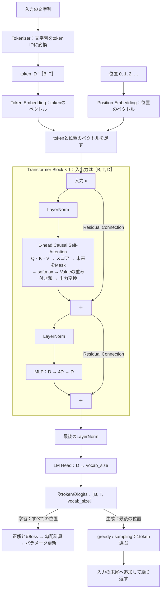
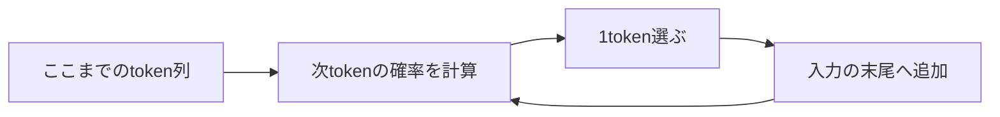
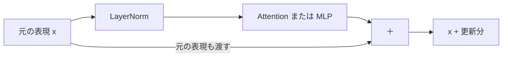

# Part 1 — 1層・1ヘッドのTiny GPTを作る

## これから作るGPTの全体像

このPartでは次の構成のGPTを作ります。図の各部品を実装し、最後に学習と文章生成を動かします。



## まず、学習前のGPTで続きを生成してみる

最初に、これから作るGPTを動かしてみましょう。参照コードには完成した計算の仕組みが入っていますが、パラメータはまだ学習していない初期値です。

このPartでは日本語の文章を使います。モデルが扱う単位を **token** と呼びます。この教材では1文字を1tokenにし、「日本の首都は東京です。」は次のように分かれます。

```text
日 | 本 | の | 首 | 都 | は | 東 | 京 | で | す | 。
```

実際のGPTでは1tokenが単語や文字列の一部になることもあります。仕組みは1.2で説明します。

uvが使える環境でこのリポジトリのルートから次のコマンドを実行します。1行目で日本語の1万文書を保存し、2行目で文字の語彙を作ってから学習前のGPTで生成します。ここで保存されるデータは参照コード側の `sample/data/` に入ります。自分の作業用ディレクトリには、1.2で同じ手順で作ります。

```bash
uv run --frozen --directory sample python prepare_data.py
uv run --frozen --directory sample python preview.py
```

GPTのパラメータはまだ学習していません。「プログラミングを学ぶには、」という書きかけの文を渡すと、次のような続きを生成します。以下は実行結果の抜粋です。

```text
プログラミングを学ぶには、息話关仰ι句巳ֹ竿و肉膨櫻逮討際狼諏恕絆引当赦緊砺瀉刈徨͡捨城孙繕盧喝≡鑞じこ劉क堀屏鬱芭唐汐政ي夷帳影廠虚代
```

出てくるのはどれもtrainの文書にある文字ですが、意味の通る並びにはなっていません。GPTはどの文字の後にどの文字が続きやすいかをまだ学んでおらず、語彙の文字をほぼでたらめに選んでいるためです。

それでも内部では次のtokenの確率を計算して1つ選び、入力へ追加する処理が動いています。



**文章を生成する仕組みができていても、適切な続きを予測できるとは限りません。** ではどのように予測を計算し、学習によって何を変えるのでしょうか。

ここから自分の作業用ディレクトリで1つずつ実装していきます。Part 1の最後に同じ入力を使い、学習で予測がどう変わったかを比べましょう。

操作デモ：[学習前のGPTが1tokenずつ生成する過程を見る](demos/part1.html#generation)

## このPartで作るもの

作るのはTransformer Blockを1つ持つDecoder-only Transformerです。Attentionのヘッドも1つにします。固定した日本語の1万文書で次のtokenを予測するように学習させ、同じ入力に対する学習前後の続きを比較します。

目標は、普段使っているLLMの「入力を読む」「学習する」「生成する」が、どの計算に対応するのかを説明できるようになることです。

後のPartではここで作ったBlockを複数並べ、Attentionを複数ヘッドにして生成時のKV Cacheを追加します。学習済みのパラメータからInstruction Tuningを行うところまで、この実装を拡張していきます。

## 学習を始める前の準備

### データと実験の規模を決める

FineWeb-2 Edu Japaneseの `small_tokens_cleaned` から1万文書を取り出して使います。日本語の語句や文末のつながりが学習前後でどう変わるかを観察しましょう。

配布データから重複しない1万文書を選び、train 9,000文書・validation 1,000文書に分けて保存します。以降は同じデータを使うので、実験のたびに取得する必要はありません。

配布元：[FineWeb-2 Edu Japanese](https://huggingface.co/datasets/hotchpotch/fineweb-2-edu-japanese)

| 条件 | 設定 |
|---|---:|
| Block数 | 1 |
| Attentionのヘッド数 | 1 |
| ベクトルの次元 `d_model` | 128 |
| 一度に読む長さ `context_length` | 128token |
| MLPの中間次元 | 512 |
| 一度に処理する系列数 `batch_size` | 16 |
| 語彙数 | 4,052 |
| train / validation | 9,000文書 / 1,000文書 |
| 更新回数 | 10,000回 |
| パラメータ数 | 1,256,276（約126万） |

まず20回更新して一連の処理を確認し、その後で10,000回の更新を実行します。10,000回の更新は5〜10分程度で終わります。

### 作業用ディレクトリの構成

このリポジトリの `sample/` に参照用の完成コードがあります。本文を読みながら、自分の作業用ディレクトリ `tiny-gpt-handson/` に実装していきましょう。途中で迷ったときは参照コードの対応するファイルを確認できます。

```text
tiny-gpt-handson/
├── pyproject.toml
├── prepare_data.py
├── main.py               節ごとに書き換えて実行する確認・学習の入口
├── data/
│   └── fineweb-japanese-10k/
│       ├── train.jsonl
│       ├── validation.jsonl
│       └── manifest.json  取得条件とデータのハッシュ
├── tiny_gpt/
│   ├── __init__.py       空のファイル
│   ├── config.py        実験条件
│   ├── tokenizer.py     文字の語彙とIDへの変換
│   ├── dataset.py       文書のID化と入力・正解の組
│   ├── model.py         GPTの計算
│   ├── generate.py      次token予測の繰り返し
│   └── train.py         loss・更新・記録
└── runs/
    └── part1/           実行時に作成する結果の保存先
```

`model.py` は1.3で `TinyGPT` の骨格を作り、節ごとに部品を追加して、1.10でモデル全体がつながります。学習コマンドを実行するのは1.13です。

各節の動作確認・実験のコードは、作業用ディレクトリの `main.py` に保存し `uv run python main.py` で実行します。次の節に進むときは中身を置き換えてください。`tiny_gpt/` の各ファイルには部品だけを置き、実行の入口は `main.py` に集約します。最後の1.13では、`main.py` は学習を呼び出すだけになります。

### uvで環境を用意する

Python 3.14.7とuvを使います。好きな場所に作業用ディレクトリを作り、移動してください。

```bash
mkdir -p tiny-gpt-handson/tiny_gpt
cd tiny-gpt-handson
touch tiny_gpt/__init__.py
```

以下を `pyproject.toml` として保存します。

```toml
[project]
name = "tiny-gpt-handson"
version = "0.1.0"
requires-python = ">=3.14"
dependencies = [
    "torch==2.14.0",
    "matplotlib==3.11.2",
    "huggingface-hub==1.32.0",
    "pyarrow==25.0.1",
]
```

次のコマンドで依存関係をインストールします。

```bash
uv sync --python 3.14.7
```

以降のコマンドと保存先はこの作業用ディレクトリを基準にします。

### 実験条件を1か所に置く

設定値を変更したら別の名前で結果を保存します。比較するときにどの設定で得た結果かを見失わないためです。

**保存先：`tiny_gpt/config.py`。**

```python
class Config:
    def __init__(self) -> None:
        # 1tokenを表すベクトルの次元数（shapeの D）。Embeddingから
        # Attention・MLP・LM Headまで、すべての部品がこの幅でつながる
        self.d_model: int = 128
        # 1系列に入れるtoken数の上限。shapeの T はこの値以下。
        # Attentionが参照できる範囲であり、生成時に見返せる長さでもある
        self.context_length: int = 128
        # 1回の更新に使う系列の数（shapeの B）。
        # B本ぶんのlossを平均して、パラメータを1回だけ更新する
        self.batch_size: int = 16
        # パラメータを更新する回数。
        # 1stepで batch_size × context_length 個のtokenから学習する
        self.steps: int = 10000
        # 1回の更新で、勾配の方向へパラメータを動かす幅。AdamWに渡す
        self.learning_rate: float = 0.0003
        # 何stepごとにvalidationのlossを測るか
        self.eval_every: int = 1000
        # 評価1回で使うバッチ数。複数バッチの平均を取り、lossのぶれを抑える
        self.eval_batches: int = 8
        # 乱数の種。初期化するパラメータと、学習に使うバッチの切り出し位置を
        # 実行ごとに同じにする
        self.seed: int = 42
        # 結果の保存先 runs/<run_name>。設定を変えて比較するときは名前も変える
        self.run_name: str = "part1"
```

### Tensorのshapeを読む

このPartで繰り返し登場する記号は4つです。

| 記号 | 意味 | 最初の設定での例 |
|---|---|---:|
| `B` | バッチサイズ。一度に処理する系列の数 | 16 |
| `T` | 1系列に含まれるtoken数 | 128 |
| `D` | 1tokenを表すベクトルの次元 | 128 |
| `vocab_size` | 語彙に含まれるtokenの数 | 4,052 |

`[B, T, D]` は「B個の系列があり、それぞれのT個の位置にD次元のベクトルがある」という意味です。最初の設定では `T` も `D` も128ですが、別の軸です。

## 1.1 GPT全体の流れ — 各位置で次のtokenを予測する

冒頭で動かしたGPTは、次のtokenを1つ選んで入力へ追加する処理を繰り返していました。この節では、その「次のtokenを予測する」をどんな計算問題として定義するかを決めます。ここで決めた問題を、1.2以降の部品で1つずつ解いていきます。

「日本の首都は東京です。」をtokenへ分けて末尾の「。」を除いて入力すると、GPTは各位置で次のtokenのスコア（1.10でlogitと呼びます）を返します。

| 入力の位置 | その位置までの入力 | 予測する正解token |
|---|---|---|
| 0 | 日 | 本 |
| 1 | 日本 | の |
| 2 | 日本の | 首 |
| 3 | 日本の首 | 都 |
| 4 | 日本の首都 | は |
| 5 | 日本の首都は | 東 |
| 6 | 日本の首都は東 | 京 |
| 7 | 日本の首都は東京 | で |
| 8 | 日本の首都は東京で | す |
| 9 | 日本の首都は東京です | 。 |

1系列の出力shapeは `[1, 10, vocab_size]` です。位置5で「東」を予測するとき、入力の位置6にある「東」を見せてはいけません。この制限は1.6のCausal Maskで実装します。

文章は長さが決まっていないので、文章全体を1つの出力として予測することはできません。代わりに文章の確率を次のように分け、各項を同じモデルで予測します。

```text
P(x₁, x₂, ..., xₙ)
  = P(x₁) × P(x₂ | x₁) × ... × P(xₙ | x₁, ..., xₙ₋₁)
```

この各項に相当する予測を学習するモデルを自己回帰言語モデルと呼びます。

この教材では過去と現在の位置を参照するSelf-Attentionを使い、別のEncoderの出力を読む仕組みを持たない **Decoder-only** 構成を作ります。

モデルが完成すると、呼び出し方は次の形になります。この節ではまだ実行できません。1.3から部品を作り始め、1.10でこの形になります。

```python
token_ids = torch.tensor([[3, 5, 8, 2]], dtype=torch.long)
logits = model(token_ids)
last_logits = logits[:, -1, :]
```

`logits[:, -1, :]` は「すべての系列について、最後の位置のすべての候補」を取り出します。生成時に知りたいのは入力の続きなので、最後の位置を使います。

### この節で理解したこと

GPTの基本的な仕事は過去のtoken列を条件に次のtokenを予測することです。学習と生成では同じモデルの出力を違う目的で使います。

## 1.2 学習データとTokenization — 文字列を予測問題に変える

GPTを学習させるには、「ここまでの入力」と「その次に来るtoken」の組が大量に必要です。次のtokenを予測する問題なら、人が別途回答を書く必要はありません。元の文章の続きがそのまま正解になるので、文章そのものから学習問題を作れます。

ただしモデルが扱えるのは数値のTensorだけで、文字列をそのまま入力できません。学習問題を作る前に、文字列を数値の列へ変える必要があります。

そこでTokenizerで文字列をtokenへ分割し、それぞれを整数IDへ変換します。さらに同じtoken列から1tokenずらした2つの系列を切り出し、入力と正解を作ります。

今回のTokenizerは1文字を1tokenにします。「日本の首都は東京です。」は11個のtokenになります。区切りを `/` で表すと、入力と正解の対応は次のとおりです。

```text
元の列： 日 / 本 / の / 首 / 都 / は / 東 / 京 / で / す / 。
入力 x： 日 / 本 / の / 首 / 都 / は / 東 / 京 / で / す
正解 y： 本 / の / 首 / 都 / は / 東 / 京 / で / す / 。

この1系列では：x.shape = [T]、y.shape = [T]、T = 10
B系列をまとめると：x.shape = [B, T]、y.shape = [B, T]
```

位置0では「日」から「本」、位置1では「日 / 本」から「の」を予測します。`y` は「一度に生成すべき別の文章」ではなく、各位置に対応する正解を並べたものです。

**語彙はtrainの文書に出てきた文字を並べた表です。** 文字をコード順に並べ、表の添字をtoken IDにします。今回のデータには4,050種類の文字が出てきます。実際のGPTは、よく現れる文字の並びを1つのtokenにまとめるBPEという方式を使い、語彙も数万から十数万あります。仕組みの理解には1文字単位で十分なので、この教材では文字単位のまま進めます。

語彙には文字とは別に、特別なtokenを2つ予約します。文書の終わりを示す専用の終端token（EOS）と、語彙にない文字を表すtoken（UNK）です。validationにはtrainに出ない文字が少しあり、その文字だけUNKに置き換えます。

Tokenizerの語彙を作ることとGPTを学習させることは別の処理です。

| 処理 | 決まるもの | この後の扱い |
|---|---|---|
| 語彙作成 | 文字とtoken IDの対応 | 固定して使う |
| GPTの学習 | EmbeddingやAttentionなどのパラメータ | 次token予測の誤差から更新する |

語彙の作成にはtrainの文書だけを使います。validationはGPTのパラメータ更新にも語彙作成にも使いません。

### 実装

まず、参照コードの [prepare_data.py](../sample/prepare_data.py) を手元の作業用ディレクトリへコピーし、実行してください。このファイルには取得条件を固定して文書を保存する処理がまとまっています。

```bash
uv run python prepare_data.py
```

**trainはパラメータ更新に使う文書、validationは更新に使わず予測を測る文書**です。文書単位で分けることで同じ文書の前半がtrain、後半がvalidationに入ることを防ぎます。

次に、文字の語彙を作り、文字列とID列を変換するコードを書きます。

**保存先：`tiny_gpt/tokenizer.py`。**

```python
import json
from pathlib import Path


DATA_DIR = Path("data/fineweb-japanese-10k")
# 文字とは別に語彙の先頭へ予約する特別なtoken。文字列は表示用の名前で、
# 文章の中には現れない。
# EOS: 文書の終わり。文書の末尾にだけ付ける。GPTはこれも予測対象として学習し、
#      生成時に選んだら文章を終了する。
# UNK: 語彙にない文字。trainに出なかった文字がvalidationやpromptに現れたとき、
#      その文字だけこのtokenに置き換える。
EOS_TOKEN = "<eos>"
UNK_TOKEN = "<unk>"


def read_texts(path: Path) -> list[str]:
    texts: list[str] = []
    with path.open(encoding="utf-8") as source:
        for line in source:
            document = json.loads(line)
            texts.append(document["text"])
    return texts


class Tokenizer:
    def __init__(self, tokens: list[str]) -> None:
        # ID順に並べたtokenの表。token IDはこの表の添字。
        self.tokens: list[str] = tokens
        self.token_to_id: dict[str, int] = {}
        for token_id, token in enumerate(tokens):
            self.token_to_id[token] = token_id
        self.vocab_size: int = len(tokens)
        self.eos_id: int = self.token_to_id[EOS_TOKEN]
        self.unk_id: int = self.token_to_id[UNK_TOKEN]

    @classmethod
    def from_texts(cls, texts: list[str]) -> "Tokenizer":
        chars: set[str] = set()
        for text in texts:
            chars.update(text)
        return cls([EOS_TOKEN, UNK_TOKEN] + sorted(chars))

    def encode(self, text: str) -> list[int]:
        token_ids: list[int] = []
        for char in text:
            token_ids.append(self.token_to_id.get(char, self.unk_id))
        return token_ids

    def decode(self, token_ids: list[int]) -> str:
        chars: list[str] = []
        for token_id in token_ids:
            chars.append(self.tokens[token_id])
        return "".join(chars)
```

`Tokenizer.from_texts` がtrainの文字から語彙を作り、`encode` と `decode` が文字列とID列を変換します。

**`main.py` を次の内容にして実行します。** 語彙はtrainの文書から毎回作ります。1秒もかからず、同じ文書からは同じ語彙ができます。

```python
from tiny_gpt.tokenizer import DATA_DIR, Tokenizer, read_texts

tokenizer = Tokenizer.from_texts(read_texts(DATA_DIR / "train.jsonl"))
text = "日本の首都は東京です。"
token_ids = tokenizer.encode(text)
print("語彙数:", tokenizer.vocab_size)
print("入力:", text)
print("token ID:", token_ids)
print("復元:", tokenizer.decode(token_ids))
```

```bash
uv run python main.py
```

続いて、全文書をつないで1本のtoken列にします。文書の末尾にはEOSを付けます。

**保存先：`tiny_gpt/dataset.py`。このファイルは1.11で拡張します。**

```python
import torch

from tiny_gpt.tokenizer import Tokenizer


def encode_documents(texts: list[str], tokenizer: Tokenizer) -> torch.Tensor:
    # 何千もの文書を、文書の区切りにEOSを挟んで1本の長いtoken列につなぐ。
    # 例: ["骨粗しょう症とは", "私たちは呼吸"] という2文書なら
    #   骨 粗 し ょ う 症 と は <eos> 私 た ち は 呼 吸 <eos>
    # という1本の列になる（実際は1文字が1つのIDに置き換わる）。
    # 学習ではこの長い列のどこからでも切り出して使う。
    token_ids: list[int] = []
    for text in texts:
        token_ids.extend(tokenizer.encode(text))
        # 別の文書へ移る境界を、専用のtokenで表す。
        # これがないと「…呼吸<eos>」の続きが次の文書の冒頭に見え、
        # モデルは無関係な文書同士が続いていると学習してしまう。
        token_ids.append(tokenizer.eos_id)
    return torch.tensor(token_ids, dtype=torch.long)
```

### 動作確認 — 文書のつなぎ目と、入力と正解の対応を見る

短い2文書をつないで、境界にEOSが入ることを確かめます。続いて、各位置の正解が「1token先」になっているかをID列と復元した文章で確かめます。

```python
import torch
from tiny_gpt.dataset import encode_documents
from tiny_gpt.tokenizer import DATA_DIR, Tokenizer, read_texts

train_texts = read_texts(DATA_DIR / "train.jsonl")
tokenizer = Tokenizer.from_texts(train_texts)

joined = encode_documents(["日本の首都は東京です。", "猫は"], tokenizer)
print("つないだID:", joined.tolist())
print("復元:", tokenizer.decode(joined.tolist()))
print("trainのtoken数:", len(encode_documents(train_texts, tokenizer)))

text = "日本の首都は東京です。"
ids = torch.tensor(tokenizer.encode(text), dtype=torch.long)
x = ids[:-1]
y = ids[1:]
print("元のID:", ids.tolist())
print("入力:", tokenizer.decode(x.tolist()))
print("正解:", tokenizer.decode(y.tolist()))
print(x.shape, y.shape)
assert tokenizer.decode(tokenizer.encode(text)) == text
```

復元した文字列は「日本の首都は東京です。<eos>猫は<eos>」になります。EOSはIDが0なので、つないだID列では2文書の末尾に `0` が入ります。trainの文書全体をつなぐと約593万tokenになります。

入力は「日本の首都は東京です」、正解は「本の首都は東京です。」になり、shapeはどちらも `[10]` です。

trainに出てこない文字を `encode` するとUNKのIDになり、`decode` すると `<unk>` と表示されます。

### この節で理解したこと

Tokenizerは文字列をtoken ID列へ変換します。入力と正解を1tokenずらすことで文章そのものから次token予測の学習問題を作れます。

## 1.3 Token Embedding — 整数のラベルを学習できるベクトルへ変える

次tokenを予測するには「今のtokenがどんな性質を持つか」が必要です。たとえば「。」は文の終わりを表し、「は」は名詞の後に来やすい助詞です。こうした性質があるからこそ、その後に何が来やすいかを絞れます。

ところが1.2で作ったtoken IDは「どのtokenか」を区別するための番号にすぎず、こうした性質を入れる場所がありません。IDが10と11だからといって、その2つのtokenの使われ方が似ているとは限りません。IDをそのまま量として計算に使うと、番号の大小や差という無関係な情報を持ち込んでしまいます。

そこで各tokenに、性質を保持するための入れ物としてベクトルを割り当てます。これがToken Embeddingです。ベクトルは複数の成分を持つので、1つのtokenについて「文の終わりらしさ」「助詞らしさ」のような複数の性質を同時に持てます。以降の計算はIDが何番かではなく、このベクトルが表す性質をもとに進みます。

ベクトルの値は人が決めるのではなく、次token予測の学習で決まります。その結果、使われ方が似たtokenは似たベクトルへ近づいていきます。

実体は `[vocab_size, D]` の表です。token IDに対応する行を取り出すと、そのtokenのベクトルになります。

```text
Embedding行列 E： [vocab_size, D]
入力のID：       [B, T]
取り出した結果： [B, T, D]

tokenベクトル = E[token ID]
```

表の中身は最初は乱数で初期化します。学習中に更新されるのはIDの番号ではなく、この表の値です。ベクトルの各成分に人が「文の終わりらしさ」「助詞らしさ」などの意味を先に割り当てるわけではありません。学習の結果として、性質が成分の組み合わせに表れます。

### 実装

この節からモデル本体の `TinyGPT` を作り始めます。最初はToken Embeddingだけを持ち、`forward` はIDから取り出したtokenの表現をそのまま返します。以降の節で部品を1つずつ足し、1.10で次tokenのlogitを返す形にします。

表は `nn.Embedding` で作ります。行数が語彙数、列数がConfigの `d_model` です。

**`tiny_gpt/model.py` を次の内容で作成します。**

```python
import torch
from torch import nn

from tiny_gpt.config import Config


class TinyGPT(nn.Module):
    def __init__(self, vocab_size: int, config: Config) -> None:
        super().__init__()
        self.token_embedding = nn.Embedding(vocab_size, config.d_model)

    def forward(self, ids: torch.Tensor) -> torch.Tensor:
        # ID [B, T] のそれぞれについて、表の行を取り出す。結果は [B, T, D]。
        x = self.token_embedding(ids)
        return x
```

### 動作確認 — 同じIDが同じ行を取り出すか

表示して読めるように、語彙数6・`d_model` 4の小さなモデルを作ります。

**`main.py` を次の内容にして実行します。**

```python
import torch
from tiny_gpt.config import Config
from tiny_gpt.model import TinyGPT

config = Config()
config.d_model = 4
model = TinyGPT(6, config)

ids = torch.tensor([[2, 5, 2]])
x = model(ids)
print(x.shape)
print(x[0])
```

`ids` が `[[2, 5, 2]]` なので、取り出すのは表のID 2・ID 5・ID 2に対応する行です。入力のshape `[1, 3]` が出力の `[1, 3, 4]` に変わります。最初と最後の位置は同じ行を取り出すため、表示された3行のうち1行目と3行目は同じベクトルです。

同じtokenでも文脈によって役割は変わりますが、Embeddingを取り出した直後は他のtokenを参照していません。文脈を反映する処理はこの後で追加します。

次のように、同じIDは同じ行を参照します。表の数値は説明用の例です。

| token ID | 成分0 | 成分1 | 成分2 | 成分3 |
|---|---:|---:|---:|---:|
| 2 | 0.2 | -0.5 | 0.1 | 0.8 |
| 5 | -0.3 | 0.4 | 0.6 | 0.0 |

```text
入力のID [2, 5, 2]
   ↓      ↓      ↓
  行2    行5    行2
```


### この節で理解したこと

Embeddingはtokenを学習可能なベクトルに変換する表です。IDという番号では持てないtokenの性質をベクトルとして保持し、以降の計算で使えるようにします。文脈を処理する前の各tokenの出発点となる表現です。

## 1.4 Position情報 — 同じtokenがどこにあるかを表す

文章の意味は、どのtokenが並ぶかだけでなく、どの順で並ぶかで決まります。「犬が猫を追う」と「猫が犬を追う」は同じ文字の集まりですが、追う側と追われる側が逆です。次token予測でも同じで、同じtokenの集まりでも並びが違えば次に来やすいtokenは変わります。予測のためには、各tokenが何番目にあるかをモデルが分かる必要があります。

ところが1.3までの処理では、各位置のベクトルはそのtokenのIDだけで決まります。token列 `[猫, 犬]` と `[犬, 猫]` は同じ2つのベクトルを逆に並べただけで、位置の情報はどこにも入っていません。同じtokenが2回出る `[猫, 犬, 猫]` では、最初と最後の「猫」はまったく同じベクトルになり、どちらが前かを区別できません。1.5で足すSelf-Attentionは各位置のベクトルの中身だけを見て情報を集めるので、ここで位置を入れておかないと後の処理でも順序を使えません。

そこで「どのtokenか」に加えて「何番目の位置か」をベクトルに入れます。このPartでは位置にも学習可能なベクトルを割り当てるPosition Embeddingを使い、tokenのベクトルへ次のように足し合わせます。

```text
X[b, t] = token_embedding[ids[b, t]] + position_embedding[t]

token_embedding(ids)       [B, T, D]
position_embedding(位置)   [T, D]
足した結果                 [B, T, D]
```

位置ベクトルはバッチ内のすべての系列で共通なので、`[T, D]` を各系列へ足せます。PyTorchがサイズ1の軸を補って計算するブロードキャストを使っています。

位置の表し方はこれだけではありません。RoPEのように、Attentionの計算へ位置関係を組み込む方式もあります。このPartではまずEmbeddingを足す方式でPosition情報の役割を確かめます。

### 実装

位置の表を `TinyGPT` に足します。行数はConfigの `context_length` です。`forward` では入力の長さに応じて `0, 1, 2, ...` という位置IDを作り、位置ベクトルを取り出してToken Embeddingへ足します。

**`model.py` の `TinyGPT` を次のクラスへ置き換えます。**

```python
class TinyGPT(nn.Module):
    def __init__(self, vocab_size: int, config: Config) -> None:
        super().__init__()
        self.context_length = config.context_length
        self.token_embedding = nn.Embedding(vocab_size, config.d_model)
        self.position_embedding = nn.Embedding(
            config.context_length, config.d_model
        )

    def forward(self, ids: torch.Tensor) -> torch.Tensor:
        length = ids.shape[1]
        if length == 0 or length > self.context_length:
            raise ValueError("入力の長さがcontext_lengthの範囲外です")

        positions = torch.arange(length)
        # tokenの表現 [B, T, D] に、全系列で共通の位置表現 [T, D] を足す。
        x = self.token_embedding(ids)
        x = x + self.position_embedding(positions)
        return x
```

この方式では用意した位置の表より長い系列をそのまま入力できません。たとえば位置の表が128行なら使える位置は0〜127です。`forward` の先頭で長さを確かめているのはこのためです。

### 動作確認 — 同じIDでも位置が違えば別のベクトルになるか

1.3と同じ入力で、1行目と3行目が変わるかを見ます。

**`main.py` を次の内容にして実行します。**

```python
import torch
from tiny_gpt.config import Config
from tiny_gpt.model import TinyGPT

config = Config()
config.d_model = 4
model = TinyGPT(6, config)

ids = torch.tensor([[2, 5, 2]])
x = model(ids)
print(x.shape)
print(x[0])
print(torch.equal(x[0, 0], x[0, 2]))
```

`x` のshapeは `[1, 3, 4]` のままです。token列 `[猫, 犬, 猫]` の最初と最後の「猫」はToken Embeddingでは同じベクトルです。そこへ位置0と位置2の別々のベクトルを足すので、表示された1行目と3行目は違うベクトルになり、最後の比較は `False` になります。1.3では同じだった2行が、位置を区別できる表現に変わりました。

### この節で理解したこと

Position情報はtokenの内容に加えて位置や順序を計算へ持ち込むためにあります。学習可能な位置の表を使う方式では、その表の長さが入力できる長さの上限になります。

## 1.5 1-head Self-Attention — 他のtokenから情報を集める

次に来るtokenは、今のtokenだけでは決まりません。たとえば「日本の首都は」の続きを予測するには、直前の「は」だけでなく、前にある「日本」「首都」の文字の情報も必要です。予測のためには、各位置が他の位置から必要な情報を集められる必要があります。

ところがここまでの処理では、各位置のベクトルは「自分が何のtokenで、何番目にいるか」だけで決まります。他のtokenの内容は入っていません。過去のベクトルを単純に平均する方法もありますが、どの入力でも同じ割合で混ぜることになります。どの位置の情報が必要かは入力によって変わるので、固定の割合では足りません。

そこでSelf-Attentionを使います。Self-Attentionは各位置について「他の位置の情報をどの割合で集めるか」を入力に応じて計算します。参照する側も参照される側も同じ入力列から作るため、Self-Attentionと呼びます。

そのために、各tokenのベクトル `X` を3つの別々の線形変換へ通します。

| ベクトル | この計算での役割 |
|---|---|
| Query（Q） | 参照する側の特徴。Keyとのスコア（score）計算に使う |
| Key（K） | 参照される側の特徴。Queryとのスコア計算に使う |
| Value（V） | softmax後の割合を掛けて、実際に集める情報 |

入力のベクトル同士をそのまま照合する代わりに、参照する側・参照される側・集める情報に分けて変換します。「どの情報を選ぶか」と「選んだ先から何を受け取るか」にそれぞれ適した変換を学習できます。Q・K・Vの役割を人が決め打ちするのではなく、次token予測の誤差から変換行列を更新します。

バイアスを省略して書くと、次の式になります。

```text
Q = XWq
K = XWk
V = XWv

scores  = QKᵀ / √d_k
weights = softmax(scores)
output  = weights V

Attention(Q, K, V) = softmax(QKᵀ / √d_k)V
```

1ヘッドでは `d_k = D` とします。B個の入力系列は独立に処理されます。

| 計算 | 入力のshape | 結果のshape |
|---|---|---|
| Q・K・Vへの変換 | `[B, T, D]` | それぞれ `[B, T, D]` |
| Kの最後の2軸を交換 | `[B, T, D]` | `[B, D, T]` |
| QとKの行列積 | `[B, T, D] × [B, D, T]` | `[B, T, T]` |
| 最後の軸にsoftmax | `[B, T, T]` | `[B, T, T]` |
| Valueの重み付き和 | `[B, T, T] × [B, T, D]` | `[B, T, D]` |

内積は対応する成分を掛けて足す計算です。2次元なら `q・k = q[0]×k[0] + q[1]×k[1]` です。向きが揃うほど大きくなりますが、ベクトルの長さにも左右されます。softmaxはこのスコアを指数関数に通して合計で割り、Attention weight（各位置をどの割合で参照するか）へ変換します。

操作デモ：[内積が参照の割合に変わる過程を見る](demos/part1.html#dot-product)

Queryの向きと長さを変え、スコアとsoftmax後の割合がどう動くかを確かめられます。

`[T, T]` の行は参照する側、列は参照される側です。各行にsoftmaxを適用すると、その位置から各tokenへ向けたAttention weightの合計が1になります。

`√d_k` で割るのは、次元が増えたときに内積の大きさが増え、softmaxが極端に偏りやすくなるのを抑えるためです。各成分の分散が同程度という仮定では内積の分散は次元数に比例します。平方根で割ることでそのスケールを調整します。この計算はscaled dot-product attentionと呼ばれます。[Attention Is All You Need](https://arxiv.org/abs/1706.03762)

小さな数値でAttention weightがどのようにできるかを見てみましょう。ここでは学習済みの値を使わず、計算を追うためにQ・K・Vを直接決めます。

```text
Q = [[1, 0],       K = [[1, 0],       V = [[10,  0],
     [0, 1]]            [0, 1]]            [ 0, 20]]

QKᵀ / √2 ≈ [[0.707, 0.000],
             [0.000, 0.707]]

weights ≈ [[0.670, 0.330],
           [0.330, 0.670]]

1行目のoutput ≈ 0.670 × [10, 0] + 0.330 × [0, 20]
              ≈ [6.70, 6.60]
```

QとKが決めるのは混ぜる割合です。最終的に混ぜる対象はValueです。

操作デモ：[ValueをAttention weightの分だけ縮めて足す](demos/part1.html#weighted-sum)

矢印を1本ずつつなぎ、「他のtokenの情報を集める」がベクトルの足し算であることを確かめられます。

### 実装

まず、Q・K・Vから重み付き和を計算する関数を作ります。続いて、入力をQ・K・Vへ変換するモジュールを作ります。

**`model.py` の先頭に `import math` を足し、`TinyGPT` の前に次の関数とクラスを追加します。**

```python
import math


def scaled_attention(
    q: torch.Tensor, k: torch.Tensor, v: torch.Tensor,
) -> tuple[torch.Tensor, torch.Tensor]:
    key_size = q.shape[-1]
    # [B, T, D] @ [B, D, T] → [B, T, T]。行iから列jを参照するスコア。
    scores = q @ k.transpose(-2, -1)
    scores = scores / math.sqrt(key_size)
    # 各行について参照先のAttention weightを合計1にし、その割合でValueを集める。
    weights = torch.softmax(scores, dim=-1)
    output = weights @ v
    return output, weights


class SelfAttention(nn.Module):
    def __init__(self, d_model: int) -> None:
        super().__init__()
        self.query = nn.Linear(d_model, d_model)
        self.key = nn.Linear(d_model, d_model)
        self.value = nn.Linear(d_model, d_model)
        self.output = nn.Linear(d_model, d_model)

    def forward(self, x: torch.Tensor) -> tuple[torch.Tensor, torch.Tensor]:
        # 同じxから、参照する側の特徴Q、参照される側の特徴K、集める情報Vを作る。
        q = self.query(x)
        k = self.key(x)
        v = self.value(x)
        mixed, weights = scaled_attention(q, k, v)
        output = self.output(mixed)
        return output, weights
```

`@` は行列積です。`transpose(-2, -1)` は最後の2軸を交換します。softmaxの `dim=-1` は最後の軸、つまり参照先tokenの軸を指定しています。

`nn.Linear` は `x @ weight.T + bias` を計算します。そのためPyTorchに保存される `weight` の軸の順序は上の数式の `Wq` とは逆です。`query.weight`・`key.weight`・`value.weight` がQ・K・Vを作るために学習するパラメータです。

最後の `self.output` は集めた情報を次の処理へ渡す線形変換です。

`nn.Module` を継承したクラスで各モジュールを属性へ代入すると、PyTorchがそのパラメータを登録します。`model.parameters()` が中のモジュールのパラメータまで返すのは、この登録があるためです。

**この時点のAttentionは未来のtokenも参照できます。次の節でMaskを追加してからGPTの学習に使います。**

### 動作確認 — 入力からQ・K・Vを作って通す

`SelfAttention` に `[B, T, D]` の入力を渡し、Attention weightと出力のshapeを確かめます。

```python
import torch
from tiny_gpt.model import SelfAttention

torch.manual_seed(0)
attention = SelfAttention(4)
x = torch.randn(1, 3, 4)
output, weights = attention(x)
print(output.shape, weights.shape)
print(weights[0])
```

出力は `[1, 3, 4]`、Attention weightは `[1, 3, 3]` です。各行の合計は1です。位置0の行にも位置1・2への重みが付いています。まだ未来のtokenを参照できるためです。

### 実験 — 混ぜる割合と混ぜる情報を分けて変える

Q・Kが決めるAttention weightとVから集める情報が別の役割を持つことを確かめます。

先ほどの数値例を動かします。

```python
import torch
from tiny_gpt.model import scaled_attention

q = torch.tensor([[[1.0, 0.0], [0.0, 1.0]]])
k = torch.tensor([[[1.0, 0.0], [0.0, 1.0]]])
v = torch.tensor([[[10.0, 0.0], [0.0, 20.0]]])
output, weights = scaled_attention(q, k, v)

print(weights)
print(output)
torch.testing.assert_close(weights.sum(dim=-1), torch.ones(1, 2))
```

次に、Q・Kを変えずにValueだけを2倍にしてください。Attention weightは変わらず、重み付き和は2倍になります。Q・KとValueが別の役割を持つことを確かめられます。

操作デモ：[Wq・Wk・Wvを変えて、役割の違いを確かめる](demos/part1.html#qkv)

同じ入力Xからでも、Wq・Wkを変えると参照する割合が変わります。Wvだけを変えると割合は同じまま、集める情報と出力が変わります。入力から計算するQ・K・Vと学習するWq・Wk・Wvの違いを確認してください。

### この節で理解したこと

Self-AttentionはQ・Kから参照先ごとのAttention weightを作り、その割合でValueを集めます。Attention weightは入力ごとに変わり、その作り方を決める変換行列は学習で変わります。

## 1.6 Causal Mask — 次に予測するはずのtokenを見せない

学習では、1つの系列のすべての位置の予測を一度に計算したいです。1.2で作った入力と正解は位置ごとに対応しているので、1回の計算でT個の位置それぞれの次tokenを予測させれば、1系列からT個の学習問題をまとめて扱えます。ただし各位置には、その位置で予測するべき答えを見せてはいけません。

ところが1.5のSelf-Attentionは、すべての位置を参照できます。入力が「日本の首都は東京です」、正解が「本の首都は東京です。」のとき、位置0の正解は「本」です。その「本」は入力の位置1にすでに存在しています。未来まで参照できるモデルは位置1から「本」の情報を持ってくるだけで簡単に予測できてしまいます。生成時には未知の次tokenが入力にないので、学習時だけ答えを見る状態になります。

そこで各位置から自分より後ろの位置を参照できないようにします。これがCausal Maskです。過去と現在だけで予測させ、生成時にも使える規則を学習させます。

具体的には、スコア行列のうち未来に対応する場所を負の無限大にしてからsoftmaxを計算します。

```text
参照される位置 →     0    1    2    3
参照する位置 0       ○    ×    ×    ×
             1       ○    ○    ×    ×
             2       ○    ○    ○    ×
             3       ○    ○    ○    ○

× のスコアを −∞ にする → softmax後のAttention weightは0
```

softmaxの前に0を入れるだけでは不十分です。`exp(0)=1` なので、その位置にもAttention weightが付く可能性があるためです。

MaskがないSelf-Attentionは全位置を参照できます。上の制限を加えたものがCausal Self-Attentionです。すべてのTransformerで未来を隠すわけではなく、この教材の自己回帰生成に必要な制限です。

### 実装

**`model.py` の `scaled_attention` を、次の関数へ置き換えます。** `SelfAttention` クラスは変更しません。

```python
def scaled_attention(
    q: torch.Tensor, k: torch.Tensor, v: torch.Tensor, causal: bool = True,
) -> tuple[torch.Tensor, torch.Tensor]:
    key_size = q.shape[-1]
    length = q.shape[-2]
    # [B, T, D] @ [B, D, T] → [B, T, T]。行iから列jを参照するスコア。
    scores = q @ k.transpose(-2, -1)
    scores = scores / math.sqrt(key_size)

    if causal:
        future = torch.ones(length, length, dtype=torch.bool)
        future = torch.triu(future, diagonal=1)
        # 未来のスコアを −∞ にすると、softmax後のAttention weightが0になる。
        scores = scores.masked_fill(future, float("-inf"))

    # 各行について参照先のAttention weightを合計1にし、その割合でValueを集める。
    weights = torch.softmax(scores, dim=-1)
    output = weights @ v
    return output, weights
```

`torch.triu(..., diagonal=1)` は対角線より右上を残します。Maskのshapeは `[T, T]` で、バッチ内の各スコア行列へ共通に適用されます。現在のtokenに相当する対角線は隠しません。

Causal Maskも参照できる範囲を位置ごとに変えるため、位置の手掛かりを含みます。ただしPosition Embeddingとは働きが異なります。位置の表現を明示的に与える処理と未来を参照させない処理を組み合わせて使います。

### 実験 — Maskで未来への参照が消えるか

Maskの有無だけを変え、未来に対応するAttention weightが0になることを確かめます。

先ほどの数値例をMaskあり・なしで比較します。新しい関数では `causal=True` が既定値です。

```python
import torch
from tiny_gpt.model import scaled_attention

q = torch.tensor([[[1.0, 0.0], [0.0, 1.0]]])
k = torch.tensor([[[1.0, 0.0], [0.0, 1.0]]])
v = torch.tensor([[[10.0, 0.0], [0.0, 20.0]]])

_, normal_weights = scaled_attention(q, k, v, causal=False)
_, causal_weights = scaled_attention(q, k, v, causal=True)
print(normal_weights)
print(causal_weights)
assert causal_weights[0, 0, 1].item() == 0.0
```

Maskありでは1行目が `[1, 0]` になります。最初のtokenは自分しか参照できません。2行目はもともと未来を含まないため、約 `[0.330, 0.670]` のままです。

操作デモ：[Causal Maskの有無を切り替える](demos/part1.html#causal-mask)

未来へのスコアが−∞になり、Attention weightが0になる変化を確認できます。

### この節で理解したこと

Causal Maskは未来の正解を参照する抜け道を防ぎます。これにより1回の計算で複数位置を学習しながら、それぞれを過去だけに基づく予測にできます。

## 1.7 Feed Forward Network / MLP — 各位置の表現を加工する

Attentionで、各位置は過去の位置から情報を集められるようになりました。ただし集めた情報は、そのままでは次token予測に使いやすい形とは限りません。たとえば「日本の首都は」の最後の位置では、「首都」と「は」の情報を組み合わせて「次は地名が来やすい」という特徴にしたいです。各位置で、集めた情報を組み合わせて加工し、次token予測に使える特徴へ変える処理が必要です。

Attentionの出力はValueの重み付き和に線形変換を掛けたものです。どの位置からどれだけ集めるかは入力に応じて変わりますが、集めた後のベクトルには線形な変換しか掛かっていません。集めた情報同士を組み合わせて別の特徴を作るような非線形な処理が、各位置にまだありません。

そこでMLPを使います。MLPは各位置のベクトルへ非線形な変換を適用します。Attentionがtoken間で情報を集めるのに対し、MLPは集めた後の各ベクトルを加工します。式とshapeは次のとおりです。

```text
MLP(x) = GELU(xW₁ + b₁)W₂ + b₂

[B, T, D] → Linear → [B, T, 4D] → GELU → Linear → [B, T, D]
```

GELUは非線形な活性化関数です。線形変換を2回続けるだけなら1回の線形変換へまとめられますが、間に非線形関数を入れるとより多様な変換を表せます。

一度 `4D` に広げることで中間段階で扱える特徴の数を増やします。最後はResidual Connectionで元のベクトルへ足せるように `D` へ戻します。4倍は設計上の選択であり、必須の比率ではありません。中間次元を増やすとパラメータ数と計算量も増えます。

同じMLPのパラメータをすべての位置で共有します。位置ごとに別のMLPを用意するわけではありません。

### 実装

**`model.py` の先頭に `from torch.nn import functional as F` を足し、`TinyGPT` の前に `FeedForward` を追加します。**

```python
from torch.nn import functional as F


class FeedForward(nn.Module):
    def __init__(self, d_model: int) -> None:
        super().__init__()
        self.expand = nn.Linear(d_model, 4 * d_model)
        self.contract = nn.Linear(4 * d_model, d_model)

    def forward(self, x: torch.Tensor) -> torch.Tensor:
        # Linearは最後のD軸だけを変換する。別の位置のtokenは混ぜない。
        hidden = self.expand(x)
        hidden = F.gelu(hidden)
        output = self.contract(hidden)
        return output
```

### 実験 — 別のtokenへ変更が伝わるか

位置0の入力だけを変え、位置2の出力が変わるかを確かめます。

```python
import torch
from tiny_gpt.model import FeedForward

mlp = FeedForward(4)
x = torch.randn(1, 3, 4)
changed = x.clone()
changed[0, 0] = changed[0, 0] + 10.0

original_output = mlp(x)
changed_output = mlp(changed)
torch.testing.assert_close(original_output[0, 2], changed_output[0, 2])
print(original_output.shape)
```

位置2の出力は同じです。MLP単独では別のtokenの変更は伝わりません。一方Causal Self-Attentionでは位置2から過去の位置0を参照できるため、位置0の変更が位置2の出力へ影響することがあります。

### この節で理解したこと

Attentionはtoken間の情報交換を担い、MLPは各tokenの表現を非線形に加工します。この2つを交互に使って文脈に応じた表現を作ります。

## 1.8 Residual ConnectionとLayerNorm — 変換を重ねられるようにする

AttentionとMLPを1回ずつ通すだけでは、情報を集めて加工する機会が1回しかありません。加工した結果をもとにもう一度情報を集め、さらに加工するというように、AttentionとMLPの組を何層も重ねて深くしたいです。層を重ねるほど、より多くの段階を経た特徴を作れます。

ところがAttentionとMLPで毎回ベクトルを置き換えると、学習の初期段階でもそれまでの表現が大きく変わることがあります。層を重ねるほど、学習でパラメータを直す手がかり（1.11で扱う勾配）も多くの変換を通ることになります。

また層ごとにベクトルの値の大きさが変わると、後続の計算が扱うスケールも変わります。小さな1層モデルでは動いても、そのまま深くすると学習しにくくなる可能性があります。

そこでResidual ConnectionとLayerNormを使います。Residual Connectionは変換前のベクトルに変換結果を足します。変換全体で毎回表現を作り直す代わりに、元の表現への追加・修正を学習できる形にします。

LayerNormは各tokenのベクトル内で値のスケールを整えます。このPartではAttentionやMLPへ入力する前に適用するPre-LN構成を使います。

Residual Connectionの式は単純です。

```text
y = x + f(x)
```

`f(x)` が小さいときにも `x` をそのまま先へ渡せます。微分には恒等写像の項もあるため、変換を通る経路に加えて勾配が流れる経路を持てます。ただし元の情報が必ず保存されることや勾配の問題が完全になくなることを保証するわけではありません。

LayerNormは1つのtokenのD成分について平均と分散を計算します。

```text
μ = (x₁ + ... + x_D) / D
σ² = Σ(xᵢ − μ)² / D

LayerNorm(xᵢ) = γᵢ × (xᵢ − μ) / √(σ² + ε) + βᵢ
```

たとえば `[1, 3]` の平均は2、分散は1です。εを省略し、γを1、βを0とすると `[-1, 1]` になります。γ・βは学習可能なパラメータなので、学習後の出力が常に平均0・分散1になるわけではありません。

正規化するのは最後のD軸だけです。別のtokenや別の入力列を混ぜて平均を取ることはありません。

### 実装

`nn.LayerNorm` と同じ計算を、正規化する軸が見えるように自分で書きます。**`model.py` の `TinyGPT` の前に `LayerNorm` を追加します。**

```python
class LayerNorm(nn.Module):
    def __init__(self, d_model: int) -> None:
        super().__init__()
        self.scale = nn.Parameter(torch.ones(d_model))
        self.shift = nn.Parameter(torch.zeros(d_model))
        self.epsilon = 0.00001

    def forward(self, x: torch.Tensor) -> torch.Tensor:
        # 1tokenのD成分内で正規化する。平均のshapeは [B, T, 1]。
        mean = x.mean(dim=-1, keepdim=True)
        centered = x - mean
        variance = (centered * centered).mean(dim=-1, keepdim=True)
        normalized = centered / torch.sqrt(variance + self.epsilon)
        return self.scale * normalized + self.shift
```

`keepdim=True` で平均・分散のshapeを `[B, T, 1]` に保ちます。元の `[B, T, D]` から引いたり割ったりするときにtokenごとの値をD成分へ適用できます。`nn.Parameter` はTensorを学習対象として登録します。

Residual Connectionは専用クラスを作らず、次の節の `x + ...` として実装します。



### 動作確認 — tokenごとに平均0・分散1になるか

```python
import torch
from tiny_gpt.model import LayerNorm

torch.manual_seed(0)
norm = LayerNorm(4)
x = torch.randn(1, 3, 4) * 10 + 5
normalized = norm(x)
print(x[0].mean(dim=-1), x[0].var(dim=-1, unbiased=False))
print(normalized[0].mean(dim=-1), normalized[0].var(dim=-1, unbiased=False))
```

入力では3つのtokenの平均と分散がばらばらです。LayerNormを通すと、どのtokenも平均がほぼ0、分散がほぼ1になります。`scale` と `shift` の初期値は1と0なので、この時点では正規化した値がそのまま出ます。

### この節で理解したこと

Residual Connectionは元の表現に更新分を加える構造です。LayerNormは各tokenのベクトルのスケールを整えます。両者を組み込んで変換を繰り返せるBlockを作ります。

## 1.9 Transformer Block — 情報の収集と加工を1層にまとめる

1.8で見たとおり、情報を集めて加工する処理を何層も重ねたいです。そのためには、重ねる単位となる1層分の処理を1つの部品にまとめておく必要があります。そこでここまでに作ったAttention・MLP・Residual Connection・LayerNormを1つのTransformer Blockにつなぎます。入出力の形を `[B, T, D]` に揃えておくと、元の表現へ足すResidual Connectionが成立し、同じBlockを何層でも重ねられます。このBlockを1回通すことが、この教材でいう「1層」に対応します。

Blockの中のつなぎ方は次のとおりです。

```text
                 ┌───────────────────────────┐
入力 x ──────────┤                           ＋ → h
                 └→ LayerNorm → Attention ───┘

                 ┌───────────────────────────┐
     h ──────────┤                           ＋ → 出力
                 └→ LayerNorm → MLP ─────────┘

h      = x + Attention(LayerNorm₁(x))
output = h + MLP(LayerNorm₂(h))
```

Attentionが過去のtokenから情報を集め、その結果を含む表現をMLPが加工します。2つのLayerNormは構造が同じでも、学習するγ・βは別々です。

### 実装

**`model.py` の `TinyGPT` の前に `TransformerBlock` を追加します。**

```python
class TransformerBlock(nn.Module):
    def __init__(self, d_model: int) -> None:
        super().__init__()
        self.norm1 = LayerNorm(d_model)
        self.attention = SelfAttention(d_model)
        self.norm2 = LayerNorm(d_model)
        self.mlp = FeedForward(d_model)

    def forward(self, x: torch.Tensor) -> torch.Tensor:
        attention_output, _ = self.attention(self.norm1(x))
        # 変換結果で置き換えず、元の表現へ更新分を足す。
        x = x + attention_output
        x = x + self.mlp(self.norm2(x))
        return x
```

Attentionの2つ目の戻り値は観察用のAttention weightで、Block内では使いません。

Blockの入出力はどちらも `[B, T, D]` です。次のBlockへそのまま渡せる形になりました。

### 動作確認 — Blockを通してもshapeが変わらないか

```python
import torch
from tiny_gpt.model import TransformerBlock

torch.manual_seed(0)
block = TransformerBlock(4)
x = torch.randn(1, 3, 4)
print(block(x).shape)
```

`[1, 3, 4]` のまま出てきます。入力と同じshapeなので、出力をもう一度Blockへ渡せます。

### この節で理解したこと

GPTの1層はAttention・MLP・LayerNorm・Residual Connectionを組み合わせたBlockです。同じshapeで受け渡せるので、このBlockを積み重ねられます。

## 1.10 LM Head — 各tokenの表現を次token候補のlogitに変える

GPTの仕事は、各位置で次のtokenを予測することでした。そのためには各位置で、語彙に含まれる `vocab_size` 個の候補それぞれについて、次に来やすいかを表すスコアが必要です。

ところがBlockの出力は、各位置のD次元のベクトルです。たとえば「日本の首都は東」の最後の位置で、次が「京」なのか「北」なのかを、このベクトルから直接は選べません。

そこでLM HeadでD次元から `vocab_size` 次元へ変換します。各位置に次token候補ごとのスコアであるlogitが1つずつ出ます。Blockの出力からlogitまでのshapeは次のとおりです。

```text
Blockの出力           [B, T, D]
最後のLayerNorm       [B, T, D]
LM Head               Linear(D, vocab_size)
logits                [B, T, vocab_size]
probabilities         softmax(logits, 最後の軸)
```

logitは確率ではありません。負の値も取れ、候補全体の合計が1になる必要もありません。softmaxを使うと、各候補が0〜1の値を持ち、合計が1の分布になります。

Attentionのsoftmaxは「どの入力tokenを参照するか」の分布でした。ここでのsoftmaxは「次にどのtokenを出すか」の分布です。同じ関数を使いますが、対象の軸と目的が異なります。

### 実装

いよいよ入力から出力までをつなぎます。1.4の `TinyGPT` に `block`・`final_norm`・`lm_head` を足し、`forward` でEmbeddingの後に順に通します。

**`model.py` の `TinyGPT` を次のクラスへ置き換えます。**

```python
class TinyGPT(nn.Module):
    def __init__(self, vocab_size: int, config: Config) -> None:
        super().__init__()
        self.context_length = config.context_length
        self.token_embedding = nn.Embedding(vocab_size, config.d_model)
        self.position_embedding = nn.Embedding(
            config.context_length, config.d_model
        )
        self.block = TransformerBlock(config.d_model)
        self.final_norm = LayerNorm(config.d_model)
        self.lm_head = nn.Linear(config.d_model, vocab_size)

    def forward(self, ids: torch.Tensor) -> torch.Tensor:
        length = ids.shape[1]
        if length == 0 or length > self.context_length:
            raise ValueError("入力の長さがcontext_lengthの範囲外です")

        positions = torch.arange(length)
        # tokenの表現 [B, T, D] に、全系列で共通の位置表現 [T, D] を足す。
        x = self.token_embedding(ids)
        x = x + self.position_embedding(positions)
        x = self.block(x)
        x = self.final_norm(x)
        # 各位置から次token候補のlogitを出す。出力は [B, T, vocab_size]。
        logits = self.lm_head(x)
        return logits
```

モデルはlogitsを返します。学習用のCross Entropy Lossはlogitsを直接受け取るため、ここではsoftmaxをかけません。生成時にはtokenを選ぶ処理側で分布へ変換します。

Embeddingの重み `[vocab_size, D]` とLM Headの重み `[vocab_size, D]` を共有する設計もあります。これをweight tyingと呼びます。パラメータ数を減らせますが、このPartでは「入力の表」と「出力の変換」の役割を見分けやすいように別々に持ちます。

### 動作確認 — 全体のshapeと未来の遮断を確かめる

モデル全体を通して、出力が次token候補のlogitになっているか、未来の情報が過去へ漏れていないかを確認します。

後半のtokenだけを変えても、前半の出力は変わらないはずです。

```python
import torch
from tiny_gpt.config import Config
from tiny_gpt.model import TinyGPT
from tiny_gpt.tokenizer import DATA_DIR, Tokenizer, read_texts

torch.manual_seed(42)
config = Config()
tokenizer = Tokenizer.from_texts(read_texts(DATA_DIR / "train.jsonl"))
model = TinyGPT(tokenizer.vocab_size, config)
model.eval()

first_ids = tokenizer.encode("日本の首都は東京です。")
second_ids = tokenizer.encode("日本の猫犬は東京です。")
first = torch.tensor([first_ids], dtype=torch.long)
second = torch.tensor([second_ids], dtype=torch.long)

with torch.no_grad():
    first_logits = model(first)
    second_logits = model(second)

print(first_logits.shape)
torch.testing.assert_close(first_logits[:, :3], second_logits[:, :3])

parameter_count = 0
for parameter in model.parameters():
    parameter_count += parameter.numel()
print("パラメータ数:", parameter_count)
```

shapeは `[1, 11, 4052]` です。`torch.no_grad()` の範囲では後の勾配計算に備えた記録を作りません。`model.eval()` は評価モードへの切り替えです。このモデルにはDropoutなどがありませんが、勾配計算の無効化とは別の役割であることを押さえておきましょう。

1.6のAttention weightの確認と合わせて、未来の情報が出力へ影響しないことを確かめられます。

### この節で理解したこと

GPTは各位置のベクトルを語彙数次元のlogitsへ変換します。これで入力token列から、すべての位置での次token予測までつながりました。

## 1.11 lossと学習 — 正解のtokenへ確率を寄せる

モデルには、各位置で正解のtokenに高い確率を付けてほしいです。1.10までで各位置のlogitsを出せるようになりましたが、パラメータはまだ乱数の初期値なので、予測は正解と関係なく決まります。正しい続きを予測できるようにするには、予測の誤差を1つの数値にし、それを小さくするようにパラメータを更新する必要があります。

そこでCross Entropy Lossで正解tokenに割り当てた確率を評価します。Backpropagationで各パラメータに対する勾配を求め、optimizerで値を更新します。

位置tの正解を `y_t`、そのtokenへ割り当てた確率を `p(y_t)` とすると、1つの予測のlossは次の値です。

```text
loss_t = −log p(y_t)

全体のloss = −(1 / (B × T)) Σ_b Σ_t log p(y[b, t])

正解の確率 0.8 → loss ≈ 0.223
正解の確率 0.1 → loss ≈ 2.303
```

logは自然対数です。正解の確率が高いほどlossは小さくなります。正解が最も確率の高い候補だったとしても、確率をさらに上げる余地があればlossは0ではありません。

学習では次の順に処理します。

```text
入力 → model → logits → 正解と比較 → loss
                                    ↓ backward
各パラメータの勾配 ← 計算を逆向きにたどる
        ↓ optimizer.step
各パラメータを更新 → 次のバッチへ
```

Backpropagationが計算するのは「各パラメータを微小に変えたとき、lossがどちらへどの程度変化するか」です。optimizerはその勾配を使って実際の値を変えます。この教材では勾配の履歴を使って更新幅を調整するAdamWを使います。

更新対象にはToken Embedding・Position Embedding・Wq・Wk・Wv・Attentionの出力変換・MLP・LayerNorm・LM Headが含まれます。入力ごとに計算されるQ・K・VやAttention weight自体を固定の表として学習するわけではありません。なおあるバッチで使わなかったEmbeddingの行など、毎回すべてのパラメータに非ゼロの勾配が付くわけではありません。

### 実装

まず、学習に使うバッチを切り出す処理を書きます。1.2でつないだ1本のtoken列から連続する範囲を切り出します。この範囲を「窓」と呼びます。1組の入力・正解を作るには `T+1` tokenが必要です。先頭T個を入力、その1つ先からT個を正解にします。

**`dataset.py` のimportを次の内容に置き換え、末尾に2つの関数を追加します。**

```python
import torch

from tiny_gpt.config import Config
from tiny_gpt.tokenizer import DATA_DIR, Tokenizer, read_texts
```

```python
def load_data(tokenizer: Tokenizer) -> tuple[torch.Tensor, torch.Tensor]:
    train_texts = read_texts(DATA_DIR / "train.jsonl")
    validation_texts = read_texts(DATA_DIR / "validation.jsonl")
    train_ids = encode_documents(train_texts, tokenizer)
    validation_ids = encode_documents(validation_texts, tokenizer)
    return train_ids, validation_ids


def make_batch(
    data: torch.Tensor,
    config: Config,
    generator: torch.Generator,
) -> tuple[torch.Tensor, torch.Tensor]:
    # 長い1本のtoken列から、ランダムな位置でT個ずつ切り出した「窓」をB本集める。
    # 文書の先頭から順に読むのではなく、毎回ばらばらの場所から練習問題を作る。
    # 例（T=8）: ある窓が「は、上記の問題へ」なら、
    #   入力 x: は 、 上 記 の 問 題 へ
    #   正解 y: 、 上 記 の 問 題 へ の
    # となり、「は→、」「は、→上」「は、上→記」… と
    # 「ここまでを読んで次の1文字を当てる」問題がT個ぶん一度にできる。
    starts = torch.randint(
        low=0,
        high=len(data) - config.context_length,
        size=(config.batch_size,),
        generator=generator,
    )
    inputs: list[torch.Tensor] = []
    targets: list[torch.Tensor] = []

    for start_tensor in starts:
        start = int(start_tensor.item())
        end = start + config.context_length
        # 各位置の正解は1token先。入力と正解の長さはどちらもTに揃える。
        inputs.append(data[start:end])
        targets.append(data[start + 1:end + 1])

    # B本の窓を縦に並べて、shape [B, T] の入力と正解にする。
    x = torch.stack(inputs)
    y = torch.stack(targets)
    return x, y
```

`torch.stack` は同じ長さの系列を並べ、`[T]` をB個集めて `[B, T]` にします。`generator` はバッチ選択用の乱数の状態です。後で評価や生成が学習用の乱数を進めないように分けます。

窓が文書の境界をまたぐことはあります。EOSは境界を示すtokenで、Attentionを遮るMaskではありません。この実装では同じ窓に入った前の文書も参照できますが、trainとvalidationの境界をまたぐことはありません。

次に、lossと評価の処理を書きます。PyTorchの `cross_entropy` には確率ではなくlogitsを渡します。関数内部で対数とsoftmaxに相当する計算を数値的に安定した形で行います。[CrossEntropyLoss](https://docs.pytorch.org/docs/stable/generated/torch.nn.CrossEntropyLoss.html)

**保存先：`tiny_gpt/train.py`。この節のコードを順に保存し、1.13で実行処理を追加します。**

```python
import time

import torch
from torch.nn import functional as F

from tiny_gpt.config import Config
from tiny_gpt.dataset import make_batch
from tiny_gpt.model import TinyGPT


def batch_loss(
    model: TinyGPT, x: torch.Tensor, y: torch.Tensor,
) -> torch.Tensor:
    logits = model(x)
    vocab_size = logits.shape[-1]
    # B系列×T位置の予測と正解を、同じ順序でB×T組へ並べる。
    flat_logits = logits.reshape(-1, vocab_size)
    flat_targets = y.reshape(-1)
    return F.cross_entropy(flat_logits, flat_targets)


def evaluate(model: TinyGPT, data: torch.Tensor, config: Config) -> float:
    generator = torch.Generator()
    # 評価するたび同じ窓を選び、モデルの変化を比較する。学習用乱数とは独立。
    generator.manual_seed(1234)
    total_loss = 0.0
    model.eval()

    with torch.no_grad():
        for _ in range(config.eval_batches):
            x, y = make_batch(data, config, generator)
            loss = batch_loss(model, x, y)
            total_loss += loss.item()

    return total_loss / config.eval_batches
```

`reshape(-1, vocab_size)` で `[B, T, vocab_size]` を `[B×T, vocab_size]` にし、正解も `[B×T]` に並べます。`-1` は要素数が変わらないようにその軸の長さを自動計算する指定です。入力と正解の並びを同じ規則で平らにするので、位置の対応は保たれます。

更新と評価で窓の選び方を分けます。

| 処理 | データ | 窓の選び方 | パラメータ更新 |
|---|---|---|---|
| 学習 | train | 更新するたびに抽選 | する |
| train lossの測定 | train | 評価のたびに同じ窓 | しない |
| validation lossの測定 | validation | 評価のたびに同じ窓 | しない |

評価専用の乱数を同じseedへ戻すことで同じ窓を選べます。学習バッチの抽選とは乱数を分けるので、評価を増やしても学習データの抽選順は変わりません。ここでのlossはそれぞれのテキスト全体ではなく、固定した一部の窓の平均です。

次に、学習ループを追加します。学習中のtrain lossも評価用の固定した窓で測り、validationと同じタイミングで記録します。

**`train.py` に追加します。**

```python
def train_model(
    model: TinyGPT,
    train_ids: torch.Tensor,
    validation_ids: torch.Tensor,
    config: Config,
) -> tuple[list[dict[str, float]], float]:
    optimizer = torch.optim.AdamW(
        model.parameters(), lr=config.learning_rate, weight_decay=0.01
    )
    generator = torch.Generator()
    generator.manual_seed(config.seed)
    history: list[dict[str, float]] = []

    started = time.perf_counter()

    for step in range(config.steps + 1):
        if step % config.eval_every == 0 or step == config.steps:
            train_loss = evaluate(model, train_ids, config)
            validation_loss = evaluate(model, validation_ids, config)
            history.append({
                "step": step,
                "train_loss": train_loss,
                "validation_loss": validation_loss,
            })
            print(
                "step:", step,
                "train:", round(train_loss, 4),
                "validation:", round(validation_loss, 4),
            )

        if step == config.steps:
            break

        model.train()
        x, y = make_batch(train_ids, config, generator)
        optimizer.zero_grad(set_to_none=True)
        loss = batch_loss(model, x, y)
        if not torch.isfinite(loss).item():
            raise RuntimeError("lossが有限の値ではありません")
        loss.backward()   # 勾配を計算する。この時点ではパラメータは変わらない。
        optimizer.step()  # 勾配に基づいてパラメータを更新する。

    elapsed = time.perf_counter() - started
    return history, elapsed
```

`zero_grad` で前回の勾配を消し、`backward` で今回の勾配を計算して `step` でパラメータを更新します。`backward` だけではパラメータは変わりません。

ここで記録する時間は学習ループと定期評価を含む経過時間です。データ取得や文章生成は含めません。

### 実験 — 正解への確率とlossの関係を見る

まず、正解tokenのlogitを上げるとlossが下がることを確かめます。

```python
import torch
from torch.nn import functional as F

target = torch.tensor([1], dtype=torch.long)
uncertain = torch.tensor([[0.0, 0.0, 0.0]])
confident = torch.tensor([[0.0, 3.0, 0.0]])
print(F.cross_entropy(uncertain, target).item())
print(F.cross_entropy(confident, target).item())
```

結果は約1.099と約0.095です。次に、正解を `0` へ変えて同じlogitsを評価すると、2つ目のlossは大きくなります。自信を持って間違えるほど正解の確率が低くなるためです。

次に、作ったモデルとデータで実際にlossを測り、少しだけ学習させます。

**`main.py` を次の内容にして実行します。**

```python
import torch
from tiny_gpt.config import Config
from tiny_gpt.dataset import load_data, make_batch
from tiny_gpt.model import TinyGPT
from tiny_gpt.tokenizer import DATA_DIR, Tokenizer, read_texts
from tiny_gpt.train import batch_loss, train_model

config = Config()
config.steps = 100
config.eval_every = 50
torch.manual_seed(config.seed)
tokenizer = Tokenizer.from_texts(read_texts(DATA_DIR / "train.jsonl"))
train_ids, validation_ids = load_data(tokenizer)
model = TinyGPT(tokenizer.vocab_size, config)

generator = torch.Generator()
generator.manual_seed(config.seed)
x, y = make_batch(train_ids, config, generator)
print(x.shape, y.shape)
print("入力:", tokenizer.decode(x[0, :16].tolist()))
print("正解:", tokenizer.decode(y[0, :16].tolist()))
print("学習前のloss:", round(batch_loss(model, x, y).item(), 4))

history, elapsed = train_model(model, train_ids, validation_ids, config)
print("秒数:", round(elapsed, 1))
```

`x` と `y` のshapeは `[16, 128]` で、正解は入力を1文字ずらした文字列です。学習前のlossは約8.49になります。語彙4,052個から一様に選んだときのlossが `−log(1/4052) ≈ 8.31` なので、初期値のモデルは当てずっぽうとほぼ同じです。100回の更新でlossは次のように下がります。

| step | train loss | validation loss |
|---:|---:|---:|
| 0 | 8.5125 | 8.5111 |
| 50 | 6.5096 | 6.5342 |
| 100 | 5.7953 | 5.8381 |

わずか100回でも正解tokenへ確率が寄り始めています。全体の学習は生成処理を追加した後の1.13で行います。

### この節で理解したこと

学習は正解の次tokenへ高い確率を割り当てるように、モデル内のパラメータを更新する処理です。lossの計算・勾配計算・パラメータの更新はそれぞれ別の段階です。

## 1.12 文章生成 — 次token予測を繰り返す

モデルを使って、途中まで書いた文の続きを書かせたいです。ところがモデルが1回の計算で出すのは、各位置の次tokenの候補ごとのlogitsだけです。文章の続きを得るには、この予測から1tokenを選ぶ処理と、それを繰り返す処理が必要です。

1.1で見たとおり、生成は最後の位置のlogitsから1tokenを選び、入力へ追加して繰り返す処理です。この節ではその繰り返しを実装します。常に最大のlogitを選ぶか、分布から抽選するかで、同じモデルでも続きが変わります。モデルのパラメータを変えずに選び方だけを切り替えて、生成結果の違いを観察します。

繰り返しの流れは次のとおりです。

```text
入力 日本の首都は     → 最後の位置のlogits → 東を選ぶ
入力 日本の首都は東   → 最後の位置のlogits → 京を選ぶ
入力 日本の首都は東京 → 最後の位置のlogits → ...
```

このPartでは次の2つの選び方を実装します。

| 選び方 | 処理 | 観察する点 |
|---|---|---|
| greedy decoding | 最大のlogitのtokenを選ぶ | 同じ候補や短いパターンを繰り返す場合がある |
| sampling | 確率分布から抽選する | 毎回の選択によって違う続きが出る |

samplingではtemperatureを使って分布の偏りを調整できます。

```text
pᵢ = exp(logitᵢ / temperature) / Σⱼ exp(logitⱼ / temperature)

temperature < 1：高いlogitの候補に、より確率が集まる
temperature = 1：元のlogitsによる分布
temperature > 1：候補間の確率の差が小さくなる
```

正のtemperatureで割っても、候補の大小関係は変わりません。そのためgreedyの選択は変わりません。temperatureを低くしても、モデルが新しい知識を学習するわけではありません。

### 実装

**保存先：`tiny_gpt/generate.py`。**

```python
import torch

from tiny_gpt.model import TinyGPT
from tiny_gpt.tokenizer import Tokenizer


def generate(
    model: TinyGPT,
    tokenizer: Tokenizer,
    prompt: str,
    max_new_tokens: int,
    method: str = "sampling",
    temperature: float = 0.8,
    seed: int = 100,
) -> str:
    ids = torch.tensor([tokenizer.encode(prompt)], dtype=torch.long)
    generator = torch.Generator()
    generator.manual_seed(seed)
    model.eval()

    with torch.no_grad():
        for _ in range(max_new_tokens):
            # 上限を超えたら末尾だけを読み、窓の中で位置を0から付け直す。
            context = ids[:, -model.context_length:]
            logits = model(context)
            # 入力の続きを選ぶため、最後の位置の予測だけを使う。
            last_logits = logits[:, -1, :]

            if method == "greedy":
                next_id = torch.argmax(last_logits, dim=-1, keepdim=True)
            else:
                probabilities = torch.softmax(last_logits / temperature, dim=-1)
                next_id = torch.multinomial(
                    probabilities, num_samples=1, generator=generator
                )

            if int(next_id.item()) == tokenizer.eos_id:
                break
            # 自分で選んだtokenも、次の予測の入力になる。
            ids = torch.cat((ids, next_id), dim=1)

    return tokenizer.decode(ids[0].tolist())
```

EOSを選んだら `break` で終了し、文章として表示するID列には追加しません。EOSが出なければ `max_new_tokens` まで繰り返します。

`next_id` のshapeは `[1, 1]`、追加後の `ids` は `[1, T+1]` です。この関数では1つのprompt（生成の起点として渡す入力）から生成します。学習で使うバッチサイズとは独立です。

生成用の乱数を学習と分けるため、抽選は専用のGeneratorで行います。

長さが上限を超えたら末尾の `context_length` tokenだけを使います。その窓に対して位置を0から付け直す方式です。学習時より長い履歴を記憶できるようになったわけではありません。

### 実験 — パラメータを変えずに候補の選び方を変える

temperatureが変えるのはモデルのパラメータではなく、候補を選ぶ確率であることを確かめます。

まず、モデルと切り離してtemperatureだけを変えます。

```python
import torch

logits = torch.tensor([2.0, 1.0, 0.0])
for temperature in (0.5, 1.0, 2.0):
    probabilities = torch.softmax(logits / temperature, dim=-1)
    print(temperature, probabilities.tolist())
```

| temperature | 候補0 | 候補1 | 候補2 |
|---|---:|---:|---:|
| 0.5 | 0.867 | 0.117 | 0.016 |
| 1.0 | 0.665 | 0.245 | 0.090 |
| 2.0 | 0.506 | 0.307 | 0.186 |

どの場合も一番確率が高いのは候補0ですが、その候補に集まる確率は変わります。

次に、学習前のモデルで実際に生成します。

**`main.py` を次の内容にして実行します。**

```python
import torch
from tiny_gpt.config import Config
from tiny_gpt.generate import generate
from tiny_gpt.model import TinyGPT
from tiny_gpt.tokenizer import DATA_DIR, Tokenizer, read_texts

config = Config()
torch.manual_seed(config.seed)
tokenizer = Tokenizer.from_texts(read_texts(DATA_DIR / "train.jsonl"))
model = TinyGPT(tokenizer.vocab_size, config)
print("sampling:", generate(model, tokenizer, "日本の首都は", 20))
print("greedy:", generate(model, tokenizer, "日本の首都は", 20, method="greedy"))
```

手元では次のようになりました。

```text
sampling: 日本の首都は息話淳煤恫句巳。竿w肉膨嶽逮討胱琴等恕甫
greedy: 日本の首都は忌靴墨光ょ俸斡善須絡प働停剪礁柔簗畳章被
```

パラメータが初期値なので、どちらもpromptの後ろにでたらめな文字が20個続きます。同じモデルでも、samplingとgreedyでは選ばれる文字が違います。予測・選択・入力への追加の繰り返しは、学習前でもこの形で動いています。

操作デモ：[temperatureと候補の選択を比べる](demos/part1.html#temperature)

操作デモ：[実際のGPTの生成を1tokenずつ再生する](demos/part1.html#generation)

### この節で理解したこと

文章生成は予測・選択・入力への追加の繰り返しです。temperatureやsamplingは選び方を変えますが、モデルのパラメータは更新しません。

## 1.13 学習前後を比較する — lossと生成を一緒に見る

ここまでで作ったGPTを学習させ、次token予測が学習でよくなったかを確かめたいです。ただしコードが最後まで実行できても、何を学習したかは分かりません。見栄えのよい生成例が1つ出ただけでも、モデル全体の予測がよくなったとは判断できません。そこで固定した条件で、trainとvalidationのテキストでlossを測り、同じpromptの続きを学習前後で比較します。パラメータ数と経過時間も残し、モデルを拡張した後でも同じ方法で比較できるようにします。

比較の流れは次のとおりです。

```text
同じ初期値から出発
  ├─ 更新前：固定した窓のlossと、固定したpromptの生成
  ↓ trainだけでパラメータ更新
  └─ 更新後：同じ窓のlossと、同じpromptの生成
```

validationを使って勾配を計算したり、パラメータを更新したりしません。ただしvalidationを何度も見て設定を選ぶと、そのデータに合う選択へ偏ります。この小さな実験のvalidation lossをそのまま一般的な言語能力と読み替えないようにしましょう。

### 実装

学習した語彙をモデルと組にして保存するため、**`tokenizer.py` の `Tokenizer` に `save` を追加します。**

```python
    def save(self, path: Path) -> None:
        path.write_text(json.dumps(self.tokens, ensure_ascii=False), encoding="utf-8")
```

次に、生成と結果の保存に使うモジュールを読み込みます。**`train.py` のimportを次の内容に置き換えます。**

```python
import json
import platform
import time
from pathlib import Path

import matplotlib.pyplot as plt
import torch
from torch.nn import functional as F

from tiny_gpt.config import Config
from tiny_gpt.dataset import load_data, make_batch
from tiny_gpt.generate import generate
from tiny_gpt.model import TinyGPT
from tiny_gpt.tokenizer import DATA_DIR, Tokenizer, read_texts
```

続いて、loss curveの保存を追加します。

**`train.py` に追加します。**

```python
def save_loss_curve(history: list[dict[str, float]], path: Path) -> None:
    steps: list[float] = []
    train_losses: list[float] = []
    validation_losses: list[float] = []
    for row in history:
        steps.append(row["step"])
        train_losses.append(row["train_loss"])
        validation_losses.append(row["validation_loss"])

    figure, axes = plt.subplots()
    axes.plot(steps, train_losses, label="train")
    axes.plot(steps, validation_losses, label="validation")
    axes.set_xlabel("Training steps")
    axes.set_ylabel("Cross entropy")
    axes.legend()
    figure.tight_layout()
    figure.savefig(path)
    plt.close(figure)
```

最後に、準備・学習前の生成・学習・学習後の生成をつなぎます。結果を保存する部分は次の実験と比べるための処理です。

**`train.py` の末尾に追加します。**

```python
def collect_generations(
    model: TinyGPT,
    tokenizer: Tokenizer,
    prompts: list[str],
) -> list[dict[str, str]]:
    results: list[dict[str, str]] = []
    for prompt in prompts:
        results.append({
            "prompt": prompt,
            "sampling": generate(model, tokenizer, prompt, 80),
            "greedy": generate(model, tokenizer, prompt, 80, method="greedy"),
        })
    return results


def run(config: Config) -> None:
    torch.manual_seed(config.seed)
    # validationの内容を使わず、trainの文字だけから語彙を作る。
    tokenizer = Tokenizer.from_texts(read_texts(DATA_DIR / "train.jsonl"))
    train_ids, validation_ids = load_data(tokenizer)
    model = TinyGPT(tokenizer.vocab_size, config)

    parameter_count = 0
    for parameter in model.parameters():
        parameter_count += parameter.numel()
    print("パラメータ数:", parameter_count)
    print("train / validationのtoken数:", len(train_ids), len(validation_ids))

    prompts = ["日本の首都は", "猫は", "健康を保つためには、", "プログラミングを学ぶには、"]
    validation_texts = read_texts(DATA_DIR / "validation.jsonl")
    # validationの文書の冒頭からも続きを生成する。
    for index in range(2):
        prompts.append(validation_texts[index][:24])
    before = collect_generations(model, tokenizer, prompts)
    print("学習前:\n" + json.dumps(before, ensure_ascii=False, indent=2))

    history, elapsed = train_model(model, train_ids, validation_ids, config)
    after = collect_generations(model, tokenizer, prompts)
    print("学習後:\n" + json.dumps(after, ensure_ascii=False, indent=2))
    print("学習と評価の秒数:", round(elapsed, 2))

    output_dir = Path("runs") / config.run_name
    output_dir.mkdir(parents=True, exist_ok=True)
    manifest = json.loads((DATA_DIR / "manifest.json").read_text(encoding="utf-8"))
    report = {
        "config": vars(config),
        "python": platform.python_version(),
        "torch": torch.__version__,
        "platform": platform.platform(),
        "parameters": parameter_count,
        "vocab_size": tokenizer.vocab_size,
        "dataset": manifest,
        "train_tokens": len(train_ids),
        "validation_tokens": len(validation_ids),
        "processed_tokens": config.steps * config.batch_size * config.context_length,
        "training_and_evaluation_seconds": elapsed,
        "history": history,
        "generation_temperature": 0.8,
        "generation_seed": 100,
        "max_new_tokens": 80,
        "before": before,
        "after": after,
    }
    (output_dir / "metrics.json").write_text(
        json.dumps(report, indent=2, ensure_ascii=False), encoding="utf-8"
    )
    tokenizer.save(output_dir / "tokenizer.json")
    torch.save({
        "model": model.state_dict(),
        "config": vars(config),
    }, output_dir / "model.pt")
    save_loss_curve(history, output_dir / "loss.png")
```

`vars(config)` は設定オブジェクトの属性を辞書として取り出します。`state_dict()` はモデルの学習済みパラメータを取り出します。ここでは生成と後のFine-tuning（学習済みパラメータの追加学習）に使うため、`model.pt` にパラメータと設定、`tokenizer.json` に語彙を保存します。この2つは組にして使います。別のTokenizerで同じIDが別のtokenを指すと、モデルに違う入力を渡してしまうためです。optimizerの状態を保存していないため、学習途中から更新履歴まで完全に再開するcheckpointではありません。

### 実験 — 学習で予測がどう変わったかを比べる

ここまでの部品をまとめて動かし、パラメータ更新によってvalidationでの予測と生成結果がどう変わるかを調べます。

#### まず短く動かす

`config.py` の `steps` を20、`run_name` を `"part1-smoke"` に変えます。

**`main.py` を次の内容にします。**

```python
from tiny_gpt.config import Config
from tiny_gpt.train import run

run(Config())
```

```bash
uv run python main.py
```

パラメータ数、step 0とstep 20のloss、学習前後の生成が表示されることを確認します。`runs/part1-smoke/` に `metrics.json`・`model.pt`・`tokenizer.json`・`loss.png` ができていれば、一連の処理がつながっています。

20回の更新は動作確認用です。ここで文章らしい出力が出なくても、学習の実装が間違っているとは限りません。

#### 学習前後を比較する

`steps` を10,000、`run_name` を `"part1"` に戻し、同じコマンドを実行します。各実行は同じseedでモデルを初期化するため、20回学習したパラメータからの続きにはなりません。

`runs/part1/` の結果を開き、次の表を手元の結果で埋めてください。lossの数値は `metrics.json` の `history`、生成文は `before`・`after` にあります。lossの推移は `loss.png` で見られます。

| 観察するもの | 学習前：step 0 | 学習後：step 10,000 |
|---|---|---|
| 固定したtrain窓のloss | 記録する | 記録する |
| 固定したvalidation窓のloss | 記録する | 記録する |
| 語句や文末のつながり | 記録する | 記録する |
| 入力の話題が続くか | 記録する | 記録する |
| 同じ表現の繰り返し | 記録する | 記録する |

seedを固定しても、PyTorchのバージョンや実行環境の違いをまたいだ結果の完全一致は保証されません。比較は同じ環境で行い、生成の完全一致よりlossの推移と複数の出力の傾向を見ます。

#### 参考：この設定での実行結果

Apple M5 ProのCPU、Python 3.14.7・PyTorch 2.14.0・macOS 26.6で実行した結果です。パラメータ数は1,256,276で、10,000回の更新と定期評価に約3分かかりました。データ取得・語彙作成・文章生成の時間は含みません。

| 指標 | 学習前 | 10,000回の更新後 |
|---|---:|---:|
| train loss | 8.5125 | 3.5022 |
| validation loss | 8.5111 | 3.5536 |


同じ入力「プログラミングを学ぶには、」からsamplingで生成した結果を示します。temperatureは0.8、生成用のseedは100です。以下は冒頭の抜粋です。

```text
学習前：
プログラミングを学ぶには、息話关仰ι句巳ֹ竿و肉膨櫻逮討際狼諏恕絆引当赦緊砺瀉刈徨͡捨城孙繕盧喝≡鑞じこ劉क堀屏鬱芭唐汐政ي夷帳影廠虚代

学習後：
プログラミングを学ぶには、イラスを行うこ。
今後2 5、次世代に入り当たら安い色の取ることもいいます。これら水道府県などはります。しに代謝金を未満の状況ではあります。
```

**でたらめな文字の並びだった出力に、「次世代に入り」「ことができます」「状況ではあります」のような語句や文末のつながりが現れました。** ひらがな・漢字・句読点の使い分けも文字単位で学んでいます。Tokenizerは学習前後で同じです。GPTのパラメータを更新したことで次に続くtokenの選ばれ方が変わっています。

一方プログラミングの学び方を説明する文章にはなっていません。greedyでは「そのために、そのために、」という繰り返しが続きました。語句のつながりが整うことと話題を保って説明できることを分けて観察しましょう。

固定した4つのpromptとvalidationの2文書の冒頭について、学習前後のsampling・greedyを記録しています。全条件と出力は `sample/results/japanese-10k.json` にあります。

操作デモ：[学習前と学習後の生成過程を比べる](demos/part1.html#generation)

#### 結果をどう読むか

**trainとvalidationのlossが下がった場合**、trainの窓だけでなく、validationの窓でも正解tokenへ高い確率を割り当てられるようになったと考えられます。ただしvalidationはtrainと同じ1万文書から分けた文書なので、別の文体や質問への対応能力までは示していません。

**trainだけが下がり、validationが上がった場合**、trainへの適合が進みすぎている可能性があります。データ量・更新回数・モデル容量を変えて確かめます。1回の小さな揺れだけで過学習と決めず、曲線の傾向を見ましょう。

**どちらも高いままの場合**、学習量が足りない、learning rate（パラメータを動かす幅、Configの `learning_rate`）が合っていない、実装に問題がある、といった可能性があります。1.2の入力・正解のずれと1.10の未来の情報が漏れていないかの確認に戻り、その後で更新回数を増やします。

**lossが下がっても文章が不自然な場合**もあります。学習時は正しい過去tokenを入力しますが、生成時は自分の出したtokenを次の入力にします。1つの誤りでその後の入力が学習データから外れていくことがあります。候補を選ぶ方法の違いも結果に影響します。

#### 選び方だけを変える

`metrics.json` の `after` 内にある同じpromptの `sampling` と `greedy` を比較してください。モデルのパラメータは同じです。違うのはtokenの選び方だけです。

次に、同じ学習済みモデルでtemperatureを変えます。`run` の `after = collect_generations(...)` の直後へ次を追加します。

```python
for temperature in (0.7, 1.0, 1.3):
    text = generate(
        model, tokenizer, "プログラミングを学ぶには、", 80,
        temperature=temperature, seed=100,
    )
    print("temperature:", temperature)
    print(text)
```

パラメータは同じでも候補の選び方によって文章が変わります。

### この節で理解したこと

学習の結果はvalidationのlossと生成例の両方から確認します。lossの低下、読みやすい文章、質問に正しく答える能力はそれぞれ別に確かめる必要があります。

## Part 1で完成したもの

文字列を入力すると、各位置で次tokenのlogitsを返すモデルができました。その内部ではtokenと位置をベクトルに変換し、1層のTransformer Blockで文脈を取り込んでいます。正解tokenとの誤差でパラメータを更新し、その予測を繰り返して続きを生成できます。

学習で変わるのはこの計算に使うパラメータの値です。入力文やAttention weightがそのままモデルの中へ保存されるわけではありません。生成時には学習済みパラメータを使って入力に応じた表現と分布を計算します。

ここまでのコードを使って次の問いを説明してみてください。

1. 入力と正解を1tokenずらすと、なぜ次token予測の学習問題になるのでしょうか。
2. Token EmbeddingとPosition Embeddingは、何の違いを表すのでしょうか。
3. Q・K・Vのうち、参照する割合を決めるものと、実際に混ぜるものはどれでしょうか。
4. Causal Maskを外すと、学習時だけ使えるどんな抜け道ができるでしょうか。
5. AttentionとMLPでは、どちらがtoken間で情報を交換するでしょうか。
6. GPTの「1層」の中には、どの部品があるでしょうか。
7. `backward()` と `optimizer.step()` は何が違うでしょうか。
8. temperatureを変えることとFine-tuningでは、何を変えるのでしょうか。

Part 2ではここで作ったBlockを複数並べます。1層・2層・4層でパラメータ数・loss・学習時間・生成結果を比べ、深くすると何が変わるかを確かめましょう。
