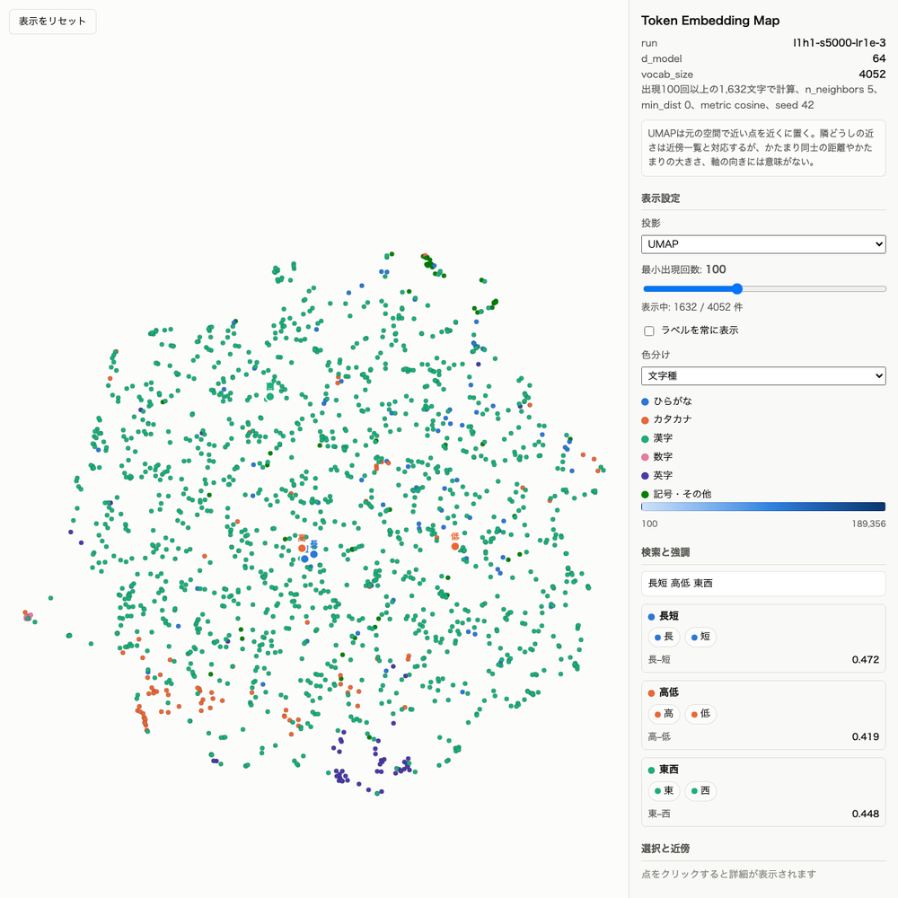

# 内部表現の可視化結果

学習したモデルの中で、文字がどう置かれ、文脈でどう読み替えられるかを見る。見たいことと手法は `visualization-plan.md`。

hidden stateは次の6文（`data/hidden-state-sentences.json`）を入れ、位置9の「行」と位置10の「の」について層ごとのベクトルを取り出す。後ろの2文は前文と単語を入れ替えたもの。

- お金を預けたい。銀行の口座を開く。
- 休暇を楽しもう。旅行の予定を立てる。
- 処理が完了した。実行の結果を確認する。
- 書類を受領した。発行の日付を確認する。
- 処理が完了した。銀行の口座を開く。
- お金を預けたい。実行の結果を確認する。

「予測」はそのベクトルをそのまま出力層に通した次の文字の上位。「近い文脈」はvalidation全体657,408位置の同じ層のベクトルの中でコサイン類似度が高いもので、対象との関係で「同じ2文字（銀行の行）」「同じ文字・前が違う（旅行の行）」「別の文字（預金の金）」の3列に分けて上位10を出す。文の下の「偶然の水準」は「別の文字」の位置の類似度の上位0.1%点で、「別の文字」の上位がこれに近ければ特にこの文脈に近いとは読まない。

「層数」と「基準モデル」の節の近傍は、validation先頭39,936位置から分類せずに上位10を出していたときのもの。「学習済みモデル」の節は、改行と半角スペースを除いて窓1,024で通した641,024位置から探す。

token embeddingの近傍は `tok_emb.weight` のコサイン類似度で、候補は訓練データで100回以上出現した1,632文字。この節の「偶然の水準」はランダムなベクトルどうしの類似度で、hidden stateの偶然の水準とは定義が違う。

Attentionの重みは同じ6文を入れ、層×ヘッドごとに「直前」（1つ前の文字への重み）と「先頭」（文の先頭の文字への重み）を、全文の位置1以降で平均して出す。比較の基準は「均等」で、位置 i が自分を含めた位置0〜i の i+1 個を等しく見た場合の値。「お金を預けたい。」の位置3「預」なら お・金・を・預 に0.25ずつで、全文の位置1以降で平均すると直前・先頭とも0.15になる。

```bash
uv run main.py visualize-hidden-states --run-name <run_name>
uv run main.py visualize-embeddings --run-name <run_name>
uv run main.py visualize-attention --run-name <run_name>
```

## 学習済みモデル

対象は `ku-nlp-gpt2-small-char`（12層・12ヘッド・768次元、Wikipedia + CC-100 + OSCARの171GBで事前学習。読み込み方は `pretrained-model-plan.md`）。表は6文のうち単語だけが違う4文（銀行・旅行・実行・発行）で示す。

### Layer 12の「行」は、別の熟語の「行」より、同じ話題の別の語の末尾に近い

Layer 12の「行」に近い位置を探すと、「別の文字」の上位は 銀行→証券会[社]・金融機[関]・ネットバン[ク]、旅行→ジェットツーリン[グ]・ツア[ー]・海外留[学]、実行→起[動]・スキャ[ン]・インストー[ル]、発行→実[施]・出[版]・発[券] と、同じ話題で同じ働きをする語の末尾で埋まる。同じ「行」でも別の熟語（銀行に対する旅行、実行に対する走行・移行）はそれより遠い。残差ストリームの中身が「どの文字か」から「どの話題の、どんな語の末尾か」に置き換わっている。

| 文 | 同じ2文字 | 同じ文字・前が違う | 別の文字 | 偶然の水準 |
|---|---|---|---|---:|
| お金を預けたい。銀行 | 銀[行]のIT(0.98) 銀[行]で不動(0.98) | 観光旅[行]をして(0.89) パック旅[行]なら(0.89) | 証券会[社]におけ(0.93) 金融機[関]のカー(0.93) ネットバン[ク]を(0.93) | 0.89 |
| 休暇を楽しもう。旅行 | ハワイ旅[行]は(0.97) 観光旅[行]をして(0.97) | 夜[行]バスの(0.91) 走[行]時や(0.91) | ジェットツーリン[グ]は(0.95) スキーツア[ー]バス(0.94) 海外留[学]をお(0.94) | 0.92 |
| 処理が完了した。実行 | 命令を実[行]して(0.96) スキャンの実[行]時(0.96) | IDを発[行]して(0.91) 走[行]時や(0.91) 迅速に移[行]する(0.91) | 起[動]直後に(0.95) スキャ[ン]の種類(0.94) インストー[ル]した(0.94) | 0.91 |
| 書類を受領した。発行 | 認証局の発[行]する(0.96) 発表された発[行](0.94) | 刊[行]された(0.93) 命令を実[行]して(0.90) | 実[施]要綱を(0.94) 出[版]社(0.94) チケットの発[券](0.93) | 0.90 |

- **同じ話題の別の語が、同じ文字の別の熟語を追い越すのはLayer 6〜10。** Layer 0〜4は「同じ文字・前が違う」の1位（0.83〜1.00）が「別の文字」の1位（0.62〜0.81）より高い。銀行・実行はLayer 6、旅行・発行はLayer 10で逆転する。「別の文字」の中身も、Layer 4の 銀行→企[業]・金[融]、実行→実[施] から、Layer 12の 証券会[社]・金融機[関]、起[動]・インストー[ル] へと、字面の近さから話題の近さに変わる
- **偶然の水準との差は0.03〜0.05と小さいが、偶然ではない。** 64万候補の上位10が話題の語で埋まる。後半の層では全位置に共通する成分が大きくなり、コサイン類似度が全体に底上げされるので、値の差ではなく上位の中身で読む
- **予測も同じ順で変わる。** Layer 0〜2は「行」自身（出力ヘッドがトークン埋め込みと重み共有なので、埋め込みをそのまま出力層に通すと自分が最大になりやすい）、Layer 4〜8は単語の続き（銀行→員・券、実行→さ・す）、Layer 12は文として続く語（銀行→口座の口、実行→実行時・実行中・実行結果）

### token embeddingは「同じ型に入れ替えて使える文字」どうしが近く、上位10のほぼ全部に理由が付く

反対語（長↔短・高↔低・東↔西・北↔南）は互いに近傍1位（0.40〜0.56）。方角4文字、月→週・年・日・曜、県→府・州・市・国・町・都のように、同じ場所に入れ替えて使える文字の群が上位10を埋める。偶然の水準は近傍1位で0.12、上位10の平均で0.10なので、下の表の類似度はどれも偶然ではない。

| 文字 | 近傍上位10（類似度） |
|---|---|
| 高 | 低(0.40) 大(0.23) 安(0.21) 小(0.20) 多(0.20) 長(0.19) 深(0.19) 強(0.16) 広(0.16) 超(0.16) |
| 低 | 高(0.40) 減(0.26) 短(0.26) 軽(0.23) 抑(0.22) 貧(0.21) 狭(0.21) 薄(0.21) 緩(0.20) 悪(0.19) |
| 東 | 西(0.50) 北(0.38) 南(0.37) 京(0.29) 沖(0.23) 阪(0.22) 千(0.22) 福(0.22) 田(0.20) 江(0.20) |
| 月 | 週(0.38) 年(0.33) 日(0.25) ヶ(0.22) 曜(0.22) 季(0.20) 歳(0.19) 火(0.19) 毎(0.18) 午(0.17) |
| 県 | 府(0.37) 州(0.32) 市(0.31) 国(0.26) 町(0.24) 都(0.23) 駅(0.22) 沖(0.22) 島(0.20) 区(0.19) |
| ア | イ(0.32) オ(0.30) ス(0.30) フ(0.29) サ(0.27) リ(0.27) ラ(0.27) カ(0.26) バ(0.26) エ(0.26) |
| い | く(0.35) き(0.30) う(0.25) し(0.25) か(0.22) す(0.21) さ(0.21) お(0.21) っ(0.20) け(0.19) |

- **反対語だけでなく同じ側の語も近い。** 高の近傍は 低・大・小・多・長・深・強・広 と「〜い」形容詞の漢字、低の近傍は 減・軽・抑・貧・薄・悪 と「下げる・少ない」側。近さは意味の一致ではなく「〜い」「〜が高い」のような同じ型に入ること
- **文字種ごとにまとまる。** 各文字の最近傍10のうち同じ文字種の割合は、候補の5%しかないカタカナで0.90、ひらがなで0.70（偶然なら0.05）。UMAPの2次元図でも元の768次元のコサイン近傍（全体で0.98）でも同じで、図が作ったまとまりではない

### Attentionの重みは後半の層ほど文の先頭に集まるが、先頭の値ベクトルはほぼゼロで「どこも見ない」の置き場になっている

位置1以降から先頭への重みの全ヘッド平均は、Layer 1の0.24からLayer 10の0.86まで上がる（均等なら0.15）。ただし先頭位置の値ベクトルのノルムはLayer 4〜11で他の位置の2〜8%しかなく、重みの9割を先頭に置いてもコンテキストベクトルにはほぼ何も足されない。先頭は「このヘッドは今の位置では何も参照しない」を表す置き場で、ヒートマップの先頭の列は情報の参照として読まない。

| 層 | 先頭（平均） | 先頭（最大のヘッド） | 直前 | 先頭の値ベクトルのノルム ÷ 他の位置の平均 |
|---|---:|---:|---:|---:|
| 1 | 0.24 | 0.36 | 0.24 | 0.54 |
| 2 | 0.48 | 0.90 | 0.19 | 0.20 |
| 4 | 0.51 | 0.87 | 0.29 | 0.07 |
| 6 | 0.68 | 0.99 | 0.17 | 0.07 |
| 8 | 0.72 | 0.87 | 0.11 | 0.03 |
| 10 | 0.86 | 0.98 | 0.09 | 0.02 |
| 12 | 0.81 | 0.93 | 0.08 | 0.54 |
| 均等 | 0.15 | | 0.15 | |

Layer 12の比0.54は、先頭を見ないヘッド1つ（先頭0.00、比7.3）が押し上げた値で、先頭を見る11ヘッドでは0.02〜0.04。

先頭が置き場になる仕組み（`tmp/check_attention_sink.py`・`tmp/check_attention_sink2.py`、commitしない）。

- **softmaxの重みは合計1なので、「見ない」にも置き場が要る。** 参照したい文字がない位置でも重みはどこかに置く。値ベクトルがほぼゼロの位置に集めれば、出力に何も足さずに済む
- **置き場に使えるのは先頭だけ。** Causal maskで位置0はどの位置からも必ず見え、位置0自身は自分しか見ないので、中身が後ろの文に依らず一定になる
- **先頭の残差ストリームだけノルムが桁違いに大きい。** Layer 1のブロックが先頭に大きなベクトルを書き込み、Layer 6以降は約730（他の位置は48〜140）。層正規化で長さをそろえると各ヘッドに毎回ほぼ同じ向きで入るので、そのキーはどのクエリとも高いスコア（他より4〜12大きい）、値ベクトルはノルム0.1〜0.4（他は4〜9）になるよう学習されている
- **文字ではなく位置で決まる。** 先頭の「お」を 処・。・、・の・１ に替えても、先頭への重みの全層平均は0.63〜0.64で変わらない。学習データでは文書の先頭に必ず `<s>` があったのでこの役は `<s>` で学習されたが、`<s>` がなければ位置0の文字が引き受ける
- **ヘッドの役割は先頭を除いた残りの重みで読む。** 「お金を預けたい。銀行」の「行」をLayer 5 Head 8で見ると、重みは お0.75・。0.07・銀0.06 で先頭しか目に入らない。先頭を除いて1に正規化すると 。0.28・銀0.24・行0.13 となり、句点と直前の文字を見るヘッドだと読める。ヒートマップは先頭列を除いて色を付け直す表示が要る（未実装）

この性質はattention sinkと呼ばれ、長い入力で先頭の数tokenをKVキャッシュから落とすと生成が壊れることが報告されている（[Xiao et al. 2023, Efficient Streaming Language Models with Attention Sinks](https://arxiv.org/abs/2309.17453)）。先頭のノルムが桁違いになる現象は [Sun et al. 2024, Massive Activations in Large Language Models](https://arxiv.org/abs/2402.17762) に同じ観察がある。「コンテキストが長いほど最初の方を忘れるのは何故か」の答えではない。先頭は全位置から常に見られているが、その重みは内容の参照ではなく、長い入力の前半の内容が使われるかは別に測る必要がある。

## 層数

### 層を積むと「行」の表現は、単語の確定 → 次の文字 → 話題の順に作られる（1層 → 4層）

対象は `l4h1-d128-s5000-lr1e-3`。比較元は基準モデルの節（1層・64次元）。

4層では層ごとに役割が分かれ、1層モデルで外れていた「銀行→う・い（動詞の行）」の予測は消えた。

| 層 | 銀行のあとの予測 | 実行のあとの予測 | 前文だけ違う組の類似度 | 近い文脈 |
|---|---|---|---:|---|
| 0 | 為(0.04) 点 距 | 同じ | 1.00 | 動詞の行（行うこと・行われた） |
| 1 | 為(0.07) 場 席 | 為(0.17) 点 う | 1.00 | 同じ熟語の同じ文字（中央銀行・団体旅行・実行する・発行して） |
| 2 | の(0.06) 販 場 に | 為(0.08) 点 の 列 | 1.00 | 同上 |
| 3 | の(0.14) に は | し(0.06) 列 の す | 0.98 | 同上 |
| 4 | は(0.22) の に で | の(0.06) し す 後 | 0.92・0.96 | 別の文字が入る（下表） |

- **Layer 1は直前の1文字だけで決まる。** 前文だけ違う組（お金→銀行と処理→銀行、処理→実行とお金→実行）のベクトルは類似度1.00で同一になり、近傍は同じ2文字熟語そのもの。1層目が「自分がどの単語の中にいるか」を作っている。1層目のヘッドが1つ前のtokenだけを見ている可能性があり、Stage 5でAttention weightを見るときに確かめる
- **Layer 2〜3で次の文字が単語ごとに分かれる。** 銀行のあとは の・に・は、実行のあとは し・す（実行し・実行する）。前文はまだ効いていない
- **Layer 4で名詞のあとの助詞になり、分かれ方は「銀行 vs サ変名詞（旅行・実行・発行）」になる。** 1層モデルの「動詞側 vs 熟語側」は、そもそも銀行の行を動詞と読んだ外れだった。6文の類似度の最小は0.56（1層は0.89）まで開いた

Layer 4の近傍上位10には、同じ「行」を含む文脈を押しのけて別の文字が入る。

| 文 | 別の文字の近傍（類似度） | 読み |
|---|---|---|
| お金を預けたい。銀行 | 金[融]商品(0.58) 出[費](0.57) 借金[額](0.57) 金[融]ショ(0.56) | お金 |
| 処理が完了した。銀行 | 政[府](0.62) サバ[州](0.60) 公[式](0.58) 儀[式](0.57) | 組織・制度 |
| 休暇を楽しもう。旅行 | 進[行](0.79) 設[備](0.71) 移[行](0.71) 収[入](0.70) 移[動](0.69) | 移動・施設 |
| 処理が完了した。実行 | 進[行](0.78) 受[信](0.67) 設[備](0.67) 移[行](0.66) | 処理が進む |
| 書類を受領した。発行 | 進[行](0.76) 移[行](0.72) 審[査](0.66) 発[売](0.66) 放[送](0.66) | 手続き |

- **前文の話題はLayer 4で初めて使われる。** 同じ「銀行」でも、前文が「お金を預けたい」なら金融・出費・借金額、「処理が完了した」なら政府・州・公式に入れ替わる。類似度0.92の小さな差の中身がこれ
- **残差ストリームの中身が「どの文字か」から「次に何が来るか」に置き換わる。** Layer 1の近傍は同じ熟語の同じ文字だけだったが、Layer 4では文字が違っても、あとに似た語が続く単語の末尾（融・費・額、査・売・送）が近くなる
- 別の文字の近傍の類似度は0.56〜0.71で、同じ熟語の0.83〜0.88より低い。テレビC[M]・留[守]電のように読みに乗らないものも混ざるので、上位10の数件は偶然と見る

「の」は層を積んでも平坦なままだった。予測の最大値はLayer 4でも0.05（実行の→方）で、6文とも た・一・場・方・中 が0.02前後に並び、近傍は全層で名詞に続く「の」だけ。6文の類似度の最小はLayer 1で1.00、Layer 4で0.91と下がり、前文や単語の情報は少しずつ混ざるが、直前が名詞の「の」は先の候補が広すぎて予測を絞れない。

### 層を積んでもtoken embeddingの近傍は変わらない（1層 → 4層、128次元）

対象は `l1h1-d128-s5000-lr1e-3` と `l4h1-d128-s5000-lr1e-3`。反対語の類似度・順位は1層128次元と4層128次元でほぼ同じで、層を積んだ効果は埋め込みには出ない（長→短 0.39→0.40、高→低 0.18→0.15、東→西 0.10→0.13）。文脈の情報は上の節のとおり層の側に現れるので、幅を広げた構成では埋め込み地図よりhidden stateを見る。なぜ128次元で反対語が消えたかは次の幅の節。

## 幅 d_model

### 幅を128にすると反対語は入力側の埋め込みから消え、出力層には残る（64 → 128）

対象は `l1h1-s5000-lr1e-3`（64次元）と `l1h1-d128-s5000-lr1e-3`（128次元）。

64次元で近傍1位だった反対語の組は、128次元にすると長↔短だけが残り、高↔低・東↔西は上位10から消える。

| 組 | 1層64次元 | 1層128次元 |
|---|---|---|
| 長→短 | 0.47（1位） | 0.39（1位） |
| 高→低 | 0.42（1位） | 0.18（39位） |
| 東→西 | 0.45（1位） | 0.10（236位） |

近くなる理由を、訓練データで数えた「次の文字の分布」「前の文字の分布」の類似度と、入力側 `tok_emb` と出力側 `out_head`（この実装では別の行列）の類似度で確かめた（`tmp/why_neighbors.py`）。

| 組 | 次の文字分布 | 前の文字分布 | tok_emb（64 / 128） | out_head（64 / 128） |
|---|---:|---:|---|---|
| 長↔短 | 0.65 | 0.55 | 0.47 / 0.39 | 0.08 / 0.10 |
| 高↔低 | 0.64 | 0.96 | 0.42 / 0.18 | 0.72 / 0.61（1位） |
| 東↔西 | 0.12 | 0.74 | 0.45 / 0.10 | 0.75 / 0.76（1〜2位） |
| 北↔南 | | | 0.26 / 0.28 | 0.71 / 0.64（1〜3位） |

- **入力側は「次に何が来るか」で寄る。** 埋め込みはショートカット接続で出力層に直行するので、次が 期・い・く で共通する長↔短はどちらの幅でも1位。長↔短は出力側では離れている
- **出力側は「どんな前文脈で予測されるか」で寄る。** 「最〜」「関〜」のあとに同じように来る高↔低・東↔西・北↔南は、出力側でどちらの幅でも1〜3位。東↔西は次の文字がほぼ違う（東はほぼ京）のに近いので、前文脈の効果
- **64次元では入力側にも前文脈の情報が漏れていた。** 128次元では入力側から消え、役割が入力側と出力側で分かれた。次元が足りないと同じ方向を使い回す必要があった、という仮説
- **128次元の上位10の大半は偶然の水準。** ランダムな1,632本のベクトルでも近傍1位の平均は128次元で0.30、上位10の平均で0.25になり、実際の埋め込み（0.30、0.25）と変わらない。高→譲(0.25)・低→厳(0.26)のような近傍に理由はない。読むのは0.30を明らかに超える組と1位の組だけ

反対語が近いのは意味が近いからではなく、「最〜い」の型に同じように入る、つまり同じ場所に入れ替えて使えるから。モデルは高と低が逆の意味だとは知らない。

## 基準モデル（1層・64次元）

対象は `l1h1-s5000-lr1e-3`（1層1ヘッド、d_model 64、5,000step）。条件を変える前の、1つのモデルだけの観察。

### 「行」はLayer 1で、銀行・旅行なら動詞の仲間、実行・発行なら熟語の仲間になる

Layer 0は文字と位置だけで決まるので6文とも同じで、予測上位は間(0.04)・動・響・更、近傍は別の位置にある「行」だけになる。Layer 1で次のように分かれる。

| 文（対象まで） | 実際の次 | 予測上位5 | 近い文脈上位5（類似度） |
|---|---|---|---|
| お金を預けたい。銀行 | の | う(0.11) い(0.11) き(0.06) っ(0.06) 動(0.06) | 活動を␤[行]なって(0.91) / 上野[行]一(0.91) / 時間に[行]ったの(0.91) / によって[行]われて(0.91) / 美容整形を[行]う(0.90) |
| 休暇を楽しもう。旅行 | の | う(0.28) っ(0.13) い(0.12) く(0.05) わ(0.03) | 美容整形を[行]う(0.94) / 活動を␤[行]なって(0.93) / 時間に[行]ったの(0.93) / 中央銀[行]の(0.93) / CMを[行]って(0.92) |
| 処理が完了した。実行 | の | 為(0.06) の(0.05) 動(0.05) っ(0.04) が(0.03) | ␤銀[行]、(0.95) / 非[行]など(0.94) / 上野[行]一(0.93) / 先[行]投資(0.93) / 団体旅[行]の(0.91) |
| 書類を受領した。発行 | の | し(0.05) っ(0.05) う(0.05) い(0.05) く(0.04) | 上野[行]一(0.93) / 大流[行]した(0.93) / 活動を␤[行]なって(0.92) / 実[行]する(0.92) / ␤銀[行]、(0.92) |
| 処理が完了した。銀行 | の | 為(0.05) き(0.05) い(0.05) し(0.05) う(0.04) | 上野[行]一(0.94) / ␤銀[行]、(0.94) / 非[行]など(0.93) / から[行]うこと(0.92) / 活動を␤[行]なって(0.92) |
| お金を預けたい。実行 | の | 動(0.08) っ(0.06) う(0.05) い(0.05) 為(0.04) | 上野[行]一(0.93) / 活動を␤[行]なって(0.92) / ␤銀[行]、(0.92) / 先[行]投資(0.91) / 時間に[行]ったの(0.91) |

- 銀行・旅行のあとは、予測が「う・い・っ・く」（行う・行い・行った・行く）に寄り、近傍も「行なって」「行ったの」「行われて」のような動詞の行が並ぶ。実行・発行のあとは、近傍が「銀行」「非行」「先行」「流行」のような熟語の行に入れ替わり、予測も為（行為）・の・動に変わる
- 前文だけ入れ替えても（お金を預けたい→処理が完了した）、直前の単語だけ入れ替えても（銀行→実行）、近傍は動詞と熟語の混ざった中間になる。上位10で数えると動詞の個数は8→6（前文）、8→4（単語）、逆方向は2→4、2→6。前文と直前の単語のどちらか一方で決まってはいない
- 予測の確率は最大でも旅行のあとの「う」0.28で、実際の次の文字「の」は最も高い文でも0.05。文脈で候補の傾向は変わるが、次の文字を当てられるほど絞れてはいない
- 予測上位に前文の末尾の文字が入る（楽しもう→う 0.28、受領した→し 1位、預けたい→い 2位）。1つしかないヘッドが前の文字をそのまま写している可能性があり、Attentionの重みを見るときに確かめる
- 仲間分けは文脈が表現を変えたことの観察で、「銀行の行は動詞だとモデルが理解した」という意味ではない。実際「銀行の」の行は熟語であり、動詞寄りの予測は外れている

### 「の」は文脈によらず「名詞のあとのの」のまま

Layer 1の予測と近傍は6文ともほぼ同じで、代表の2文だけ示す。

| 文（対象まで） | 予測上位5 | 近い文脈上位5（類似度） |
|---|---|---|
| お金を預けたい。銀行の | た(0.02) よ(0.02) 方(0.02) 中(0.02) 人(0.01) | 恋愛という[の]は(0.99) / アクセス[の]種類(0.98) / それなり[の]量を(0.98) / 次回[の]ウイル(0.98) / こ[の]検出(0.98) |
| 処理が完了した。実行の | 中(0.02) 場(0.01) ア(0.01) よ(0.01) 方(0.01) | 未知[の]バリエ(0.98) / セントラルへ[の]参加(0.98) / ゴールド[の]価格(0.98) / 融資[の]条件(0.98) / トーク[の]記録(0.98) |

- 予測は「た・よ・方・中・人・場」が0.01〜0.02で並び、実質的に絞れていない。近傍はどれも名詞に続く「の」で、類似度は0.98〜0.99
- 6文どうしのコサイン類似度は最小でも0.971で、「行」の最小0.895より明らかに高い。直前が名詞の「の」は先の候補が広すぎて、前文の違いを取り込んでも予測に使えない

### token embeddingでは反対語が近傍1位になり、方角と「〜い」形容詞がまとまる

| 文字 | 近傍上位10（類似度） |
|---|---|
| 長 | 短(0.47) 着(0.41) 老(0.38) 均(0.35) 化(0.35) 済(0.34) 早(0.34) 恵(0.33) 勝(0.32) 森(0.32) |
| 短 | 長(0.47) 貢(0.38) 若(0.37) 濃(0.37) 定(0.35) 驚(0.35) 稿(0.35) 寄(0.34) 周(0.34) 宮(0.33) |
| 高 | 低(0.42) 濃(0.39) 山(0.38) 強(0.37) 歌(0.36) 柔(0.36) 浴(0.34) 産(0.31) −(0.31) 弱(0.30) |
| 低 | 潜(0.44) 高(0.42) 狭(0.40) 扱(0.36) 近(0.35) 甘(0.32) 践(0.32) 球(0.31) 鳴(0.30) 女(0.30) |
| 東 | 西(0.45) K(0.37) 北(0.37) 神(0.37) 繁(0.34) び(0.34) 帳(0.32) 貨(0.32) リ(0.32) ワ(0.31) |
| 西 | 東(0.45) 南(0.42) 吉(0.37) 漏(0.33) 両(0.32) 顕(0.32) せ(0.31) +(0.30) 路(0.30) 頑(0.30) |

- 長↔短・高↔低・東↔西は互いが近傍1位（低から見た高だけ2位）
- 「〜い」で終わる形容詞の漢字（老・早・若・濃・強・柔・弱・狭・近・甘）が互いの近傍に出る。次の文字が「い・く・さ」になりやすい文字が、次文字予測の都合で同じ方向に寄る
- 東・西の近傍に北・南が入り、方角の4文字がまとまる
- 着・均・貢・潜など、意味的な関係が思い当たらない文字も上位に入る。64次元でもランダムなベクトルの近傍1位の平均は0.41で、上位10のすべてに理由が付くわけではない

候補を出現100回未満の文字まで広げると、ほぼ初期値のままの埋め込みが偶然の一致として混ざる。逆に上位300文字に絞ると短・低・西が候補から外れる。HTMLでは最小出現回数を動かして確かめられる。

### 2次元の図に出るのは文字種の分かれ方だけで、意味の近さは出ない



UMAP（コサイン距離、n_neighbors 5、min_dist 0）では、数字10文字が離れた小さなかたまりを作り、カタカナは縁に沿って小さなかたまりに分かれ、英字は下側にまとまる。漢字1,361文字は中央の大きなかたまりで、ひらがなはその中に散る。PCAでも並びは同じで、ひらがな・漢字・カタカナが横に並び、数字だけ下に離れる。カタカナの次はカタカナ、数字の次は数字が来やすいので、次の文字の種類を当てる方向が、点群の中で最も散らばりの大きい方向になっている。

一方、上の表の意味の近さはPCAの図には出ない。UMAPでは東・西は重なるが、低は長・短・高から離れて置かれる。図の隣接だけで近いと言わず、近傍一覧の類似度で確かめる。
